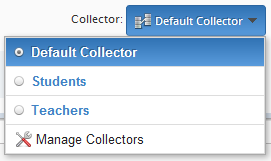

Export Data
-----------

For all the data buffs out there, the final piece in the mosaic is the exporting of data which allows for further manipulation external to FluidSurveys.

Export Survey Questions
^^^^^^^^^^^^^^^^^^^^^^^

Exporting Survey Questions to an editable format, such as Microsoft Word (.Doc) or Adobe Reader (.PDF) files is an available option as it allows for a survey to be taken Offline at a conference hall. 

You’ll then have the option of exporting the survey questions into a .DOC or .PDF file. With .DOC files, the questions will remain editable and you will be able to modify the titles/formatting in a word editor.

.. figure:: ../../resources/analyze/export_survey_questions.png
	:scale: 70%
	:align: center
	:class: screenshot
	:alt: 

	*Figure 9.1* Report Dashboard

Furthermore, 

You can specify advanced options for the PDF export (show branching conditions, looping information, etc) by clicking on “Show Advanced Options” and checking off the desired options

.. list-table:: 
   :widths: 35 65
   :header-rows: 1

   * - General Options
     - Description
   * - 1. Display title and description at the top of the document
     - Show the Survey Title and Description at the top of the exported questions document. By default, this option is enabled
   * - 2. Create a new page in the document for every page
     - When a page contains more questions than can fit onto a page, it will bleed over onto additional pages. While this option does not prevent that, it will create a new page for every page in the survey. By default, this option is enabled.

.. list-table:: 
   :widths: 35 65
   :header-rows: 1

   * - Page Options
     - Description
   * - 1. Show page numbers
     - Display the survey page number on the bottom right. By default, this option is enabled
   * - 2. Show looping information on pages that are looped
     - A survey online can contain looping and branching logic, which can be translated onto paper. While it may make little to no sense, this option can be disabled. By default, this option is enabled
   * - 3. Show branching information on apges that have branching logic
     - This has the same affect has as item 2. By default, this option is enabled

.. list-table:: 
   :widths: 35 65
   :header-rows: 1

   * - Question Options
     - Description
   * - 1. Show question ID's
     - A question that has a unique identifier, ie., "q1", can be shown on a printed survey. By default, this option is enabled
   * - 2. Show a looping icon beside questions that contain looping
     - If a question has looping, it will have a looping icon beside it if this option is enabled. By default, this option is disabled
   * - 3. Show select box choices as radio buttons instead of bullets
     - In order to maintain a consistency between online and offline, the ability to have checkboxes look like actual boxes as opposed to a bullet, is a possibility by enabling said option. By default, this option is disabled

Export Language
===============

.. image:: ../../resources/analyze/export_language.png
  :scale: 70%
  :align: right
  :class: screenshot
  :alt: Change Language

If your survey contains multiple languages, then exporting the data into the right language would alternatively make sense. Before exporting the data, select the desired language from the dropdown located to the right of "Export Responses" and then "Export to CSV" which will export that languages data.

Export Responses
^^^^^^^^^^^^^^^^

Exporting survey responses is a perfect opportunity for a surveyor to begin creating large scale informative graphs within a 3rd party application such as Microsoft Excel.
The results can be exported to either Microsoft Excel (.CSV) or IBM (.SPSS)

.. figure:: ../../resources/analyze/export_responses.png
  :scale: 70%
  :align: center
  :class: screenshot
  :alt: Export Responses

  *Figure 9.1* Export Responses section in the Analyze section

.. list-table:: 
   :widths: 35 65
   :header-rows: 1

   * - Question Options
     - Description
   * - 1. Separate values with commas (defaults to tab-separated for Excel compatibility)
     - Checking this option will put each question type in a separate column
   * - 2.  Split into multiple files (if exporting more than 255 columns into Excel 2003 and earlier)
     - Surveys with more than 255 questions may break early versions of Excel. Check this option to prevent that. The responses will be exported in multiple files.
   * - 3. Use scores as labels (show score instead of text for multiple choice questions)
     - Questions with custom score values are shown instead of the word, eg., 0 instead of No.
   * - 4. Include identifiers in headers (for response import)
     - Questions with identifiers will be added as titles in the csv file. (Ex: [q1] A question?).
   * - 5. Include unique identifiers for each row (per response)
     - Questions with identifiers will show along with the questions.
   * - 6. Export questions on separate rows (for database import)
     - Instead of putting questions in columns, the questions will be on rows.
   * - 7. Replace newline characters with \n (Resolve compatibility issues with certain software)
     - By default, [Enter] is a newline. However, some spreadsheet applications have an issue with the button, and therefore \n is used instead
   * - 8. Replace newline characters with spaces
     - Some spreadsheet applications require that a space is used to separate data as opposed to a newline. Enabling this option will allow for the exported data to play nicely with said application
   * - 9. Include a link to view/edit this response
     - Instead of sifting through online responses via the Response Table, enabling this option will provide the online version of said individuals responses

.. note::

  By default, there are no selected Advanced Export Options.

Filter
======

Exported data will adhere to any currently selected Filters. Therefore, setting the Filter beforehand, and then exporting the information, allows for a tight-nit group of specifically requested information, as opposed to all response data. The Filter in Export Data works exactly as the filter found everywhere else in FluidSurveys.

.. figure:: ../../resources/analyze/filter.png
  :scale: 70%
  :align: center
  :class: screenshot
  :alt: Filter

  *Figure 9.1* Report Dashboard

Export to SPSS (SAV)
====================

One of the numerous export options available in FluidSurveys is Export to SPSS. SPSS is an advanced statistical analytics program that can be used to perform further analysis on your collected data.

First and foremost, before exporting results into SPSS, you’ll want to make sure that your questions have the appropriate labels and that your choices have the appropriate scores associated with them.

You can easily add labels to any question in your survey. By default, there is a green link that says “No Identifier” right next to the question title. If you click on this, you’ll be able to change the label of the question.

Choice options are by default scored with increasing values, beginning at 1. The first choice in a set will have a score of 1, the second a score of 2, and so on. You can modify the score of each choice by selecting the “Score” links underneath the “Choice” text field, and then assigning a custom score to each variable.

Once you have defined your labels and scores (i.e. coded your survey), you can proceed to the export.

Head over into the Analytics section of your survey, select “Export” from the top right menu, and click on “Export to SPSS”. A .zip file containing a .sps script and a response.txt file will download.

Once the file has downloaded, you’ll need to make a slight modification to the “script.sps” file. Open it in an HTML compatible text editor (Notepad, for example), and locate the string that says /File=’responses.txt’. Change the ‘responses.txt” portion to reflect the actual location of the file. For example, if the file was downloaded to your Downloads folder, you’d change it to: /FILE=’C:\Users\Downloads\responses.txt’. Save the file once and the change will be made.

You’ll now be able to run your script.sps file by double-clicking on it. When you do, SPSS will open and you’ll see your script. Just click on the Run menu then click on “Run all”, and all of your response data will appear in SPSS.

Export Survey Invites
^^^^^^^^^^^^^^^^^^^^^

As an survey matures, and the Invite tool is utilized, dissecting who received an invite or not may be golden opportunity to figure out who's left.

.. figure:: ../../resources/analyze/export_invites.png
  :scale: 70%
  :align: center
  :class: screenshot
  :alt: Export Survey Invites

  *Figure 9.1* Export Survey Invites

.. note::

  Exporting Survey Invites will export all individuals within the Address Book, including those that may not have been sent a survey invite. It is simple to distingiush between those that have, or have not received an invite, by verifying that the Invite URL contains /?code=None, but also their Status is blank.

Collector
=========

Invites can be sent using a different Collector, eg., Teachers, Students, etc., and therefore sifting through all Survey Invites, it is advantageous to simply select the appropriate Collector group, eg., Students, which will only export Survey Invites for survey invites sent for that collector.

