Reports
-------

Pro, Ultra, and Enterprise account holders have the ability to create custom reports in the Analyze section, which can aid in whipping your data into shape. The benefits of customized reports are for earier data management, and data analysis, all the while ensuring a pretty journey is maintained. Some of things you can accomplish are:

	1. Create Reports similar to a Microsoft Word document
	2. Export or Share Reports with your colleagues
	3. Alter Chart Items to match your analysis needs

.. warning::

	Deleting responses will affect Reports

.. note::

	A Report is meant to symbolize aggregate data, in that it is rather disadvantageous to refer to a Report for 1 single persons response, or to view only 1 persons Response in a sea of many. Instead, to view a single response, refer to the response table.

Report Dashboard
^^^^^^^^^^^^^^^^

To begin the process, click on the [Analyze] icon in either the Editor, or on the Survey Dashboard page to the right of the survey you wish to build custom reports. The first time you go to the "Analyze" section, you will see the Report Dashboard. This is where you see a list of existing reports. By default, there are zero reports in a newly created survey.

.. figure:: ../../resources/analyze/report_dashboard.png
	:scale: 70%
	:align: center
	:class: screenshot
	:alt: Report Dashboard

	*Figure 9.1* Report Dashboard

Survey Statistics
^^^^^^^^^^^^^^^^^

Survey Statistics provide quick and effective information about a particular survey. To view statistics for your survey, click on “Statistics”, which is found under “Analyze” (Pie shaped icon) 

.. figure:: ../../resources/analyze/survey_statistics.png
	:scale: 70%
	:align: center
	:class: screenshot
	:alt: Survey Statistics

	*Figure 9.1* Survey Statistics

Under Survey Statistics, you’ll see the survey length, the number of individuals who’ve completed the survey, the completion rate (number of completions/number of starts), the average completion time, the estimated completion time and the average number of responses per day.

.. figure:: ../../resources/analyze/responses_per_day.png
	:scale: 70%
	:align: center
	:class: screenshot
	:alt: Responses Per Day

	*Figure 9.1* Responses Per Day

The Responses per Day chart outlines the amount of responses received on a particular date. Using the image above as an example, you can see that on June 10, 2011, roughly 30 
respondents completed the survey in question. Likewise, on June 05, 2011, the completion rate was closer to 60.

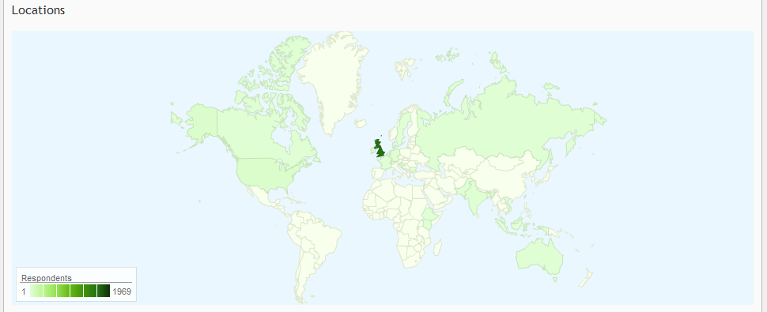

	*Figure 9.1* Geographical Map

In addition, the Statistics section contains a geographical map which indicates where the majority of the responses came from. In the image above, the primary source of responses 
originated in Canada.

New Report
^^^^^^^^^^

When you are ready to create a Report, click on the [+New Report] button located on the right side of the page

In the pop-up, you can:

	* Provide the Report Name. The default name is "Summary Report"
	* The base language for the Report
	* Advanced Options, ie., build a blank Report, etc.

	.. figure:: ../../resources/analyze/create_new_report.png
		:scale: 70%
		:alt: New Report
		:align: center
		:class: screenshot

		*Figure 9.1* Create a new report screen

.. list-table:: 
   :widths: 28 78
   :header-rows: 1

   * - Section
     - Description
   * - 1. Checkbox Questions
     - Closed-ended questions can only have certain chart items. Otherwise, "Invalid Data Source Selected" will appear if something other than, *"Bar Charts"*, *"Chart Tables"*, *"Tables"* is used. The default choice is *"Chart Tables"*
   * - 2. Multiple Choice Questions
     - A Multiple Choice question, being close-ended, can only have certain char items, such as, *"Pie Charts"*, *"Bar Charts"*, *"Chart Tables"*, *"Tables"*. The default choice is *"Chart Tables"*
   * - 3. Grid (matrix) Questions
     - N-Atrix and 3D Matrix questions adhere to a Grid format. Therefore, only *"Bar Charts"* and *"Tables"* are available as a charting item. The default choice is "Tables"
   * - 4. Open-ended Questions
     - Since a response from an open-ended question can range from precise, to vague, there are only specific charting types available; *"Include Inline"*, ie., Include the responses with the chart item, and *"Include Appendices"*, ie., Include at the end of the Report in the Appendix. The default choice is "Include Appendices"
   * - 5. Table Statistics
     - IF the "Tables" chart item was included, by default both counts (choices) and percentages (scores) are included.
     	* [Include both counts and percentages] will show both selected choices, and percentage of selected choices compared to the rest
     	* [Include percentages only] will only show the "Percentage" 
     	* [Include counts only] will only show the "Count"
   * - 6. Include Section Separators
     - If a survey contains various Section Heading as question resources that is crucial to understanding either the response, or the gathered data, then a Report can include those separators. By default, this option is unchecked.

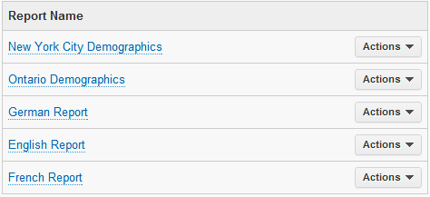

Over time, all Reports tied to a survey will always be a click away (until deleted) on the right-hand side. 

A report will have various options available which are a click away. The Actions button contains actions unique to that Report, such as:

* Share Report
* Duplicate Report
* Delete
* Export to PDF 
* Export to Word
* Export to PowerPoint
* Export to Excel

Multi-Lingual Reports
^^^^^^^^^^^^^^^^^^^^^

If a survey contains 1 of 72 languages, a Report can be created to strictly represent said language. You can add French, German, Bulgarian, or even Bengali, to your survey. There’s no limit on the number of languages a survey can have, and when you create a multi-lingual survey, the subsequent report will also have multi-lingual functionality. 

.. image:: ../../resources/analyze/french_report_choice.png
	:scale: 70%
	:align: left
	:class: screenshot
	:alt: Create a French Report

If for instance, your survey has both French and English language support, you’ll be able to view and create reports in English and French. To do so, go into the “Reports” section under “Analyze” and select “French” from the dropdown, as seen below.

After clicking “Create Report”, a newly created French report will be at your disposal. Subsequently, any new items added into the Report will be in the selected Report language. 
The same process can be followed for any other languages that have been added to the survey.

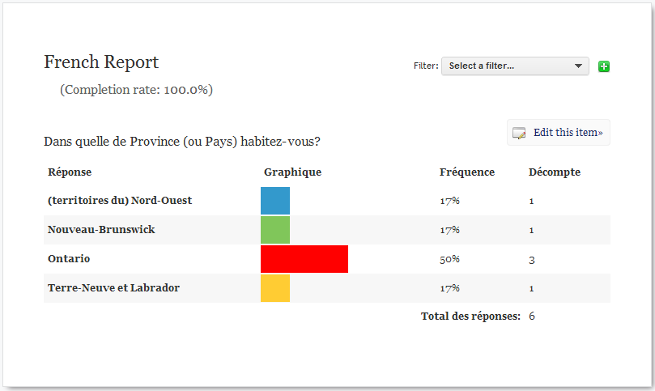

	*Figure 9.1* French Report

Chart Types
^^^^^^^^^^^

When creating a Report, by default, every question type will have its appropriate chart item which allows for an immediate level of satisfaction when viewing large sets of data. But, selecting the appropriate chart item is required when dealing with specific question types. Below are:

1) An example of how the Chart Item looks like
2) The only question types available to certain items

Text
====

Text chart is used primarily as a Report Separator to indicate what either the Report is supposed to represent, or what the following items signify.

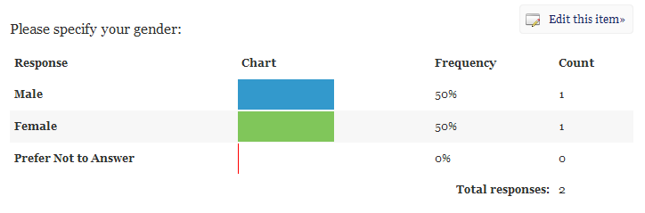

	*Figure 9.1* Text Chart Item

A Text chart item is not specific to a question type

Table
=====

Table is the most common chart item when information is required to be quickly displayed in a Report, as it allows for the data source to be formated for a text item, such as a axis, legends, items and labels

.. figure:: ../../resources/analyze/table_chart_type.png
	:scale: 70%
	:align: center
	:class: screenshot
	:alt: Text Chart Type

	*Figure 9.1* Text Chart Item

A Text chart item is available to:

	* Yes/No
	* Checkbox
	* Multiple Choice
	* Dropdown
	* Multiple Choice Grid
	* Dropdown Grid
	* Checkbox Grid
	* Natrix
	* 3D Matrix
	* Semantic Differential
	* Net Promoter

Pie Chart
=========

A familiar sight to any user of Reports, is that infamous circular chart divided into sectors, each whose length (consequently its central angle and area) is proportional to the quantity it represents, otherwise known as the Pie Chart. The Chart item is perfect for forcing 1 question, short in length, but powerful in information, to be displayed in a colourful pie format.

.. figure:: ../../resources/analyze/pie_chart_type.png
	:scale: 70%
	:align: center
	:class: screenshot
	:alt: Pie Chart Type

	*Figure 9.1* Pie Chart Item

A Pie chart item is available to:

	* Yes/No
	* Multiple Choice
	* Dropdown
	* Multiple Choice Grid
	* Dropdown Grid
	* Natrix
	* Drill Down
	* 3D Matrix
	* Semantic Differential
	* Net Promoter

Column Chart
============

A column chart, like a bar chart, is a simple chart with rectangular bars of lengths usually proportional to the magnitues or frequencies of what they represent, ie., time, age, etc. 

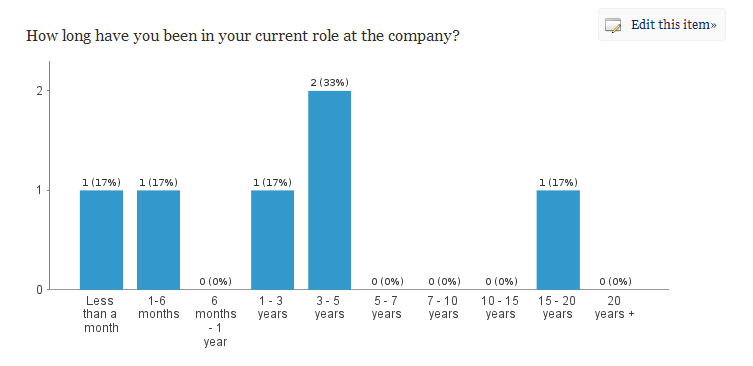

	*Figure 9.1* Column Chart Item

A Column chart item is available to:

	* Yes/No
	* Checkbox
	* Multiple Choice
	* Dropdown
	* Multiple Choice Grid
	* Dropdown Grid
	* Checkbox Grid
	* Natrix
	* Drill Down
	* 3D Matrix
	* Semantic Differential
	* Net Promoter

Bar Chart
=========

A bar chart, like a column chart, is a simple chart with rectangular bars of lengths usually proportional to the magnitues or frequencies of what they represent, ie., time, age, etc. 

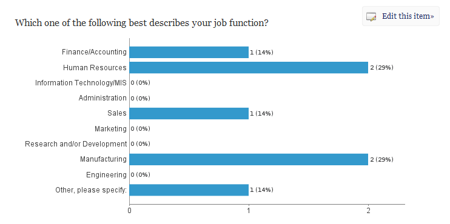

	*Figure 9.1* Bar Chart Item

A Bar chart item is available to:

	* Yes/No
	* Checkbox
	* Multiple Choice
	* Dropdown
	* Multiple Choice Grid
	* Dropdown Grid
	* Checkbox Grid
	* Natrix
	* Drill Down
	* 3D Matrix
	* Semantic Differential
	* Net Promoter

Line Chart
==========

A line chart or line graph is a type of chart, which displays information as a series of data points connected by straight lines, thus becoming a perfect candidate for showing financial reports, sales over time, etc.

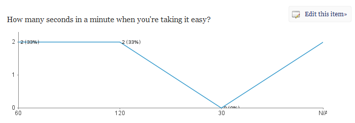

	*Figure 9.1* Line Chart Type

A Line Chart item is available to:

	* Yes/No
	* Checkbox
	* Multiple Choice
	* Dropdown
	* Multiple Choice Grid
	* Dropdown Grid
	* Checkbox Grid
	* Natrix
	* Drill Down
	* 3D Matrix
	* Semantic Differential
	* Net Promoter

Appendix
========

All text response data garnered will appear in the Appendix. 

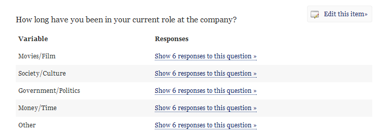

	*Figure 9.1* Appendix Chart Item

An Appendix chart item is available to:

	* Text Response
	* Date/Time
	* Text Response Grid
	* Natrix
	* 3D Matrix
	* Hidden Value
	* Timer

Cross-tabulation
================

The process of creating a contingency table from the multivariate frequency distribution of statistical variables, which is heavily used within a survey research group. Cross-tabulation allows for the x-axis to contain information which can be correlated with the y-axis, 1 question with another.

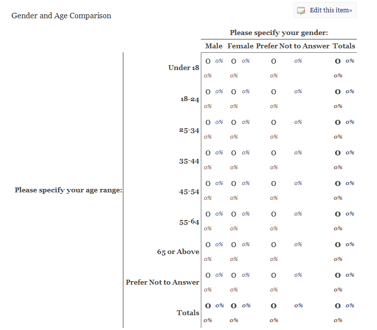

	*Figure 9.1* Cross Tabulation Chart Item

A Cross Tabulation chart item is available to:

	* Yes/No
	* Checkbox
	* Multiple Choice
	* Dropdown
	* Multiple Choice Grid
	* Dropdown Grid
	* Checkbox Grid
	* Natrix
	* Drill Down
	* 3D Matrix
	* Semantic Differential
	* Net Promoter

Aggregate Statistics
====================

A statistics charting item, allows for aggregate data combined from several measurements, ie., multiple question sources. As shown below, it allows for a quick assembly of questions to see what the sum, mean and variable. Additionally, multiple questions can be included into 1 aggregate statistics chart item that allows for 1 column to be added up in its entirety to reveal an overall conclusion

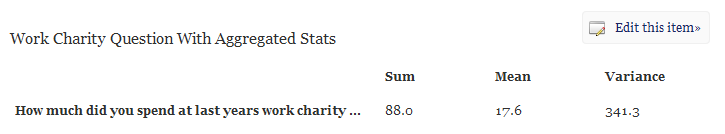

	*Figure 9.1* Aggregate Statistics Chart Item

An Aggregate Statistics chart item is available to:

	* Yes/No
	* Checkbox
	* Multiple Choice
	* Dropdown
	* Multiple Choice Grid
	* Dropdown Grid
	* Checkbox Grid
	* Natrix
	* Drill Down
	* 3D Matrix
	* Semantic Differential
	* Net Promoter

Time-series Chart
=================

Simply put; data forecasting. It allows to potentially predict future values based on previously observed values. You can set it up to show, what an individual paid for a product between dates x and y, which gave a conclusion (price) at z. Thus, allowing for the future to glimmer with prosperity and potentiality.

.. figure:: ../../resources/analyze/time_chart_type.png
	:scale: 70%
	:align: center
	:class: screenshot
	:alt: Time Series Chart Type

	*Figure 9.1* Time Series Chart Item

A Time Series chart item is available to:

	* Yes/No
	* Checkbox
	* Multiple Choice
	* Dropdown
	* Multiple Choice Grid
	* Dropdown Grid
	* Checkbox Grid
	* Natrix
	* Drill Down
	* 3D Matrix
	* Semantic Differential
	* Net Promoter
	
Edit This Item
^^^^^^^^^^^^^^

When a [+New Report] is clicked, all questions will be charted with the chart item that best suites the specific question type. While this saves time, it can provide a high-level overview of what to expect for a report. However, each and every Report comes with the ability to alter each and every chart type by simply clicking on [Edit this item]

.. image:: ../../resources/analyze/click_edit_this_item.png
	:scale: 70%
	:align: center
	:class: screenshot
	:alt: Share Individual Report in Report

The Pie Chart above utilizes the following selected options seen below. By default, the "Header" of an item within Reports adheres to the question title found in the Editor. 

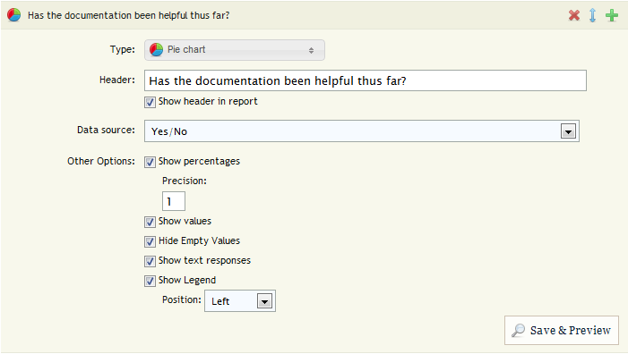

.. note::

	The above image is only a representation of [Edit This Item] for a Yes/No Data Source on a Pie Chart chart item

Edit Report
^^^^^^^^^^^

The [Edit Report] allows for each and every chart item to be condensed in size, to allow for a quick-and-seamless transition from Editing to Final product. Clicking each row, ie., "Please provide some feedback" will present that items customizable options

.. image:: ../../resources/analyze/edit_report.png
	:scale: 70%
	:align: center
	:class: screenshot
	:alt: Edit Report

Filter
^^^^^^

A filter allows for the ability to drill down into a surveys responses and extract specific information. For instance, if you'd only like to see the results of individuals who anwered "Yes" to a particular question, you can do so. Within each filter, you can implement multiple parameters, so you can create a filter based on several choices. 

.. figure:: ../../resources/analyze/filter.png
	:scale: 70%
	:align: center
	:class: screenshot
	:alt: Filter

	*Figure 9.1* Only English responses from a specific "Invite Email"

Be on the lookout for the Green Plus sign in various places. It will help you saves a lot of time!

Export Report
^^^^^^^^^^^^^

Creating a Report is one thing, which is the perfect starting point for a plethora of possible future options and analytics, but a report can be exported to popular 3rd party applications, such as Microsoft Word, Adobe PDF, Microsoft Excel, and Microsoft Power Point. 

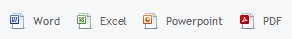

To do so, beside your report, you will see a series of icons. From left-to-right, they are Adobe PDF, Microsoft PowerPoint, Microsoft Excel, and Microsoft Word. Simply click on one of these icons, and your report will be exported into the selected format.

Share Individual Reports
^^^^^^^^^^^^^^^^^^^^^^^^

Sharing an individual Report allows for a subset of individuals to see only 1 Report with forced options enabled. For instance, if the Report only contains male demographic responses, and "Allow Filtering" is disabled, the viewers will be oblivious to the fact that there are any female responses. 

The ability to share a Report with an individual can be found in 2 places.

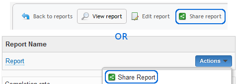

Within the "Actions" dropdown, or within a Report, at the top, under [Share Report]

In life, it's all about the journey, and while the destination is identical when taking either path, the same pop-up will still present itself. 

.. figure:: ../../resources/analyze/share_popup.png
	:scale: 70%
	:align: center
	:class: screenshot
	:alt: Share a Report Popup

	*Figure 9.1* Share a Report Popup

Clicking [Add Share] will reveal a new section, whereby a link can be shared among a set of groups, or an individual

.. figure:: ../../resources/analyze/add_share.png
	:scale: 70%
	:align: center
	:class: screenshot
	:alt: Add Share

	*Figure 9.1* Add Share

.. list-table:: 
   :widths: 28 78
   :header-rows: 1

   * - Section
     - Description
   * - 1. Share Name
     - The Share Name is strictly for . By default, this option is disabled.
   * - 2. Share Options
     - Force the shared individuals to only 2 options
     	* **[Allow Filtering]** will either allow or disallow the creations of filters. By default, this option is disabled
     	* **[Allow Exporting]** will either allow or disallow the exporting (.PDF, .XLS, .DOC) of a shared Report. By default, this options is disabled

When [Done] is clicked, a new Row will appear under "Report Sharing" that contains a link, which can be sent to a party, who can then gain access to only that Report. 

.. figure:: ../../resources/analyze/added_share_options.png
	:scale: 70%
	:align: center
	:class: screenshot
	:alt: Share with Added Options

	*Figure 9.1* Share with Disabled Options

From here, the "Share URL" can be copied, and sent to its intended audience, whereby they will be restricted to only viewing the Report, since Filtering and Exporting is disabled. A "Share Name" can be deleted from within the "Actions" dropdown on the right-hand side. Additionally, a "Share Name" can be edited on the fly.

.. note::

	An individual who received a single report sharing link, does not need to have an FluidSurveys account. Their entire existence will be the shared Report. 

Share Reports
^^^^^^^^^^^^^

If privacy is a concern, and you would like to limit exposure to your Reports via a password, then Share Reports allows for specifically that set of functionality. In short, if you wish to share your reports with people you know without giving them access to your entire account, you can use this form to create a password-protected link.

To share Reports, navigate to the section by going [Analyze] > "Reports" and the section, "Share Your Reports" is at the bottom. 

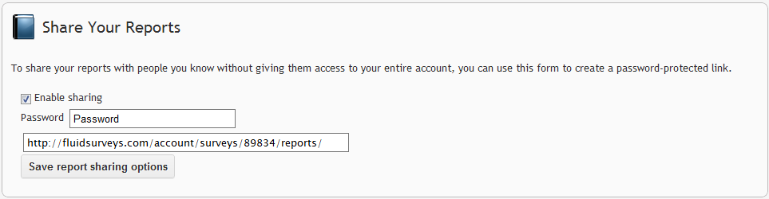

	*Figure 9.1* Enable Share Reports

Once an individual has been sent the Report URL, eg., http://fluidsurveys.com/account/surveys/89833/reports/ they will be presented with a "This page requires a password". 

.. figure:: ../../resources/analyze/reports_login.png
	:scale: 70%
	:align: center
	:class: screenshot
	:alt: Enter a password to proceed

	*Figure 9.1* Enter a password to proceed

Once the password has been successfully entered, the user will move to the next screen which contains the Report, along with all analytical information such as, Complete + Incomplete responses, completion rate, etc.

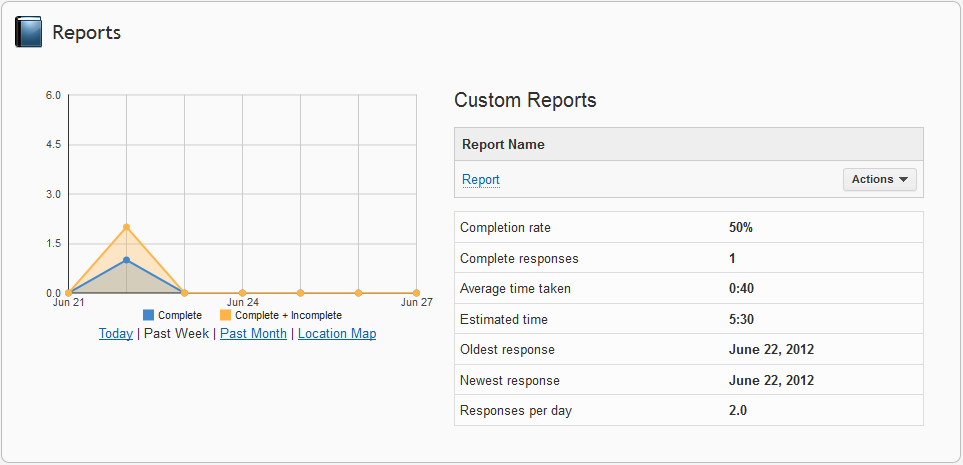

	*Figure 9.1* Shared Custom Reports

.. note::

	All Reports will be available via "Share Reports", despite having a Password. While "Share Individual Report" does not have a password associated with a Report, and does provide specific options to be disabled, if you would rather share 1 Report at a time as opposed to all Reports, please refer to "Share Individual Reports"