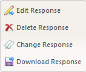
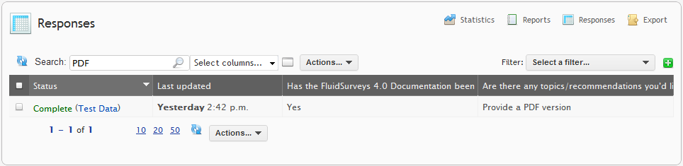
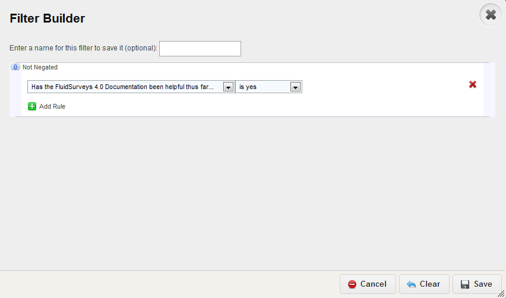
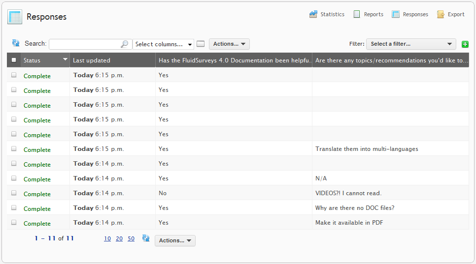

Responses
---------

The most important part of any survey are the responses. Thankfully, we provide an intuitive Response Viewer, which is free for all accounts.
 
The Response Table is available via the [Analyze] > "Response" within the Editor, or [Analyze] > "Responses" via a survey in the Surveys Dashboard

The response viewer displays all of your survey responses in a tabular format. Each response is shown in an individual row, while the questions/answers are displayed in the columns.

.. figure:: ../../resources/analyze/response_table.png
	:scale: 70%
	:align: center
	:class: screenshot
	:alt: Response Table

	*Figure 9.1* Response Table for a Small Survey

Actions
^^^^^^^

Much like a great Arnold Schwarzenegger 1980's flick, the Response Table comes packed with an “Actions…” dropdown (located at the top and bottom) which allows for further data manipulation.

.. figure:: ../../resources/analyze/actions_dropdown.png
	:scale: 70%
	:align: center
	:class: screenshot
	:alt: Available Actions

	*Figure 9.1* Available Actions

.. list-table:: 
   :widths: 28 78
   :header-rows: 1

   * - Section
     - Description
   * - 1. Delete selected responses
     - Any selected responses in the table will be deleted when this option is selected. If a response is not selected, an error message will appear stating to, "Please select responses in the table to delete them"
   * - 2. Delete test responses
     - A response is categorized as "Test" when the (Test Data) string is appended at the end of a status, eg., "Complete (Test Data)" which happens whenever the [Preview] icon is clicked in either the Editor or the Surveys Dashboard, and a response is completed, or started, ie., Incomplete. It is very common for an Administrator to clear all responses before sending a survey out
   * - 3. Delete imported responses
     - A response is categorized as "Imported" when the (Imported) string is appended at the end of a status, eg., "Completed (Imported)" which happens whenever a response is uploaded using either the "Import Responses" or Offline Mode feature.
   * - 4. Delete all responses
     - First and foremost, it is not possible to retrieve deleted responses. When "Delete all responses" is selected, a pop-up will appear asking, "Are you sure?" which requires the keywords, "I agree" to be entered by the Administrator. Once "Ok" is clicked, the responses will be deleted.
   * - 5. Add response
     - Add response, is very much like clicking the [Preview] icon, with the major different being that a new window will appear, and when [Submit] is clicked, the response will be marked as "Complete", without the (Test Data) string
   * - 6. Add multiple response
     - A blank entry will be added to your response database. A window will appear that will ask for the "Amount of Responses" to be created. Once "Ok" is clicked, depending on the value, n amount of responses (rows) will be created. From there, Right-Clicking and selecting, "Edit Response" allows for the response to be completed. 
   * - 7. Import responses
     - Allows for responses to be imported via a CSV file. To learn more about importing responses, refer to "Import Responses" in the Tutorial section
   * - 8. Download selected responses
     - Download the selected responses into either PDF, Word, or CSV
   
.. warning::

	It is NOT possible to undo the "Delete all responses" action. Once "I agree" and "Ok" has been clicked, the responses are permanently deleted.

Right-Click Menu
^^^^^^^^^^^^^^^^

A response table contains a options specific to 1 row of data. For instance, right clicking on a single response will produce a dropdown window with options to explicitly alter the state of that response. Therefore, any change made using the right-click menu, will only adhere to only 1 row (response)

.. list-table:: 
   :widths: 28 78
   :header-rows: 1

   * - Section
     - Description
   * - 1. Edit Response
     - Alter the user’s response
   * - 2. Delete Response
     - Delete the selected response
   * - 3. Change Response
     - You can change the status of a response to Incomplete, Complete, Terminated, or Quota Reached
   * - 4. Download Response
     - Download the response into a Adobe PDF, Microsoft Word, or a Microsoft Excel format 
   
Search
^^^^^^

A popular survey can easily generate upwards of 1000 responses, which can become a cumbersome act of sifting through the data in order to find a specific persons response. The Search bar (located beside "Actions")

When searching for a strong, eg., PDF, only text responses with "PDF" will appear.

.. note::

  The Search box will only search for strings entered via the text response question type. Since choices are static, and dependent entirely on forced options, it is more advantageous to create a Filter for such questions.

Filter
^^^^^^

In the response viewer, you also have the ability to create filters and drill down farther into the data. Filters allow you to alter which responses are displayed. 

.. image:: ../../resources/analyze/find_filter.png
  :scale: 70%
  :align: center
  :class: screenshot
  :alt: Green Plus in Response Table

To create a filter, click on the plus sign at the top right of the Response Table and you’ll be taken to the all too familiar Filter Builder.

When "Ok" is clicked, only responses that adhere to the aforementioned Filter will reign dominate in the Response Table. 

.. image:: ../../resources/analyze/filtered_responses.png
  :scale: 70%
  :align: center
  :class: screenshot
  :alt: Filtered Responses

When a Filter is applied, a broom will appear in place of the Green Plus. When the broom is clicked, the Filter will "brush off" and all previous responses before the Filter will re-reveal themselves.

Selection Columns
^^^^^^^^^^^^^^^^^

By default, only a fraction of information is displayed at any given time for all collected data. There are a series of Columns which must be added in order to see the collected information. 

Below are a series of Columns available for every surveys response data

.. list-table:: 
   :widths: 28 78
   :header-rows: 1

   * - Section
     - Description
   * - 1. Status
     - Contains the status, ie., "Complete", "Incomplete", "Viewed"
   * - 2. Last updated
     - 
   * - 3. Date started
     - 
   * - 4. id
     - Every response group contains a unique ID that allows for the Admistrator to use it as an archiving tool. The formula is as secret as Colonel Sanders deep fried chicken.
   * - 5. Language
     - The language the survey was created in, in this case, en represents "English"
   * - 6. IP Address
     - The network address, 77.64.233.59 of where the individual completed the response. The IP Address is important in determining where specifically in the world an individual completed their survey, thus allowing for our geo-location tables to accurately pin-point them on the map found at [Analyze] > "Statistics"
   * - 7. Location
     - Based on the IP Address, the location will indicate specifically where the individual came from, eg., Canada, United States, Germany, etc.  
   * - 8. Username
     - If the user has an account with FluidSurveys, and is still logged in via cached cookies in their browser, their username will appear here.
   * - 9. GET Variables
     - This column will only show information when a survey used GET Variables, eg., ?name=FluidSurveysDocs when sending out the links originally to respondents
   * - 10. Referrer
     - If the survey is completed outside of FluidSurveys.com, ie., a pop-up on your Sales page on your web site, the referrer link will contain the URL to your Sales page on your web site, indicating that the survey was completed via a pop-up. 
   * - 11. Number of Saves
     - The number of times "Save and Continue Later" was clicked before the survey was finally submitted
   * - 12. Weighted Score
     - This column is commonly used heavily when a survey was used a Quiz, ie., the individuals final score on the Quiz
   * - 13. Completion Time
     - The amount of time it took for a respondent to traverse across a survey. Note, this column will only contain information if a survey contains more than 1 page.
   * - 14. Invite Code
     - If the Invite tool was used, then this column will contain the Invite Code said respondent used to complete their response, ie., ?code=XiA3k
   * - 15. Invite Email
     - If the invite tool was used, then this column will contain the Invite Email of said respondent
   * - 16. Invite Name
     - If the Invite tool was used, then this column will contain the Invite Name of said respondent
   * - 17. Collector
     - If a survey contained multiple Collectors, this column will contain the specific Collector, ie., container, for the individuals response, eg., "Apple", "Microsoft" (Assuming those were Collector names for a survey). Note, this column will only contain information when a collector group was used for a survey

Pages and Response Amount
^^^^^^^^^^^^^^^^^^^^^^^^^

Have you ever wanted to turn your amplifier up to 11, but couldn't since you were restricted to 10? While some surveys can grow exponentially in responses, it can become quite cumbersome to manage and sift through all the data. Luckily, there is a way to specify the amount of information shown on one page, essentially kicking the amplifier up to 11. 

To adjust the amount of responses you wish to display at once, or to move between response pages, adjust the values as seen below.

  *Figure 9.1* Page 1, with 20 responses per page selected
  
Selecting 10, 20, or 50 will display the respective amount of responses on the page.

.. note::

  By default, only 10 responses are shown per page. Altering the value (10, 20, 50) will show that many per page, as shown in Figure how the response group was raised to 11.