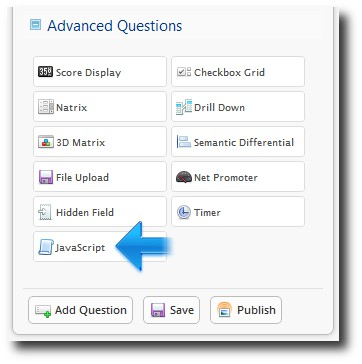
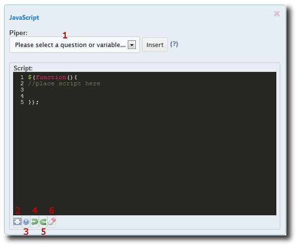
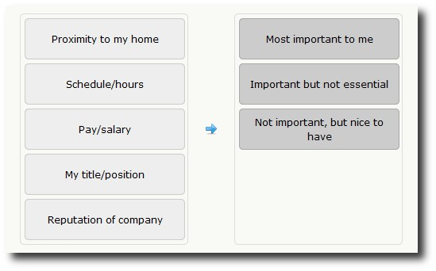

September
---------

Improved JavaScript Support in our Survey Software
^^^^^^^^^^^^^^^^^^^^^^^^^^^^^^^^^^^^^^^^^^^^^^^^^^

If you’re currently subscribing to either the Ultra or Enterprise survey software plan for FluidSurveys, you may have noticed a new Advanced Question type has recently appeared in your repertoire.

Today we’ll be exploring this new JavaScript question type and showing you what it can do in our survey software!



It’s worth mentioning that you were always able to type JavaScript code into certain questions in your survey, but there are some valuable improvements being made with this new question type:

	* You can now collect your JavaScript code into a single place for each page of your survey, making it easier to locate and work with,
	* We’ve included a built-in JavaScript editor complete with syntax highlighting,
	* You can use our JavaScript builder to easily modify the core components of the question types on your current survey page, and,
	* Administrators can show/hide the JavaScript code in preview mode!

Adding a JavaScript Question Type to your Survey
````````````````````````````````````````````````

Once you drag the JavaScript question type to your survey, you will see the following:



.. list-table:: 
   :widths: 30 70
   :header-rows: 1

   * - Section
     - Description
   * - 1. Select a Variable to Pipe into your JavaScript Code
     - Optionally, you can pipe data from your survey into your JavaScript code to play with.
   * - 2. Expand the Visible Area of the JavaScript Editor.
     - Clicking this button will give you a larger work space and makes coding much easier.

   * - 3. Toggle the JavaScript Builder Window.
     - This button shows & hides the JavaScript Builder, which allows you to build quick blocks of JavaScript code. More on this in a moment…
   * - 4. Undo
     - Undo the last action.
   * - 5. Redo
     - Redo the last action.
   * - 6. Clear
     - Wipe all of the code you added and start over.

NB: Be sure to add an identifier to each question that you want to manipulate with the JavaScript question type, or it will not appear in the Piper drop down (1) or the JavaScript Builder window (3)!

A Quick Example...
``````````````````

A Quick Example …
Let’s suppose you have this plain-jane text response question:


Wouldn’t it be that much more appealing to have the US dollar sign ($) appear directly to the left of the text input field? With the JavaScript Builder, accomplishing this is a cakewalk!

Let’s begin by taking a look at this question in our survey builder:


Notice the “q2″ in the upper-left corner of our question. This means I’ve already given this question an identifier, which is a requirement of what we’re about to do next.

Next, we drag the JavaScript advanced question type onto our survey builder, and click on the button (number (3) in our screenshot above) to show the JavaScript Builder Window:

.. image:: ../../resources/blog/September/05-Survey-Software-JavaScript-Support.jpg
	:scale: 70%
	:alt: JavaScript Question Type
	:align: center
	:class: screenshot

Now we will select the identifier which corresponds to this question from the “Question” drop-down menu, and then select the appropriate option from the “Option” drop-down menu:

.. image:: ../../resources/blog/September/06-Survey-Software-JavaScript-Support.jpg
	:scale: 70%
	:alt: JavaScript Question Type
	:align: center
	:class: screenshot

After we select these two options from our drop-down menus, FluidSurveys automatically populates the code window (the black portion) with the necessary JavaScript code! All we need to do now is replace “INSERT TEXT HERE” with our US dollar sign, and then click “Insert” to add this to our JavaScript question type!

.. image:: ../../resources/blog/September/07-Survey-Software-JavaScript-Support.jpg
	:scale: 70%
	:alt: JavaScript Question Type
	:align: center
	:class: screenshot

Here is what our JavaScript question type looks like after we click “Insert”:

.. image:: ../../resources/blog/September/08-Survey-Software-JavaScript-Support.jpg
	:scale: 70%
	:alt: JavaScript Question Type
	:align: center
	:class: screenshot

So now if we save our survey and preview it, we see the following:

.. image:: ../../resources/blog/September/09-Survey-Software-JavaScript-Support.jpg
	:scale: 70%
	:alt: JavaScript Question Type
	:align: center
	:class: screenshot

Ta da! The US dollar sign now appears next to our text input field as we wanted it to. You should also notice the “Show Script” toggle, which will show or hide the JavaScript code for the administrator. This should prove to be incredibly useful for debugging purposes!

(Another!) New Question Type: the Ranking Question
^^^^^^^^^^^^^^^^^^^^^^^^^^^^^^^^^^^^^^^^^^^^^^^^^^

These are exciting times at FluidSurveys! The developers are working so hard to make our online survey software the best it can be that we can see steam escaping from underneath their door!

We have another goody to unveil for you today: the Ranking Question type. This question type is a cool new way to get your respondents to rank items in order of importance or significance. They simply need to click and drag a variable from the left to the proper choice on the right.

Before we dive into the HOW-TO, here’s a sneak peek at the finished product:



How Do I Add This To My Survey?
```````````````````````````````

Take a seat, and grab a pen and notepad… this is rather complicated.

.. image:: ../../resources/blog/September/02-rankingQuestion.jpg
	:scale: 70%
	:alt: Add Ranking Question
	:align: center
	:class: screenshot

You have to click, and then drag the ‘Ranking Question’ onto your form builder. Boy, I’m exhausted after that explanation!

All Kidding Aside: FluidSurveys is a leader in the development of survey software, hence everything we create and release is designed to be easy to use!

And Now For A Quick Example
```````````````````````````

**Configuration**

.. image:: ../../resources/blog/September/03-rankingQuestion.jpg
	:scale: 70%
	:alt: Ranking Question Choice/Variables and Options
	:align: left
	:class: screenshot

Once you drag the Ranking Question onto your form builder, you will be able to configure it as you see fit.

To our left is a screenshot of the settings we used to create an example Ranking Question for this blog post.

Whatever you type into the ‘Choices’ section will become the “containers” that your respondents drag the ‘Variables’ onto.

So in our example, you can see that the respondents will have 5 Variables that need to be dragged onto 3 Choices.

Please note, however, that it is perfectly acceptable to have the same number of Choices as there are Variables.

