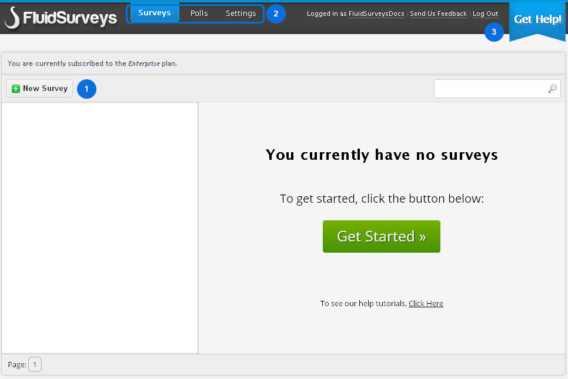
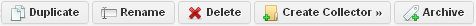
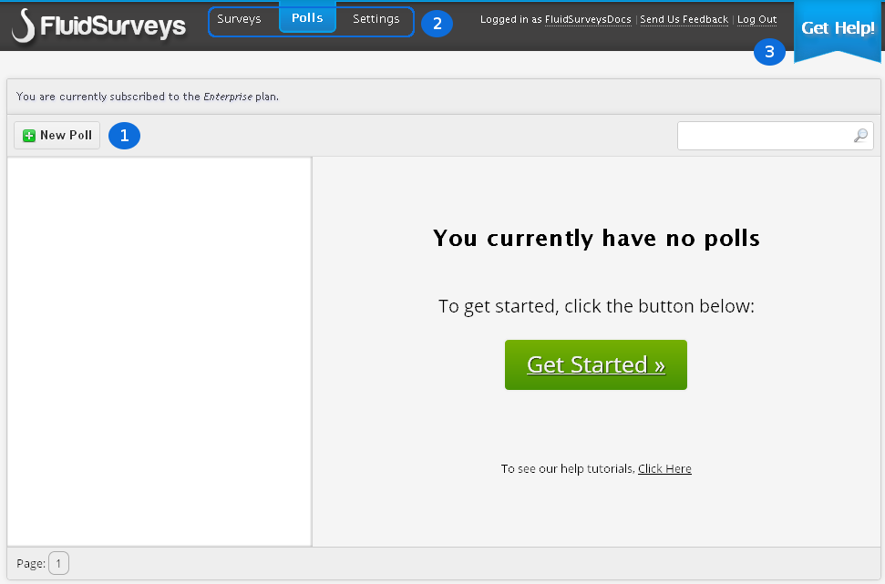
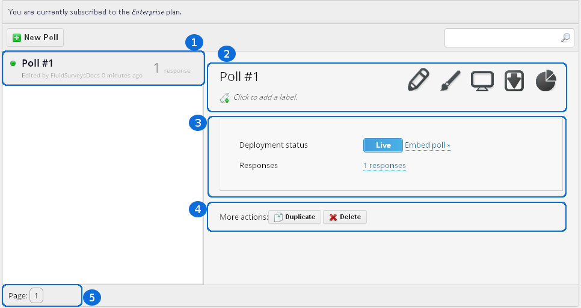
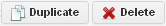
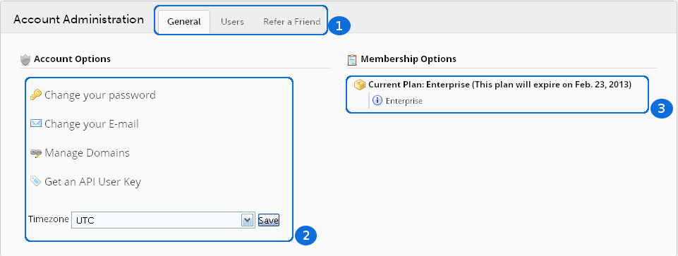
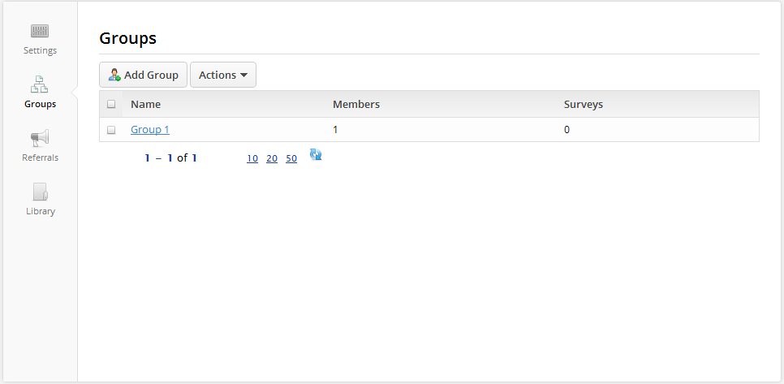
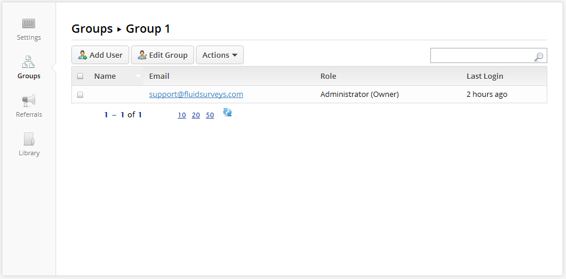
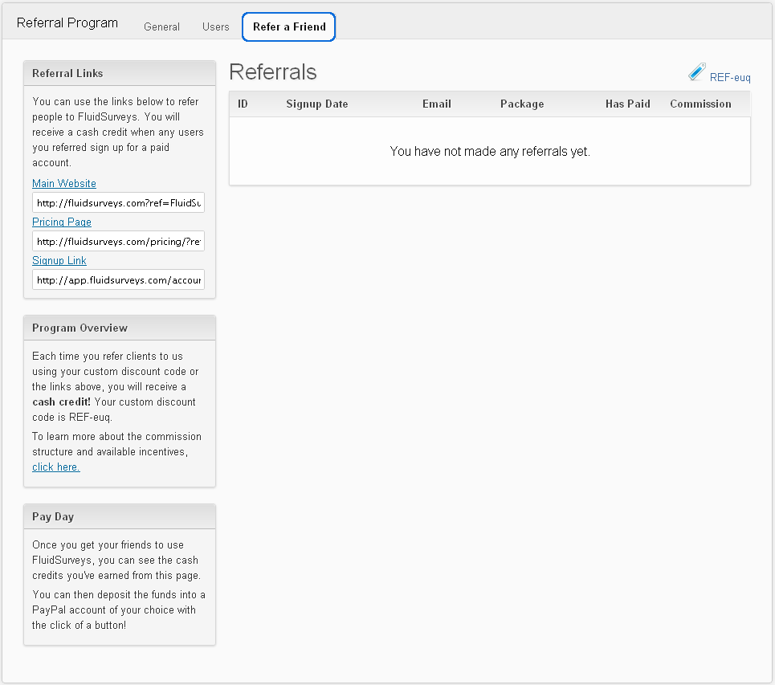

.. _Dashboard:

Dashboard
=========

Eager to get started? This page gives an admirable introduction on how to get started with FluidSurveys.

The Surveys Dashboard is the pivot point for accessing the features of FluidSurveys. From here, you can access:

* Your Surveys
* Your Polls
* Your Account Page

When you have successfully logged into your FluidSurveys account, you will be ready to create your own surveys. There are several options for creating a survey, and we will help you become familiar with them in this chapter. This is the first step you will need to taks as you start teh survey building process

Surveys Dashboard
-----------------

The first screen you'll see when logging into FluidSurveys will be the Surveys Dashboard. In the beginning, there will be no surveys in your account.

	*Figure 3.1* Survey dashboard screen with no Surveys

.. list-table:: 
   :widths: 20 80
   :header-rows: 1

   * - Section
     - Description
   * - 1. New Survey
     - The encompassing 'everything' allowing you to collect responses, multiple pages, questions, and advanced branching logic. 
   * - 2. Quick Links
     - Manage users, billing, passwords, change email address, etc.     
   * - 3. Get Help
     - Whenever aquestion arises that requires the attention, or assistance of a FluidSurveys support member, which includes the 
       ability to track any previous support history requests, click "Get Help" Our response times range from 30 minutes to 1 hour

Over time, the more surveys you create, you will start to see your Surveys Dashboard slowly fill up. A populated Surveys Dashboard presents a few new options:  

 .. figure:: ../../resources/dashboard/populated_survey_list.png
	:align: center
	:class: screenshot
	:alt: Populated Survey Dashboard
	:scale: 70%

	*Figure 3.2* A populated Surveys dashboard

.. list-table:: 
	:widths: 20 80
	:header-rows: 1

	* - Section
	  - Description
	* - 1. Surveys
	  - A list of all surveys either [Live] or [Closed]. Clicking a survey will present the available options found on the right-column.
	* - 2. Quick Links
	  - Save a few clicks with these task icons:

.. image:: ../../resources/dashboard/survey_buttons.png
	:align: center
	:class: screenshot
	:alt: Task Icons
	:scale: 70%

.. list-table::
	:widths: 20 80
	:header-rows: 0

	* - 
	  -
		1. **[Edit]** questions, branching logic
		2. **[Style]** the look and feel
		3. **[Preview]** how the survey appears to a respondent
		4. **[Publish]** your survey, set restrictions, redirections, and other conditions
		5. **[Invite]** people to become respondents of your survey
		6. **[Analyze]** the data in pretty charts, or export the data for futher manipulation
	* - 3. Statistics
	  - A high-level overview of response data held within the survey
	* - 4. Overview
	  - Quickly see the amount of questions, responses, pages and the deployment status
	* - 5. Actions
	  - Action icons are options only found on the Surveys dashboard:

.. list-table::
	:widths: 20 80
	:header-rows: 0

	* - 
	  - 
	  	1. **[Duplicate]** and create a cloned survey
	  	2. **[Rename]** your survey to something else
		3. **[Delete]** your survey from your account
		4. **[Create Collector]** to have layered responses for 1 survey
		5. **[Archive]** your survey from view
	* - 6. Page
	  - Navigate forward and back between multiple pages wherein each page contains 10 of your surveys

Polls Dashboard
---------------

The first screen you'll see when viewing the Polls Dashboard for the first time will be a familiar sight.

	*Figure 3.3* Poll dashboard screen with no Polls

.. list-table:: 
   :widths: 20 80
   :header-rows: 1

   * - Section
     - Description
   * - 1. New Poll
     - The encompassing 'everything' allowing you to collect responses, add choices, and display options 
   * - 2. Quick Links
     - Manage users, billing, passwords, change email address, etc.
   * - 3. Get Help
     - Whenever a question arises that requires the attention, or assistance of a FluidSurveys support member, which includes the ability to track any previous support history requests, click "Get Help" Our response times range from 15 minutes to 1 hour.

Over time, the more polls you create, you will start to see your Polls Dashboard slowly fill up. A populated Polls Dashboard presents a few new options.

	*Figure 3.4* A populated Polls dashboard

.. list-table:: 
	:widths: 20 80
	:header-rows: 1

	* - Section
	  - Description
	* - 1. Polls
	  - A list of all Polls either [Live] or [Closed]. Clicking a Poll will present the available options found on the right-column. 
	* - 2. Quick Links
	  - Save a few clicks with these task icons:

.. image:: ../../resources/dashboard/poll_buttons.png
	:scale: 70%
	:align: center
	:class: screenshot
	:alt: Poll Task Icons Quick Links

.. list-table::
	:widths: 20 80
	:header-rows: 0

	* - 
	  -
		1. **[Edit]** questions, variables and restrictions
		2. **[Style]** the look and feel
		3. **[Preview]** how the Poll appears to a respondent
		4. **[Publish]** your Poll, set restrictions, redirections, and other conditions
		5. **[Share]** your Poll through a social networking web site, or your own site
		6. **[Analyze]** all the response data
	* - 3. Overview
	  - Quickly see the amount of responses, and the deployment status
	* - 4. Actions
	  - Quickly see the amount of questions, responses, pages and the deployment status
	* - 5. Actions
	  - Action icons are options only found on the Polls dashboard:

.. list-table::
	:widths: 20 80
	:header-rows: 0

	* - 
	  - 
	  	1. **[Duplicate]** and create a cloned survey
	  	2. **[Rename]** your survey to something else
		3. **[Delete]** your survey from your account
	* - 6. Page
	  - Navigate forward and back between multiple pages wherein each page contains 10 of your surveys

Settings Dashboard
------------------

The Settings Dashboard is a tool to quickly access account specific administration options

	*Figure 3.5* Account page

.. list-table::
	:widths: 28 78
	:header-rows: 1

	* - Section
	  - Description
	* - 1. Account Tabs
	  - Different sections within the Settings page, such as "Users", and "Refer a Friend"
	* - 2. Account Options
	  - 
	  	1. **[Change your password]**: Passwords must be between 4 and 16 alphanumeric characters.
	  	2. **[Change your E-mail]**: Email Invites are sent using the email address on the account
		3. **[Get an API User Key]**: In order to use our API, you will need an API key. To learn more about the API, please refer to the :ref:`API` section of the documentation
	* - 3. Membership Options
	  - Your FluidSurvey account is one of several plan types: Free, Pro, Ultra, Enterprise. Each plan type has different features, invite emails per month, support options, etc. The [Manage] button allows for switching between plans at any time. 

Users Tab
^^^^^^^^^

Enterprise customers receive the ability to manage Groups, that contain Users who have survey specific permissions (Edit, Test, Publish, Deploy, Analyze). 

	*Figure 3.6* A group with 1 member 

	*Figure 3.6* A group with 1 member with 0 rights

.. list-table:: Users Dashboard
   :widths: 20 80
   :header-rows: 1

   * - Section
     - Description
   * - 1. Select Group...
     - Add or Edit a Group. A Group can then be added to a survey that will allow for those permitted the ability to Edit, Test, 
       Publish, Deploy or Analyze.
   * - 2. Account Users
     - Once a users has been added to a Group, a new set of options will appear that allow for the permission (Role) to be 
       altered

To learn more on how to add, or manage a Group and add a User, please refer to the :ref:`Tutorials` section of the documentation 

Referral Tab
^^^^^^^^^^^^

Spread your love of FluidSurveys with our **Refer a Friend** program. Your friends and colleagues will get a discount when they sign-up, and we'll cut you a cheque for each referral.

Taking advantage of the Refer a Friend program does not require you to have a paid plan. You can sign-up for a free account, distribute the sign-up link and everytime someone signs up using one of your referral links, they'll receive a discount, and we'll deposite *cash* into your PayPal account. 

See the `Refer a Friend program`_ description on FluidSurveys.com

	*Figure 3.7* Refer a Friend with no referrals

.. _Refer a Friend program: http://www.fluidsurveys.com/referrals

To learn more on how to refer a friend, please refer to the :ref:`Tutorials` section of the documentation.

Footer
------

Hot off the press Twitter tweets, blog posts, some of the most abounding tutorials are listed at the absolute bottom for quick access on both the Editor and Dashboards

.. figure:: ../../resources/dashboard/fluidsurveys_footer.png
	:align: center
	:alt: FluidSurveys Footer
	:class: screenshot
	:scale: 70%

	*Figure 3.8* Footer at the bottom of FluidSurveys