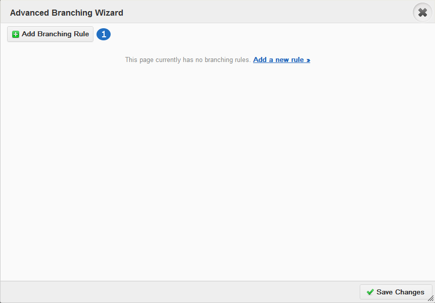
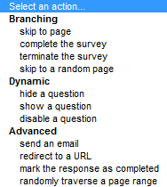
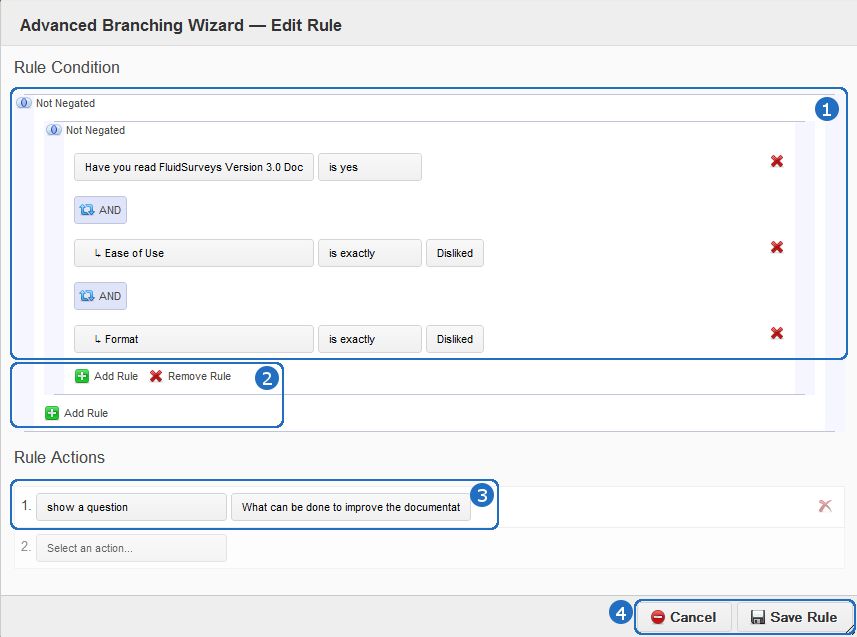
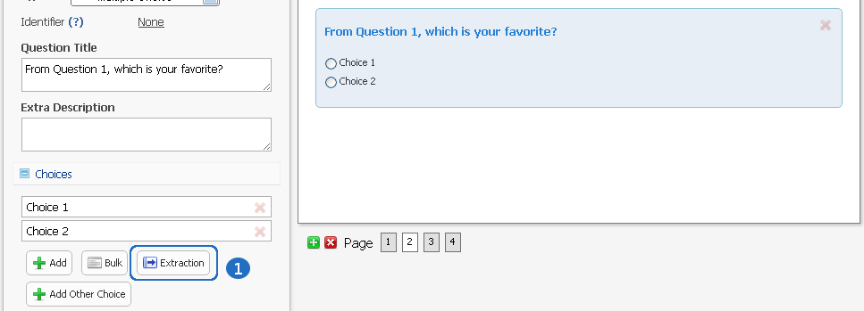
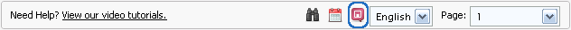

.. _Advanced Features:

Advanced Survey Features
------------------------

This chapter will teach you how to:

* Randomize questions on a page
* How to randomize questions
* Advanced Branching
* Looping
* Fully complete your knowledge banks of FluidSurveys Editor features

Logic
^^^^^

Randomize Questions
^^^^^^^^^^^^^^^^^^^

Jumping
^^^^^^^

Skipping
^^^^^^^^

Looping
^^^^^^^

Quotas
^^^^^^

Piping
^^^^^^

Branching
^^^^^^^^^

Branching is similar to simple skipping in that it allows you to send respondents to different sections of your survey based on their responses. There are however, several differences. With advanced branching, you can skip based on multiple conditions (multiple questions), as well as based on questions on previous pages. You can also implement dynamic on-page skipzping (hide, show, disable questions), and trigger a variety of actions (email messages, terminate the survey, etc). Plus, you can implement branching on additional question types, such as text response fields, grid questions and checkbox (multi-answer) questions. All in all, advanced branching can do everything that simple skipping can + more.

	*Figure 9.1* The first window seen when "Advanced Logic" is clicked

.. list-table:: 
	:widths: 30 70
	:header-rows: 1

	* - Option
	  - Description
	* - 1. Add Branching Logic
	  - Click "Add Branching Logic" to add a rule. Please note that in order to associate branching with a question in your survey, the question must first have a question identifier. To learn how to add an identifier, refer to the Identifier section in the manual.

Every branching logic condition has a quality that will execute when a block has been satisifed. There are 11 choices available to help better farther assist you in customizing your survey to your specific needs.

	*Figure 9.1* Available Logic Branches

.. list-table:: 
	:widths: 40 60
	:header-rows: 1

	* - Option
	  - Description
	* - 1. Page #
	  - Jump to a specific page. You cannotg select a previous page
	* - 2. Finish the survey
	  - Jump to the "Thank you" page. This will mark any response as "Complete". This branching logic is perfect.
	* - 3. Terminate the survey
	  - Jump to the "". This will mark any response as "Incomplete". This branching logic is perfect when you want to keep track of a demographic you may not specifically be tailoring to, ie., a survey only for females, those that watch more than 10 movies a year, etc.
	* - 4. Redirect to a URL
	  - Redirect the respondent to a web site.
	* - 5. Skip to a random page
	  - Randomly jump to a random page. You cannot select a previous page.
	* - 6. Randomly traverse specified range
	  - Jump between specified pages, ie., 4, 10, 11
	* - 7. Hide a question
	  - Based on a response, hide a question from the respondents view outright
	* - 8. Show a question
	  - Based on a response, show a question to the respondents view
	* - 9. Disable a question
	  - Disabling a question will make it so that its choices and variables cannot be selected, ie., greyed out
	* - 10. E-mail...
	  - Email an individual(s) with the satisified branching logic with a customizable Subject, Message, and adjustable Advanced Options
	* - 11. Mark this response as complete
	  - Responses are either Incomplete, or Complete. Based on a condition, some Administrators would want a survey to be marked "Complete" right away based on a response, as opposed to waiting until the [Submit] button is clicked at the end of the survey.

.. warning::

	Randomly traverse specified range has the ability to branch backwards into a survey, but the issue of an infinite recursive looping issue has the possibility of arises. For instance, based on a response, you could go back to Page 2, but if the respondent follows the same path and choices to have the logic loop them back to Page 2, the respondent may grow frustrated, leave your survey, and mark their response group as "Incomplete". It is advised against branching back into a survey.

Branching Logic can include more than 1 condition. It is best to look at logic as a series of logical statements. While it may be confusing to understanding at first glance, breaking down the conditions is as simple as deciding, "if the user selects A&E Root Beer, and if the user selects Barq's Root Beer, then I do not want them to answer the rest of the survey. I want them to leave". A block contains 1 logic condition, as seen in FIGURE <<CHANGE LATER>>

	*Figure 9.1* Logic applied to a page in a survey

.. list-table::
	:widths: 30 70
	:header-rows: 1

	* - Option
	  - Description
	* - 1. Condition 1
	  - If "drinks" contains "A&E" Root Beer AND "drinks" contains Barq's Root Beer, then "Finish the survey"
	* - 2. Condition 2
	  - If "Language" equals English, NOT, then go to page 4
	* - 3. Add Branching Logic
	  - Click "Add Branching Logic" to add a rule. Please note that in order to associate branching with a question in your survey, the question must first have a question identifier. To learn how to add an identifier, refer to the Identifier section in the manual
	* - 4. Otherwise
	  - If any of the above conditions in the survey logic wizard pop-up, 
	* - 5. Control
	  - Save, Cancel, or Reset your advanced branching logic in your survey. 

.. warning::

	It’s not recommended to use advanced branching and simple skipping together. If one is used, the other shouldn’t. Using both could lead to clashing conditions and unexpected results.

Extraction
^^^^^^^^^^

Data extraction is the act or process of retrieving data out of a previous data source for further data processing (in the case with surveys, part of another question). Essentially, data extraction allows the selected choices from one question to appear in a following question. 

Extraction, like all Advanced Logic within FluidSurveys, requires mulitple pages. When extracting choices selected by a respondent, they must reside on a page before the fact.

.. note::

	By default, "Extraction" is disabled

	*Figure 9.1* Randomize choices on the page

.. figure:: ../../resources/editor/select_variable.png
	:align: center
	:scale: 70%
	:alt: Randomize questions on the page
	:class: screenshot

	*Figure 9.1* Randomize choices on the page

.. figure:: ../../resources/editor/final_step.png
	:align: center
	:scale: 70%
	:alt: Randomize questions on the page
	:class: screenshot

	*Figure 9.1* Randomize choices on the page

.. list-table:: 
	:widths: 30 70
	:header-rows: 1

	* - Option
	  - Description
	* - 1. Extraction
	  - Clicking Extraction will lead to the next section that allows for you to choose which question you'd like to extract from
	* - 2. Variable
	  - Select the question with the correct variable name. 
		**Note** You must give the question you're extracting from a variable name
	* -  3. Extracted Choices
	  - Notice how the choices are now all the choices from the previous question. Do not be alarmed by this. Only the choices that the user selects will be shown here. Additionally, you can alter the Extraction choicse to only pull [Inverted Choices], ie, choices other than what they chose, and [Extract Choices], ie., extract only the choices instead of the variables

.. warning::

	You can [Extract From] 

		* Checkbox
		* Multiple Choice Grid
		* Text response grid
		* Dropdown Matrix

	and you can [Extract To] any question except a 3D Matrix

Languages/Translations
^^^^^^^^^^^^^^^^^^^^^^

Languages and Translations are a powerful way to reach a wide target audience by allowing for the surveyor to select from 70+ languages to reside in a single survey. 

	*Figure 9.1* Language option in the Editor

The respondent will then be able to choose the language they would like to take the survey in, by selecting it from a dropdown language bar in the upper right-hand corner of the survey. Regardless of the language selected by the respondent, the data will be overlayed into the one single survey.

When the language button has been selected, a new window will appear that allows for the desired languages to be selected. To add a language, simply move it from the "Available Languages" side to the "Selected Languages" side by using the appropriate arrows, ie., right to add, left to remove.

.. figure:: ../../resources/editor/survey_languages.png
	:align: center
	:scale: 70%
	:alt: Survey Languages Pop-up
	:class: screenshot

	*Figure 9.1* Available Survey Languages

.. list-table:: 
	:widths: 30 70
	:header-rows: 1

	* - Option
	  - Description
	* - 1. Available Languages
	  - Selected the language you wish to have in your survey. There are 70+ languages available to chose from.
	* - 2. Selected Languages
	  - All languages presently in your survey. There is no limit to the amount of languages you can have on a survey.
	* - 3. Default Language
	  - Select the default language. By default, English is the base language
	* - 4. Style
	  - Change the style between Radio Buttons, or a Dropdown menu. By default, the langauge selector is a dropdown menu.

Multiple languages on a survey will become prevalent when using the [Bulk] feature. In order to a smooth transition between mulitple languages, it is advised to be aware of those

.. figure:: ../../resources/editor/multi_language_bulk.png
	:align: center
	:scale: 70%
	:alt: Multi Language Bulk Window
	:class: screenshot

	*Figure 9.1* Bulk Window when dealing with multiple languages

.. warning::

	Only specific sections will be translated, such as [Back], [Next], [Submit], and the "Yes/No" question type. The entirety of the question title/description, its variables and choices will need to be translated by the survey creator. If the scope and size of a survey reaches 50+ questions, spread across 20+ pages, it may be advantageous to use "Mass Translations" to quickly, and efficiently translate the entirety of the content. To learn more, refer to the "Mass Translations" section of the manual

Mass Translations
^^^^^^^^^^^^^^^^^

Being able to deliver online surveys around the world can bring a host of new challenges. One of these challenges is language barriers – someone who doesn’t speak the survey language wouldn’t be able to respond. FluidSurveys already allows for the translation of all aspects of your survey – the questions, buttons, errors and warnings. However, you have to translate your questions in the editor, and the buttons on the settings page, and you have to switch between languages each time you need to translate something. We’ve devised a solution to this slow workflow: Mass Survey Translation.

Mass Translations can be found under [Publish]. 

.. figure:: ../../resources/editor/mass_translate_section.png
	:align: center
	:scale: 70%
	:alt: Mass Translate Section
	:class: screenshot

	*Figure 9.1* Mass Translate French for a survey

.. list-table:: 
	:widths: 35 65
	:header-rows: 1

	* - Option
	  - Description
	* - 1. Translate For
	  - Select from the dropdown the language you'd like to translate
	* - 2. Download French Template
	  - If the French languag was selected from the dropdown, then the French language template is available for download. Whichever language was selected, that will become the deciding factor for this section
	* - 3. Download All Languages
	  - If there are multiple languages within a survey, it may be more advantageous to download all languages in bulk, as opposed to translating each separately, ie., all languages will download into a .zip file
	* - 4. Upload Data
	  - Once the translations have been completed, re-upload the templates so they can be reflected online

.. figure:: ../../resources/editor/mass_translation_infile.png
	:align: center
	:scale: 70%
	:alt: Mass Translation French File in Editor
	:class: screenshot

	*Figure 9.1* Mass Translation French file in Editor

.. list-table::
	:widths: 35 65
	:header-rows: 1

	* - Option
	  - Description
	* - 1. Survey Language
	  - Each language will have a specific code that allows for you to quickly identifiy which file you are presently translating. Example of such languages
		    * fr = French
		    * en = English
		    * de = German
		    * es = Spanish
		    * ar = Arabic
	* - 2. Question Titles/Variables
	  - A row represents a chunk of your question. The first 2 rows, "msgid" and "msgstr", which both contain "Question 1", are the question titles.

.. warning::

	It is not advised to change the first row, "msgid" within the translation file. The "msgid" row refers to the default language text. If the default survey language is English, yet you are altering the French language file, then "Question 1" is what ties any changes made back to the:

		1. That question, ie., Question 1
		2. The foundation language text

	If the first row is changed, then you will receive a new translation file the next time you download the text file, or the [Upload] process may not work. Therefore, changing the first instance of "msgid" is advised against.

