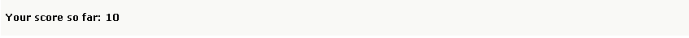
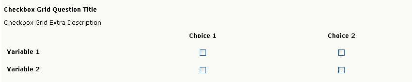
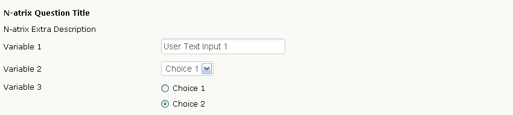
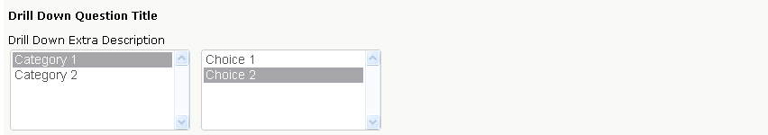
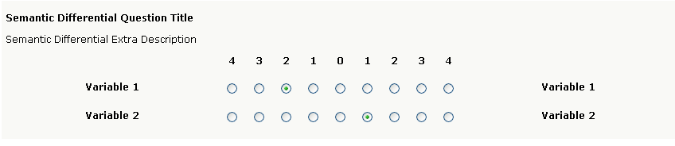
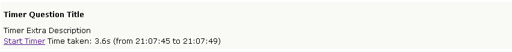

Advanced Questions
------------------

Score Display
^^^^^^^^^^^^^

In brief, the Score Display question type is essentially what it says, a score display. The question type can be used primarily for either tallying a score in an online quiz, or for calculating of financial. A Score Display comes into good use when the Score for each variable or choice in, say, a Multiple Choice question has a value.

	*Figure 5.1* Score Display Question Type

.. list-table:: Display Options
   :widths: 35 65
   :header-rows: 1

   * - Display Options
     - Description
   * - 1. Display side-by-side
     - Display side-by-side: This option allows for you to display the question type beside another question. By default, this option is disabled
   * - 2. Append to previous question
     - This question type will be appended to the question directly before it. By default, this option is disabled.
   * - 3. Width
     - You can adjust the width based on a percentage. By default, the value is 100%.

Checkbox Grid
^^^^^^^^^^^^^

Similar to other grids, you have the same types of options available, such as specifying scores for answers, and forcing variables to be unique. The display options are similar to other grids in FluidSurveys.. Similar to other grids, you have the same types of options available, such as specifying scores for answers, and forcing variables to be unique. The display options are similar to other grids in FluidSurveys.

	*Figure 5.1* Checkbox Grid Question Type

.. list-table:: Display Options
   :widths: 35 65
   :header-rows: 1

   * - Display Option
     - Description
   * - 1. Make First Column Static
     - Forces the first column to always be present. By default, this option is disabled.
   * - 2. 1st Column Size.
     - Adjusts the first columns width. By default, this option is 30%
   * - 3. Display side-by-side.
     - This option allows for you to display the question type beside another question as seen in the image to the left. By default, this option is disabled.
   * - 4. Append to previous question
     - The question is attached to the question which precedes it in the survey. By default, this option is disabled
   * - 5. Width
     - You can adjust the width based on a percentage. By default, the value is 100%.
   * - 6. Show Borders
     - Show borders around the question type. By default, this option is disabled.
   * - 7. Alternate Background Color
     - Each row will be an alternate color. By default, this option is disabled.

.. list-table:: Options
   :widths: 35 65
   :header-rows: 1

   * - Options
     - Description
   * - 1. Randomize Variables
     - Selecting this option will randomize the choices within the Checkbox question type on each survey refresh. By default, this option is disabled
   * - 2. Alphabetize Variables
     - Choices within your Checkbox will follow alphabetization (A-Z). By default, this option is disabled
   * - 3. Force Unique
     - Force a choice in a column to remain unique. No two options in a column can be identical. By default, this option is disabled.

N-atrix
^^^^^^^

The N-Atrix Question type allows for any question type to exist on any given row, such as text response, dropdown, checkboxes or radio buttons. A typical use for such a question type, is asking for detailed personal information where the types of questions can range between the available types (Dropdown for title, Text area for Name, or a Checkbox/Radio Button for types of phone numbers, or contact times). To change the question type of a row, click on the "Variables" on the left-hand side, and select "Switch to type"

	*Figure 5.1* N-Atrix Question Type

.. list-table:: Display Options
   :widths: 35 65
   :header-rows: 1

   * - Display Option
     - Description
   * - 1. 1st Column Size
     - Adjusts the first columns width. By default, this option is 30%
   * - 2. Display side-by-side
     - Display side-by-side: This option allows for you to display the question type beside another question. By default, this option is disabled
   * - 3. Append to previous question
     - This question type will be appended to the question directly before it. By default, this option is disabled.
   * - 4. Width
     - You can adjust the width based on a percentage. By default, the value is 100%.

A n-atrix has the following Question Choices available

 * Switch to type
 * Optional
 * Multiline

Drill Down
^^^^^^^^^^

Drill Down questions allow respondents to select an answer by narrowing down their choice from a general category to a specific category. For example, you could first have respondents select which state they reside in, and then select which city within that state they reside in.

	*Figure 5.1* Drill Down Question Type

.. list-table:: Display Options
   :widths: 35 65
   :header-rows: 1

   * - Display Option
     - Description
   * - 1. Appearance
     - By default, Default (Vertical) is selected. The available appearance choices are dropdown, and likert. They appear exactly as their respective parts.
   * - 2. Randomize choices
     - Selecting this option will randomize the choices within the Checkbox question type on each survey refresh. By default, this option is disabled
   * - 3. Alphabetize choices
     - Choices within your Checkbox will follow alphabetization (A-Z). By default, this option is disabled
   * - 4. Display side-by-side
     - Display side-by-side: This option allows for you to display the question type beside another question. By default, this option is disabled
   * - 5. Append to previous question
     - This question type will be appended to the question directly before it. By default, this option is disabled.
   * - 6. Width
     - You can adjust the width based on a percentage. By default, the value is 100%.

.. list-table:: Options
   :widths: 35 65
   :header-rows: 1

   * - Options
     - Description
   * - 1. Optional
     - Unchecking this option forces the question to be answered when the user is filling out your survey. By default, this option is enabled

3D Matrix
^^^^^^^^^

Similar to the N-Atrix question type, a 3D Matrix question can have different question types within each column. A 3D Matrix question is an amazing source of information when you are trying to get as much information within one question, in so far that the reports generated by responses for a 3D Matrix are broken up into pieces, as seen in the example under section 130.2

.. figure:: ../../resources/editor/3dmatrix.png
	:align: center
	:scale: 70%
	:alt: 3D Matrix Question Type
	:class: screenshot

	*Figure 5.1* 3D Matrix Question Type

.. list-table:: Display Options
   :widths: 35 65
   :header-rows: 1

   * - Display Option
     - Description
   * - 1. Make First Column Static
     - Forces the first column to always be present. By default, this option is disabled.
   * - 2. 1st Column Size.
     - Adjusts the first columns width. By default, this option is 30%
   * - 3. Top left Label
     - Attaches a label to the top left of the 3D Matrix. By default, this option is blank.
   * - 4. Sum Label
     - The label, Total, will reside beside numeric validation, if any, to indicate the Total. By default, this option is “Total”
   * - 5. Display side-by-side.
     - This option allows for you to display the question type beside another question as seen in the image to the left. By default, this option is disabled.
   * - 6. Append to previous question
     - The question is attached to the question which precedes it in the survey. By default, this option is disabled
   * - 7. Width
     - You can adjust the width based on a percentage. By default, the value is 100%.
   * - 8. Show Borders
     - Show borders around the question type. By default, this option is disabled.
   * - 9. Alternate Background Color
     - Each row will be an alternate color. By default, this option is disabled.

.. list-table:: Options
   :widths: 35 65
   :header-rows: 1

   * - Options
     - Description
   * - 1. Randomize Variables
     - Selecting this option will randomize the choices within the Checkbox question type on each survey refresh. By default, this option is disabled
   * - 2. Alphabetize Variables
     - Choices within your Checkbox will follow alphabetization (A-Z). By default, this option is disabled
   * - 3. Force Unique
     - Force a choice in a column to remain unique. No two options in a column can be identical. By default, this option is disabled.

Semantic Differential
^^^^^^^^^^^^^^^^^^^^^

A Semantic Differential question allows respondents to rate a variable, or set of variables, on a scale of choices such as “Y to X” or “Very Unsatisfied to Very Satisfied”. The labels are shown at either ends of the question, and the choices are shown horizontally.

This is a great question type to use if you want respondents to rank a specific, or set of items. For example, if you wanted to know how customers felt about your customer service and affordability on a scale of “Very Poor to Great”, you could use a Semantic Differential question.

	*Figure 5.1* Semantic Differential Question Type

.. list-table:: Display Options
   :widths: 35 65
   :header-rows: 1

   * - Display Option
     - Description
   * - 1. 1st Column Size.
     - Adjusts the first columns width. By default, this option is 30%
   * - 2. Display side-by-side.
     - This option allows for you to display the question type beside another question as seen in the image to the left. By default, this option is disabled.
   * - 3. Append to previous question
     - The question is attached to the question which precedes it in the survey. By default, this option is disabled
   * - 4. Width
     - You can adjust the width based on a percentage. By default, the value is 100%.
   * - 5. Show Borders
     - Show borders around the question type. By default, this option is disabled.
   * - 6. Alternate Background Color
     - Each row will be an alternate color. By default, this option is disabled.

.. list-table:: Options
   :widths: 35 65
   :header-rows: 1

   * - Options
     - Description
   * - 1. Randomize Variables
     - Selecting this option will randomize the choices within the Checkbox question type on each survey refresh. By default, this option is disabled
   * - 2. Alphabetize Variables
     - Choices within your Checkbox will follow alphabetization (A-Z). By default, this option is disabled
   * - 3. Force Unique
     - Force a choice in a column to remain unique. No two options in a column can be identical. By default, this option is disabled.

File Upload
^^^^^^^^^^^

File upload questions allows respondents to upload files alongside their responses. For example, a respondent could upload their resume, a video, pictures, etc. There’s no limit on the type of file that can be uploaded, or on the number of files.

In analytics, the survey administrator will have the option of viewing, or downloading, the uploaded file.

.. figure:: ../../resources/editor/file_upload.png
	:align: center
	:scale: 70%
	:alt: File Upload Question Type
	:class: screenshot

	*Figure 5.1* File Upload Question Type

.. list-table:: Display Options
   :widths: 35 65
   :header-rows: 1

   * - Display Option
     - Description
   * - 1. Display side-by-side.
     - This option allows for you to display the question type beside another question as seen in the image to the left. By default, this option is disabled.
   * - 2. Append to previous question
     - The question is attached to the question which precedes it in the survey. By default, this option is disabled
   * - 3. Width
     - You can adjust the width based on a percentage. By default, the value is 100%.

.. list-table:: Options
   :widths: 35 65
   :header-rows: 1

   * - Options
     - Description
   * - 1. Optional
     - Unchecking this option forces the question to be answered when the user is filling out your survey. By default, this option is enabled
   * - 2. Upload to another server
     - Selecting this option will allow for you to upload any files the user provides to an entirely different server, separate from FluidSurveys

Net Promoter
^^^^^^^^^^^^

The Net Promoter question type is a fast and easy way for an organization to obtain their Net Promoter Score :sup:`®`

It appears as a likert scale and can be inserted anywhere within a survey. The question asks respondents to rate how likely they’d be to recommend your offering to a friend, on a scale of “Not Likely at All to Very Likely”.

In Analytics, your Net Promoter Score :sup:`®` is automatically calculated by taking the % of people who gave you a score of 9 or 10 (promoters) and subtracting the % of people who gave you a score of 0-6 (detractors).

.. figure:: ../../resources/editor/net_promoter.png
	:align: center
	:scale: 70%
	:alt: Net Promoter Question Type
	:class: screenshot

	*Figure 5.1* Net Promoter Question Type

.. list-table:: Display Options
   :widths: 35 65
   :header-rows: 1

   * - Display Option
     - Description
   * - 1. Flip choice order
     - Change the wording for the **Left Label** and **Right Label**
   * - 2. Display side-by-side.
     - This option allows for you to display the question type beside another question as seen in the image to the left. By default, this option is disabled.
   * - 3. Append to previous question
     - The question is attached to the question which precedes it in the survey. By default, this option is disabled
   * - 4. Width
     - You can adjust the width based on a percentage. By default, the value is 100%.

.. list-table:: Options
   :widths: 35 65
   :header-rows: 1

   * - Display Option
     - Description
   * - 1. Optional
     - Unchecking this option forces the question to be answered when the user is filling out your survey. By default, this option is enabled

Hidden Field
^^^^^^^^^^^^

Hidden fields are questions that are only visible to the survey creator while editing the survey. They do not appear to respondents; however, the contents do appear in Analytics alongside responses.

Hidden fields can store existing information, trigger survey logic, etc.

**A Possible Use Case**

A survey creator might have a variety of information about their respondents already in their records, such as their name, age, phone number, etc. Since they already have this information, there’s no need to ask for it in the survey.

However, they may want to trigger survey logic based on some of this information. For example, show respondents in different age groups different questions.

They can now pipe information from their contact list into a hidden field(s), and then create a branching condition based on it. In this case, they could say: If hidden field is 18 years old, show Question 1.

.. figure:: ../../resources/editor/hidden_field.png
	:align: center
	:scale: 70%
	:alt: Hidden Field Question Type
	:class: screenshot

	*Figure 5.1* Hidden Field Question Type

Timer
^^^^^

Timer questions are perfect for tablets, or even for online quizzes, that allow for you to time exactly when an individual started their survey, and how long it took for them to complete it.

	*Figure 5.1* Timer Question Type