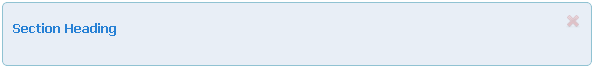
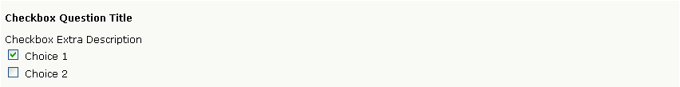
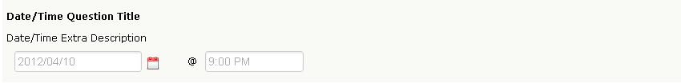
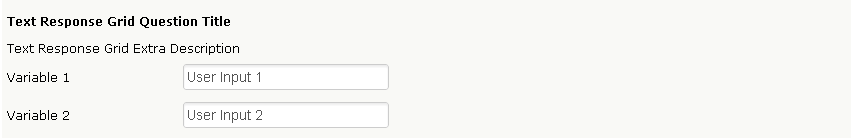
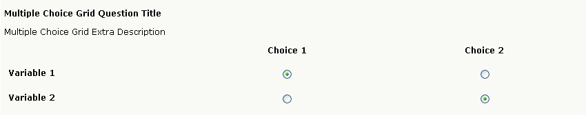

Basic Questions
---------------

The complete set of question types are available to Enterprise customers.

.. note::

	To learn more about each question types available Options, please refer to the :ref:`Question Options` section of the manual.

Section Heading
^^^^^^^^^^^^^^^

Section Heading allow survey creators to include text within their survey without actually asking a question. It can be used to include an introduction or some explanatory text in your survey, pictures, endnotes, etc. If ever you simply need to convey a message without explicitly asking a question, then a Section Heading can satisfy such a role.

	*Figure 6.1* Section Heading Question Type

.. list-table:: Display Options
   :widths: 35 65
   :header-rows: 1

   * - Display Option
     - Description
   * - 1. Display side-by-side
     - This option allows for you to display the question type beside another question as seen in the image to the left. By default, this option is disabled.
   * - 2. Append to previous question
     - This question type will be appended to the question directly before it. By default, this option is disabled.
   * - 3. Width
     - You can adjust the width based on a percentage. By default, the value is 100%.

.. note::

	Despite being able to provide a Section Heading with a unique identifier, you cannot attach advanced logic branching rules to the question type.

Yes/No
^^^^^^

A Yes/No question type is the simplest question type that we have. It has a default scoring mechanism of 1 (Yes) and 2 (No), and the choices are translated to their appropriate language when multiple languages resides on a survey. Yes/No questions are perfect when you need quick and easy page skipping based on the response.

.. figure:: ../../resources/editor/yes_no.png
	:scale: 70%
	:align: center
	:class: screenshot
	:alt: Yes No 

	*Figure 6.1* Yes/No Question Type

Including multiple languages on your survey will automatically include the appropriate translation for “Yes/No”. Therefore, Yes/No questions by default become perfect tools as “Do you agree?” pivot questions. 

.. figure:: ../../resources/editor/yes_no_french.png
	:scale: 70%
	:align: center
	:class: screenshot
	:alt: Yes No French

	*Figure 6.1* Yes/No Question Type in French

.. list-table:: Display Options
   :widths: 35 65
   :header-rows: 1

   * - Display Option
     - Description
   * - 1. Display side-by-side
     - This option allows for you to display the question type beside another question as seen in the image to the left. By default, this option is disabled.
   * - 2. Append to previous question
     - This question type will be appended to the question directly before it. By default, this option is disabled.
   * - 3. Width
     - You can adjust the width based on a percentage. By default, the value is 100%.

.. list-table:: Options
   :widths: 35 65
   :header-rows: 1

   * - Options 
     - Description
   * - 1. Optional
     - Unchecking this option forces the question to be answered when the user is filling out your survey. By default, this option is enabled
   * - 2. “Yes” skips to page
     - If the user selects, "Yes" as an answer, then they can jump to a defined page. By default, this option is disabled.
   * - 3. “No” skips to page
     - Conversely, if the user selects “No” as an answer, then you can jump to a defined page. By default, this option is disabled

.. note::

	The "Question Title" and "Extra Description" are not automatically translated by FluidSurveys. They will need to be translated separately.

Text Response
^^^^^^^^^^^^^

A Text Response question type allows for surveyors to ask a user to type either the answer out, or provide specific textual information (phone number, address, etc…). Text Response questions come with text validation ranging from Email addresses, Currency, all the way to Percentages.

.. figure:: ../../resources/editor/text_response.png
	:scale: 70%
	:align: center
	:class: screenshot
	:alt: Text Response

	*Figure 6.1* Text Response Question Type

Enabling the Multiline option and indicating the number of columns can create the perfect opportunity for allowing users to fill in text, which can also be restricted to a certain amount of words. The example below has a Text Response question type with multiline enabled, 50 columns, and All Characters validation of 2000 (roughly 200 words) which will cease to accept words after that point.

.. figure:: ../../resources/editor/text_response_customized.png
	:scale: 70%
	:align: center
	:class: screenshot
	:alt: Customized Text Response

	*Figure 6.1* Text Response with 100 columns and 10 rows

.. list-table:: Display Options
   :widths: 35 65
   :header-rows: 1

   * - Display Option
     - Description
   * - 1. Multiline
     - Allows for the text area to have multiple lines and columns. By default this option is disabled
   * - 2. Display side-by-side
     - This option allows for you to display the question type beside another question as seen in the image to the left. By default, this option is disabled
   * - 3. Append to previous question
     - This question type will be appended to the question directly before it. By default, this option is disabled
   * - 4. Width
     - You can adjust the width based on a percentage. By default, the value is 100%.

.. list-table:: Options
   :widths: 35 65
   :header-rows: 1

   * - Options
     - Description
   * - 1. Optional
     - Unchecking this option forces the question to be answered when the user is filling out your survey. By default, this option is enabled
   * - 2. Validation
     - Specific to the question. If you wish for the user to input an e-mail address, then selecting the appropriate form of validation will get those desired results. By default, this option is None 
   * - 3. Initial Value
     - Presents a default choice to the user. By default, this area is blank

Checkbox
^^^^^^^^

The checkbox question type is a multi-answer question, as in you can select more than one answer. Checkbox choice can contain a text response (which can have Validation) beside each choice, as well as an “Other, Please Specify” option which is an exclusive choice (Selecting it, or typing into the text area, will automatically deselect all options and select the other). 

	*Figure 6.1* Checkbox Question Type

.. list-table:: Display Options
   :widths: 35 65
   :header-rows: 1

   * - Display Option
     - Description
   * - 1. Appearance
     - By default, Default (Vertical) is selected.
   * - 2. Columns
     - Adjusting the amount of columns allows for By default, One column is selected.
   * - 3. Display side-by-side
     - Display side-by-side: This option allows for you to display the question type beside another question. By default, this option is disabled
   * - 4. Append to previous question
     - This question type will be appended to the question directly before it. By default, this option is disabled.
   * - 5. Width
     - You can adjust the width based on a percentage. By default, the value is 100%.

.. list-table:: Options
   :widths: 35 65
   :header-rows: 1

   * - Display Option
     - Description
   * - 1. Optional
     - Unchecking this option forces the question to be answered when the user is filling out your survey. By default, this option is enabled
   * - 2. Randomize choices
     - Selecting this option will randomize the choices within the Checkbox question type on each survey refresh. By default, this option is disabled. 
   * - 3. Alphabetize choices
     - Choices within your Checkbox will follow alphabetization (A-Z). By default, this option is disabled
   * - 4. Restrict number of selected choices
     - Restrict the number of choices a user can select before the question is disabled. By default, this option is disabled

A checkbox has the following Question Choices avaialble

  * Exclusive Choice
  * Select All
  * Add text response
  * Static Choice

Multiple Choice
^^^^^^^^^^^^^^^

The Multiple choice question type, commonly referred to as the single choice question type, allows for a user to provide one answer per question, whereas a checkbox question type allows for the user to specify more than one answer. Each choice has branching, skipping, and validation capabilities available. The display options are slightly different, in that you can change the views (Horizontal, Vertical, Combo box, Star Rating – see blow –). Star Ratings, generally used for a rating between 1 and an end value, allow for the rating to exist on a horizontal star level. 

.. figure:: ../../resources/editor/multiple_choice.png
	:scale: 70%
	:align: center
	:class: screenshot
	:alt: Multiple Choice Question Type

	*Figure 6.1* Multiple Choice Question Type

.. list-table:: Display Options
   :widths: 35 65
   :header-rows: 1

   * - Display Option
     - Description
   * - 1. Appearance
     - By default, Default (Vertical) is selected.
   * - 2. Columns
     - Adjusting the amount of columns allows for By default, One column is selected.
   * - 3. Display side-by-side
     - Display side-by-side: This option allows for you to display the question type beside another question. By default, this option is disabled
   * - 4. Append to previous question
     - This question type will be appended to the question directly before it. By default, this option is disabled.
   * - 5. Width
     - You can adjust the width based on a percentage. By default, the value is 100%.

.. list-table:: Options
   :widths: 35 65
   :header-rows: 1

   * - Options
     - Description
   * - 1. Optional
     - Unchecking this option forces the question to be answered when the user is filling out your survey. By default, this option is enabled
   * - 2. Randomize choices
     - Selecting this option will randomize the choices within the Checkbox question type on each survey refresh. By default, this option is disabled. 
   * - 3. Alphabetize choices
     - Choices within your Checkbox will follow alphabetization (A-Z). By default, this option is disabled
   * - 4. Initial Value
     - Allows you to specificy pre-populated answers to questions in your survey. By default, this option is blank "---"

A multiple choice question type as the following Question Choices Available

  * Add text response
  * Static Choice
  * Score
  * Branch to

Dropdown
^^^^^^^^

The dropdown question type is exactly what the name entails; an answer found and selected in a dropdown fashion. Also, similarly to a multiple choice question, the dropdown question type allows for only one answer. 

.. figure:: ../../resources/editor/drop_down.png
	:scale: 70%
	:align: center
	:class: screenshot
	:alt: Dropdown Question Type

	*Figure 6.1* Dropdown Question Type

.. list-table:: Display Options
   :widths: 35 65
   :header-rows: 1

   * - Display Option
     - Description
   * - 1. Display side-by-side
     - Display side-by-side: This option allows for you to display the question type beside another question. By default, this option is disabled
   * - 2. Append to previous question
     - This question type will be appended to the question directly before it. By default, this option is disabled.
   * - 3. Width
     - You can adjust the width based on a percentage. By default, the value is 100%.

.. list-table:: Options
   :widths: 35 65
   :header-rows: 1

   * - Option
     - Description
   * - 1. Optional
     - Unchecking this option forces the question to be answered when the user is filling out your survey. By default, this option is enabled
   * - 2. Randomize choices
     - Selecting this option will randomize the choices within the Checkbox question type on each survey refresh. By default, this option is disabled. 
   * - 3. Alphabetize choices
     - Choices within your Checkbox will follow alphabetization (A-Z). By default, this option is disabled
   * - 4. Initial Value
     - Specifies if the question will load with a choice. By default, this option is disabled
   * - 5. Blank Choice
     - The initial value is displayed, indicating that a selection has not been made. Note, this will not count towards a response if selected

A dropdown question type has the following Question Choices Available

 * Static Choice
 * Score
 * Branc to

Date/Time
^^^^^^^^^

A Date/Time question allows for the user to select a specific year, month, day as seen below. Date/Time questions are perfect when either trying to determine when an incident happened, or even when finding the perfect time to have a meeting. The question type essentially allows for a user to record the date and time with five types of configurations; Date/Time, Date Only, Time Only, Date/Month, and Month/Year.

The default display format is Date/Time. 

	*Figure 6.1* Date/Time Question Type

The Date/Time can be customized to accepted either only:

	* Date/Time
	* Date only
	* Time only
	* Day/Month 
	* Month/Year

.. list-table:: Display Options
   :widths: 35 65
   :header-rows: 1

   * - Display Option
     - Description
   * - 1. Display side-by-side
     - Display side-by-side: This option allows for you to display the question type beside another question. By default, this option is disabled
   * - 2. Append to previous question
     - This question type will be appended to the question directly before it. By default, this option is disabled.
   * - 3. Width
     - You can adjust the width based on a percentage. By default, the value is 100%.
   * - 4. Show Record Now Button
     - This option is useful for recording timestamps in surveys. Selecting this option adds a button which, when pressed, records the current time. Note that this disables manually changing the date/time value.

.. list-table:: Options
   :widths: 35 65
   :header-rows: 1

   * - Options
     - Description
   * - 1. Optional
     - Unchecking this option forces the question to be answered when the user is filling out your survey. By default, this option is enabled
   * - 2. Display Format
     - The question type can be altered to ask Date/Time, Date Only, Time Only, Date/Month or Month/Year. Date/Time is the default question
   * - 3. Timezone
     - Enabling this feature will create a dropdown for the user to select their appropriate timezone. By default, this option is disabled.
   * - 4. Set to now by default
     - When the survey is loaded, the time will be populated into the date field
   * - 5. Show "Record Now" button
     - As opposed to forcing the individual to type in the time, eg., 14:58, it is possible to allow for them to click "Record Now" which will input the correct current time
   * - 6. Initial Date
     - Chose an initial value for the date. The format is YYYY/MM/DD
   * - 7. Initial Time
     - Chose an initial value for the time

.. note:: 

	Despite not accepting military standard time, if the user enters 21:00, the question type will convert it to 9:00 pm

Text Response Grid
^^^^^^^^^^^^^^^^^^

In short, a Text Response Grid allows for the surveyor to ask a series of question with a set of validation types applied (Numerical, Text only, All Characters, etc…) which will present an error to the user if the validation was not adhered to. 

	*Figure 6.1* Text Response Grid Question Type

.. list-table:: Display Options
   :widths: 35 65
   :header-rows: 1

   * - Display Option
     - Description
   * - 1. 1st Column Size
     - Adjusts the first columns width. By default, this option is 30%
   * - 2. Display side-by-side
     - Display side-by-side: This option allows for you to display the question type beside another question. By default, this option is disabled
   * - 3. Append to previous question
     - This question type will be appended to the question directly before it. By default, this option is disabled.
   * - 4. Width
     - You can adjust the width based on a percentage. By default, the value is 100%.

.. list-table:: Options
   :widths: 35 65
   :header-rows: 1

   * - Options
     - Description
   * - 1. Randomize Variables
     - Selecting this option will randomize the choices within the Checkbox question type on each survey refresh. By default, this option is disabled
   * - 2. Alphabetize Variables
     - Choices within your Checkbox will follow alphabetization (A-Z). By default, this option is disabled
   * - 3. Force Unique
     - Force a choice in a column to remain unique. No two options in a column can be identical. By default, this option is disabled.
   * - 4. Sum
     - If a value is provided, 20 for instance, then all numerical values within the Text Response Grid must add up to that ceiling. This option is blank by default.
   * - 5. Sum Label
     - By default, this option is “The values should add up to {x}. Currently: {y}”, where x represents the required value, eg., 100, while y indicates the values presently entered, eg., 98

A text response grid question type has the following Question Choice available

 * Optional
 * Multiline
 * Columns

Multiple Choice Grid
^^^^^^^^^^^^^^^^^^^^

The Multiple Choice Grid question type is in essence a Likert question. This question type heralds in a new option, make column static, which will keep the most left column (with all the variables in question) static as you drag the scrollbar to the right. 

	*Figure 6.1* Multiple Choice Grid Question Type

.. list-table:: Display Options
   :widths: 35 65
   :header-rows: 1

   * - Display Option
     - Description
   * - 1. Make First Column Static
     - Forces the first column to always be present. By default, this option is disabled.
   * - 2. 1st Column Size.
     - Adjusts the first columns width. By default, this option is 30%
   * - 3. Display side-by-side.
     - This option allows for you to display the question type beside another question as seen in the image to the left. By default, this option is disabled.
   * - 4. Append to previous question
     - The question is attached to the question which precedes it in the survey. By default, this option is disabled
   * - 5. Width
     - You can adjust the width based on a percentage. By default, the value is 100%.
   * - 6. Show Borders
     - Show borders around the question type. By default, this option is disabled.
   * - 7. Alternate Background Color
     - Each row will be an alternate color. By default, this option is disabled.

.. list-table:: Options
   :widths: 35 65
   :header-rows: 1

   * - Options
     - Description
   * - 1. Randomize Variables
     - Selecting this option will randomize the choices within the Checkbox question type on each survey refresh. By default, this option is disabled
   * - 2. Alphabetize Variables
     - Choices within your Checkbox will follow alphabetization (A-Z). By default, this option is disabled
   * - 3. Force Unique
     - Force a choice in a column to remain unique. No two options in a column can be identical. By default, this option is disabled.

Dropdown Grid
^^^^^^^^^^^^^

Dropdown Grid is similar to its sibling, the dropdown question, in that it is still similar to a multiple choice question, with a single answer only. This  is the direct opposite of a checkbox question, which can have many answers. 

.. figure:: ../../resources/editor/drop_down_grid.png
	:scale: 70%
	:align: center
	:class: screenshot
	:alt: Dropdown Grid Question Type

	*Figure 6.1* Dropdown Grid Question Type

.. list-table:: Display Options
   :widths: 35 65
   :header-rows: 1

   * - Display Option
     - Description
   * - 1. 1st Column Size.
     - Adjusts the first columns width. By default, this option is 30%
   * - 2. Display side-by-side.
     - This option allows for you to display the question type beside another question as seen in the image to the left. By default, this option is disabled.
   * - 3. Append to previous question
     - The question is attached to the question which precedes it in the survey. By default, this option is disabled
   * - 4. Width
     - You can adjust the width based on a percentage. By default, the value is 100%.

.. list-table:: Options
   :widths: 35 65
   :header-rows: 1

   * - Display Option
     - Description
   * - 1. Randomize Variables
     - Selecting this option will randomize the choices within the Checkbox question type on each survey refresh. By default, this option is disabled
   * - 2. Alphabetize Variables
     - Choices within your Checkbox will follow alphabetization (A-Z). By default, this option is disabled
   * - 3. Force Unique
     - Force a choice in a column to remain unique. No two options in a column can be identical. By default, this option is disabled.
   * - 4. Blank choice
     - The initial value displayed, indicating that a selection has not been made. Note, this will not count towards a response if selected