Editor Features
---------------

Survey Title/Survey Description
^^^^^^^^^^^^^^^^^^^^^^^^^^^^^^^

The Survey Title is what respondents see when they're treading through your survey. During survey creation time, the title is defined, but at any point during the alteration of the survey, you can edit the title and description.

.. figure:: ../../resources/editor/survey_title_survey_description_option.png
	:align: center
	:scale: 70%
	:alt: Survey Title and Description in Editor
	:class: screenshot

	*Figure 5.1* Survey Title and Description in the Editor

.. note::

	The Survey Title and Survey Description can be altered at any point.

When a survey is first created, the survey title is inherited from the survey name. It can be modified by clicking on the “survey tab” at the top of the editor. The survey title will appear at the top of every page.

.. figure:: ../../resources/editor/survey_title.png
	:align: center
	:scale: 70%
	:alt: Survey Title
	:class: screenshot

	*Figure 5.1* Depiction of a survey title on a 1 page survey

.. admonition:: Survey Title Restriction

	The survey title cannot be longer than 50 characters. However, the survey title that respondents see can be edited later to include:

		* More than 50 characters
		* HTML
		* CSS
		* JavaScript

.. tip::

	An option is available to have the Survey Title and Extra Description only show up on the first page. To enable it, follow these easy steps:

		1. In the Editor, click the title
		2. Select the option, "First page title/description only"

Keyboard Shortcuts
^^^^^^^^^^^^^^^^^^

Since time is money, and FluidSurveys already accommodates a low cost survey alternative, we allow for the administrator to save a few clicks by providing essential keyboard shortcuts.

.. list-table:: 
	:widths: 30 20 60
	:header-rows: 1

	* - Section
	  - Shortcut
	  - Description
	* - 1. Save
	  - CTRL-S
	  - Save the survey in its current form
	* - 2. Select All Questions
	  - CTRL-A
	  - Select all questions on the current page
	* - 3. Copy Questions
	  - CTRL-C
	  - Copy the selected question(s)
	* - 4. Paste Questions
	  - CTRL-V
	  - Paste the question(s) in the clipboard
	* - 5. Delete
	  - CTRL-D or Delete
	  - Delete the selected question(s)
	* - 6. Next Page
	  - Page Down
	  - Traverse to the next page
	* - 7. Previous Page
	  - Page Up
	  - Go back to previous pages

Save
^^^^

With any plan, free or paid, the survey can be saved at any point by clicking the [Save] button in edit survey mode. There are 3 ways to save your survey:

	1. [Save] button found on the floating Editor box
	2. [Save] button found on the top-bar
	3. [Ctrl] + S on the keyboard

.. figure:: ../../resources/editor/3_ways_to_save.png
	:align: center
	:class: screenshot
	:alt: Multiple ways to save your survey
	:scale: 70%

	*Figure 5.2* The 3 places you can save your survey

.. warning::

	Before leaving the survey, you will be presented with a pop-up reminding you to save. If you spent hours perfecting the look-and-feel of your survey, and you forgot to save, only to close the page, you will unfortunately be presented with a lot of missing time the next time you load it up. 

	.. image:: ../../resources/editor/confirm_navigation.png
		:align: center
		:class: screenshot
		:alt: Confirm Leaving the Page
		:scale: 70%

Preview
^^^^^^^

.. figure:: ../../resources/editor/quick_links_preview.png
	:align: center
	:class: screenshot
	:alt: Preview Button
	:scale: 70%

	*Figure 5.3* Preview quick link icon

The Preview Survey button can be found within the Editor, but it is also possible to preview the survey from the Survey Dashboard screen. Clicking on preview will open a new browser window to test you survey (Figure 5.3). The survey will appear exactly as it would to a survey respondent, except for a black bar across the top of the page. The black bar won't be there for the respondents, but it's there for you -- the Administrator -- because it contains some simple tools to help you test your survey with ease and flexibility.

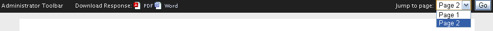

	*Figure 5.4* Administrator toolbar on a 2 page survey

.. list-table::
	:widths: 25 75
	:header-rows: 1

	* - Section
	  - Description
	* - 1. Download Responses
	  - If your survey contains multiple pages, you can download responses right from the top bar without having to enable the option under the :ref:`Publish` settings. You can download them into 
	    either Microsoft Word or Adobe Reader.
	* - 2. Jump to page
	  - Instead of having to click [Next] a multitude of times in order to get to your desired page, you can instantly jump there. This will save you time, and headache.
	* - 3. Test Data
	  -	When you preview your survey, you will notice that in the address bar the code /?TEST_DATA is appended at the end. This allows for you to quickly distinguish between actual data, and data you entered during the testing phase. To learn more about the response table, please see the :ref:`Analyze` section of the manual.

To learn more about Preview, see the :ref:`Preview` section of the manual

Publish
^^^^^^^

	*Figure 5.5* Administrator toolbar on a 2 page survey

The Publish button can be found within the Editor, but it is also possible to alter any publishing options for a survey from the Survey Dashboard screen. Clicking on Publish will direct you to edit any necessary publishing options, such as closing the survey, access restrictions, all the way to changing the survey completed message. 

.. note:: 

	All surveys are [Live] by default. You can [Close] at any point. To learn more, see the :ref:`Publish` section of the manual

Find & Replace
^^^^^^^^^^^^^^

Find & Replace can automatically locate and replace text or phrases in question titles, choices, variables, extra description fields within a survey for your keyword, replacing them with a few clicks. A dialog will appear allowing you to specify the text to locate, and what to replace it with. You can also specify where the changes should be made, be it in the entire survey, on one page, or for selected questions.

In addition, you can use `Regular Expressions`_ when searching for a keyword

.. _Regular Expressions: http://en.wikipedia.org/wiki/Regular_expression

.. figure:: ../../resources/editor/find_and_replace_bincoluars.png
	:align: center
	:class: screenshot
	:alt: Find and Replace
	:scale: 70%

	*Figure 5.6* Find & Replace binoculars

.. figure:: ../../resources/editor/find_and_replace_popup.png
	:align: center
	:class: screenshot
	:alt: Find and Replace Pop-up
	:scale: 70%

	*Figure 5.6* Find & Replace Options

.. list-table::
	:widths: 30 70
	:header-rows: 1

	* - Section
	  - Description
	* - 1. Replace
	  - Input the string you'd like to search for in either the "Entire Survey", "This Page" or "Selected Questions"
	* - 2. With
	  - What would you like to replace the string with?
	* - 3. In
	  - Select from the following locations to search for the string

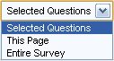

.. list-table::
	:widths: 30 70
	:header-rows: 0

	* - 
	  - 
	  	1. **Selected Questions** - Only look within selected questions
		2. **This Page** - Only search the active page
		3. **Entire Survey** - Search the entire page
	* - 4. Use Regular Expressions
	  - Allows for a deeper Find & Replace experience. To learn more about RegEx, please refer to the web site above.

.. tip::

	Using Regular Expressions, find all numbers in a survey and replace it with the string "FluidSurveys"

		1. Click on [Find and Replace]
		2. Select "Entire Survey" under "In"
		3. Enable "Use Regular Expressions"
		4. In "Replace" put "\d+" (Find all decimal numbers)
		5. In "With" put "FluidSurveys"
		6. Click [Replace]

Survey Versioning
^^^^^^^^^^^^^^^^^

Survey Versioning can restore up to 50 previous versions of your survey. This can be very useful in the case that accidental deletions or unwanted changes are made. To view and revert to a previous version of your survey, click on the "View Previous Versions" (Small Calendar) in the top-bar at the top of the Editor.

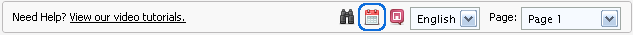

	*Figure 5.7* View Survey Versions calendar

A dialog will then appear listing all of the saved versions of the survey. You can first view the different versions, and if you'd like to restore your survey to one of the previously saved version, click [Revert]
 
.. figure:: ../../resources/editor/survey_versions_previous_versions.png
	:align: center
	:class: screenshot
	:alt: Previous Versions pop-up
	:scale: 70%

	*Figure 5.8* Your surveys previous versions pop-up

.. list-table::
	:widths: 20 80
	:header-rows: 1

	* - Section
	  - Description
	* - 1. Revisions
	  - Everytime you [Save] your survey, a revision is created of the previous one. The dropdown will show all (50 at most) previous versions
	* - 2. Revert
	  - The selected survey will load once the page is refreshed.
	* - 3. View
	  - A new window will appear, showing the selected revision. It is possible to cycle through all versions by clicking the blue forward, or backward arrow

.. list-table::
	:widths: 20 80
	:header-rows: 0

	* -
	  -	Move forward (next version) or move backward (previous version) without having to constantly close the pop-up window

.. tip::

	A situation may arise where you only want to restore parts of a survey, perhaps one or two questions. In that case, first click on the “View Previous Versions” link at the top of the editor.

		1. Click the "View Survey Versions" calendar
		2. Find the version you think the question was in last
		3. Click the [View] button
		4. In the new window showing that version of the survey, find the question
		5. Copy ([Ctrl] + c) the question
		6. Close the previous survey version windows, and paste ([Ctrl] + v) into your present survey

Page Drag-and-Drop
^^^^^^^^^^^^^^^^^^

The concept is really simple. At any point, instead of moving each question individually from 1 page to another, you can quickly and efficiently move the entirety of 1 page to an entirely different location in your survey.The goal is to click, drag, and release the page in its new desired spot.

.. figure:: ../../resources/editor/drag_pages_around.png
	:align: center
	:class: screenshot
	:alt: Change page order
	:scale: 70%	

	*Figure 5.9* Drag and Drop a page in a new slot within your survey

Additionally, if a survey has Advanced Branching Logic, dragging around pages will not remove the branching logic. However, before setting a survey live, it would be advantageous to double check the branching logic to ensure it is still accurate

Page Labels
^^^^^^^^^^^

Page labels allow you to create named pages of your survey that can then be branched to or jumped to. Page labels do not have a character type restriction, eg., #@!&$%, or character limit

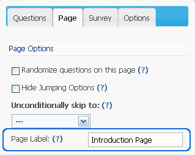

	*Figure 5.9* Altered page label

.. tip:: 

	To change the page title, here's how:

		1. Click on the [Page] tab wihtin a surveys Editor page
		2. Under "Page Label" input your new page title

Right-click Menu
^^^^^^^^^^^^^^^^

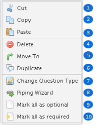

	*Figure 5.9* Right-click menu

.. list-table::
	:widths: 30 80
	:header-rows: 1

	* - Section
	  - Description
	* - 1. Cut
	  - Cut the selected question(s). If more than 1 question is selected, then those questions will be cut when [Cut] is clicked.
	* - 2. Copy
	  - Copy the selected question(s). If more than 1 question is selected, then those questions will be copied when [Copy] is clicked.
	* - 3. Paste
	  - Paste the questions on the clipboard
	* - 4. Delete
	  - Delete the selected question(s). If more than 1 question is selected, then those questions will be deleted when [Delete] is clicked.
	* - 5. Move To
	  - Move the selected question(s) to a new page. If more than 1 question is selected, then those questions will be moved when [Move To] is clicked
	* - 6. Duplicate
	  - Duplicate the selected question(s). If more than 1 question is selected, then those questions will be duplicated when [Duplicate] is clicked.
	* - 7. Change Question Type
	  - If an incorrect question type was used for a question, you can easily morph it to the appropriate one.
	* - 8. Piping Wizard
	  - Pipe previously inputted answers by a respondent into a question. If an incorrect question type was used for a question, you can easily morph it to the appropriate one.
	* - 9. Mark all as optional
	  - The selected question(s) will be marked as optional. If more than 1 question is selected, then only those questions will be marked as optional
	* - 10. Mark all as required
	  - The selected question(s) will be marked as required. If more than 1 question is selected, then only those questions will be marked as required

Add questions (Drag-and-drop)
^^^^^^^^^^^^^^^^^^^^^^^^^^^^^

The concept is really simple. The Editor is divided into two sides. The left side includes all of the different question types that can be used to construct a survey. The right hand page is simply a blank sheet of paper that is used to construct a survey. The goal is to click drag, and release a question from the left side of the page onto the right side of the page. It’s really very easy and fast. Try it for yourself to see what we mean!

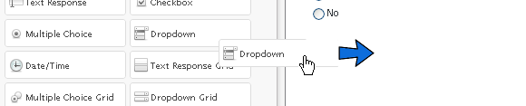

	*Figure 5.9* Drag and Drop from Left to Right

Add questions (Double click)
^^^^^^^^^^^^^^^^^^^^^^^^^^^^

If dragging-and-dropping a question into the Editor isn't your style, it is possible to double-click on a question type. Double-clicking may be more advantageous when the page has reached the point where scrolling up and down requires a few strides on the mouse wheel. To add a question type in this fashion, simply hover over the question you'd like, eg., Yes/No, and double click the Left Mouse button.

.. figure:: ../../resources/editor/double_click_add.png
	:align: center
	:class: screenshot
	:alt: Double click a question type
	:scale: 70%	

	*Figure 5.10* Double Click to add a question	

Question Morphing
^^^^^^^^^^^^^^^^^

Question morphing allows you to quickly transform one question type into another without having to re-enter all of the question information, or re-create the question. 

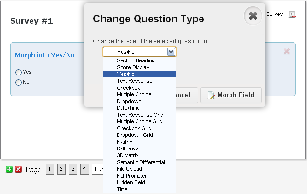

	*Figure 5.11* Select a new question type

.. tip:: 

	To change from a Section Heading to a Yes/No question type, follow these easy steps.

		1. Right-click the question you would like to morph
		2. Select "Change Question Type"
		3. In the dropdown, select "Yes/No"
		4. Click [Morph Field]

	This method of question morphing can be applied to any question type. Or, another method of morphing a question is to click the question, and on the right-hand side select "Yes/No" under the dropdown "Type"

.. warning::

	Question Morphing does not always work. It will try its best to carry the Choices/Variables from 1 question type to another, but in some cases, the information will be lost since adding columns to a previously only row question type, will force the software to remove the choices. Therefore, before morphing, save your Choices and Variables!

Bulk
^^^^

In the case that you have a long list of choices or variables, or a list that you'll be re-using often throughout your many surveys, it may be useful to use the bulk feature. The bulk editor automatically converts lists into choices/variables/rows, while giving you the option of saving them for use on any future question.

The Bulk option is available under all "Choices" and "Variables" on the left-hand floating editor box.

.. figure:: ../../resources/editor/bulk_for_drill_down.png
	:align: center
	:class: screenshot
	:alt: Bulk Editor in Editor
	:scale: 80%

	*Figure 5.11* Bulk Editor for a Drill Down question in the Editor 

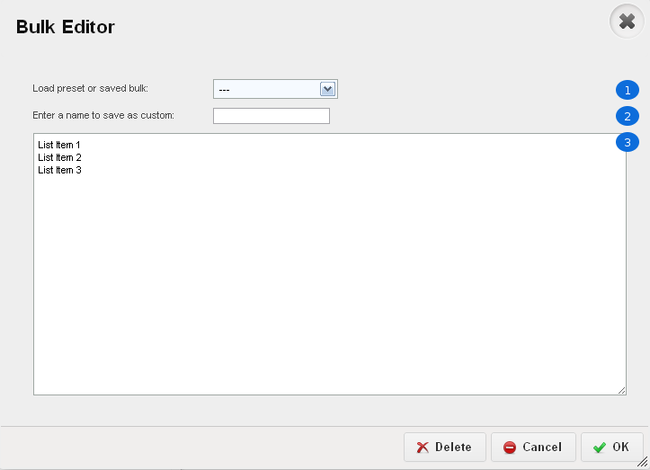

	*Figure 5.11* Bulk Editor in action

.. list-table::
	:widths: 30 80
	:header-rows: 1

	* - Section
	  - Description
	* - 1. Load Preset
	  - Select from 1 of 23 available presets
	* - 2. Save a Preset
	  - If a preset is not available, you can create one for later use
	* - 3. Editor
	  - Even though a preset was selected, you can still edit it after the fact. However, any changes made will not be saved unless it is saved as a custom preset

Additionally, you can also save custom bulk lists. To create a custom bulk list, click on the “Bulk” button when adding choices, variables, rows or columns to a question. Once the dialog appears, write or paste your list into the text field. Make sure that each item in the list is on a separate line. Then, enter a name for your list and click apply.

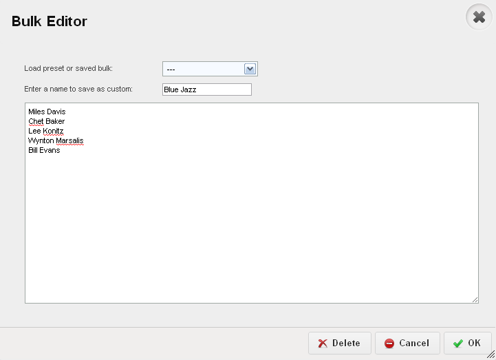

	*Figure 5.12* Save a custom preset

.. list-table::
	:widths: 30 70
	:header-rows: 1

	* - Section
	  - Description
	* - 1. Custom Preset
	  - Enter the name of the present you'd like to use
	* - 2. Preset Choices
	  - Information typed into here will be saved in the custom preset. Note that, despite the fact a preset was selected, you can still alte it after the fact.

When you return to the Bulk Editor, the preset, "Blue Jazz" will be available as a selectable option, as seen in Figure 5.12

.. warning::

	When dealing with the Bulk Editor in a multi-language survey, both sides of the Editor must match. In many cases, you may have an [Enter] on one side which is why you are unable to save the preset

	.. image:: ../../resources/editor/multi_language_bulk.png
		:align: center
		:class: screenshot
		:alt: Save a Preset
		:scale: 70%	

Template (Save)
^^^^^^^^^^^^^^^

It’s possible to create templates from existing surveys, allowing them to be re-used in the future.

To do so, open the survey from which you’d like to create the template, and click on the “Survey” tab in your editor. Then, select “Save Template”. All of the questions and branching conditions will be saved in the template.

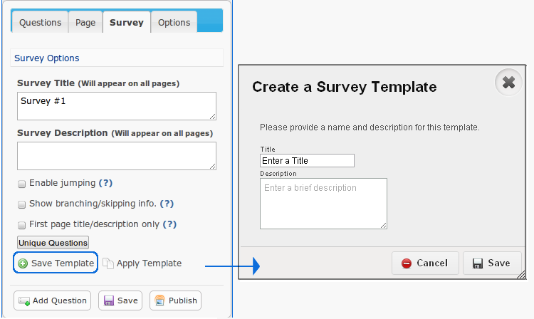

	*Figure 5.13* Save a template process	

The next time you create a survey, you’ll have the option of using the template.

.. note::

	If you’re using a multi-user account, you can create templates and share them with others.

Template (Apply)
^^^^^^^^^^^^^^^^

It’s possible to apply previously saved templates into existing surveys.

To do so, open the survey from which you’d like to apply the template, and click on the “Survey” tab in your editor. Then, select "Apply Template”. In the pop-up, input a recognizable Title, a brief description, and click [Save]. All of the questions and branching logic will be applied to the template.

.. figure:: ../../resources/editor/apply_a_template.png
	:align: center
	:class: screenshot
	:alt: Apply Template
	:scale: 70%

	*Figure 5.14* Apply a template process

.. warning::

	If you apply a template to a survey, it will replace its contents with the templates. Be careful when applying a template to an already populated survey.

Show Branching/Skip Info
^^^^^^^^^^^^^^^^^^^^^^^^

By default, respondents don’t know if there is branching or skipping information on a page. Enabling this option does the opposite, and informs the respondent that there is branching logic present. 

.. figure:: ../../resources/editor/show_skipping_branching_info.png
	:align: center
	:class: screenshot
	:alt: Show Branching/Skipping Info
	:scale: 70%

	*Figure 5.15* Enabling this will place any branching and skipping at the top of the survey page.

.. warning::

	When you re-arrange pages, the branching logic will do its best to re-arrange itself accordingly. You can re-arrange pages simply by clicking and dragging a page to a new destination location (the pages are at the bottom of your survey editor page). However, it is recommended to order your pages before adding any branching logic.

On any page that contains skip logic, you’ll notice a little branching icon on the top left of your survey-page in the editor. If you click on this, it’ll show you the branching/skip logic that exists on that page. 

.. figure:: ../../resources/editor/show_example_of_branching_info.png
	:align: center
	:class: screenshot
	:alt: Show Branching/Skipping Info
	:scale: 70%

	*Figure 5.15* Enabling this will place any branching and skipping at the top of the survey page.

.. tip:: 

	If your survey is going to be long, you'll benefit greatly from specifying page-labels for each of your pages. Just go to the “Page” tab and specify a label for that page. For more info, see "Page Labels" in the manual.

Visual Editor
^^^^^^^^^^^^^

The Rich Text Editor allows for you to easily insert images, add styling to text, YouTube videos, links, paste from Microsoft Word, etc. The Visual Editor can be used when editing the survey/question title or survey/question description. 

The Rich Text Editor is only available to the Survey Title and Survey Description, and not each individual text area for Choices or Variables

To access the Visual Editor, click on a text area in the floating box on the left hand side, and click [Open Visual Editor]. 

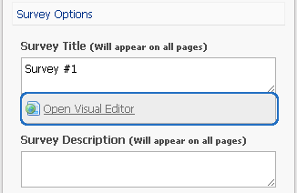

	*Figure 5.9* Editing the Survey Title in the Visual Editor

The visual editor appears as a typical text editor, with actions and commands located at the top. Any changes made in the visual editor will appear in your survey.

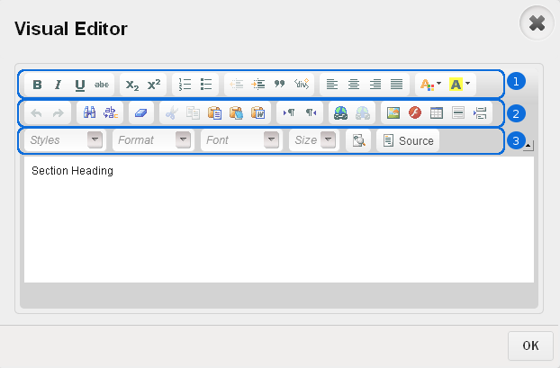

	*Figure 5.9* The visual editor with "Section Heading" in the question title

.. list-table::
	:widths: 30 80
	:header-rows: 1

	* - Section
	  - Description
	* - 1. Text/Style Alterations
	  - Make any changes to font specific sections, such as bold, italicize, center a block of text, etc. As well as adjust the font size, font type, styles, or edit the source directly
	* - 2. Content Alterations
	  - Input text directly from Microsoft Word and retain its style, insert a web link, or a video straight from YouTube

.. note::

	You can click [Source] button within the Visual Editor and input HTML, JavaScript or CSS
