.. _Question Options:

Question Options
----------------

This chapter will teach you how to:

* Randomize questions on a page
* Set the border of a question
* Change the default Scores for Choices and Variables
* Enable text Validation input
* Learn the specifics of the Editors question types options

Randomize
^^^^^^^^^

By default, questions on a survey page are held in the same place on each and every page load. However, there is an option that can do the opposite. You can randomize the questions on a survey page so that every respondent sees them in a different, and random, order. 

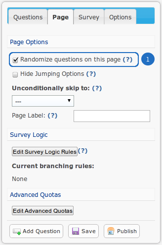

	*Figure 9.1* Randomize choices on the page

.. list-table:: 
	:widths: 30 70
	:header-rows: 1

	* - Option
	  - Description
	* - 1. Randomize questions
	  - Check this option if you would like the questions on this page to be shown in a random order every time this survey is taken.

Conincidentally enough, loading the survey for the first time presented the questions in their appropriate outline.

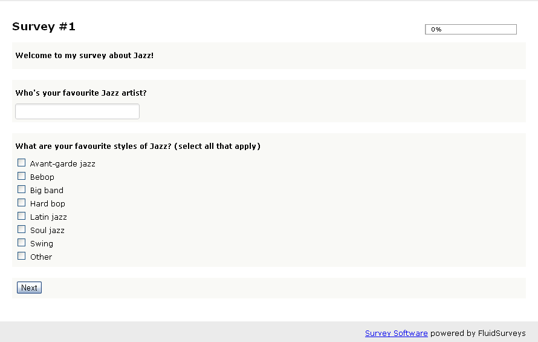

	*Figure 9.1* Questions not yet randomized

However, after loading the survey a second time, the questions "What are your favourite styles of Jazz? (select all that apply)" and "Who's your favourite Jazz artist?" are flipped

.. figure:: ../../resources/editor/post_random.png
	:align: center
	:scale: 70%
	:alt: After randomizing questions on the page
	:class: screenshot

	*Figure 9.1* Questions randomized on the page

.. note::

	The Section Header will never randomize as it allows for an Administrator to outline specific containers on the page

Alphabetize
^^^^^^^^^^^

By default, choices/variables appear in the order they were entered. Therefore, if B is put before A, the system will not auto-correct it. "Alphabetize" will automagically sort the choices/variables for you, without losing your data.

**Alphabetize is available to the following question types:**

	1. Checkbox
	2. Multiple Choice
	3. Dropdown 
	4. Text Response Grid
	5. Multiple Choice Grid
	6. Dropdown Grid
	7. Checkbox Grid
	8. Dropdown within a N-atrix
	9. Radio Buttons within a N-atrix
	10. Dropdown within a 3D Matrix
	11. Radio Buttons within a 3D Matrix
	12. Semantic Differential

The option is available under "Options" found in the flaoting editor box on the left-hand side.

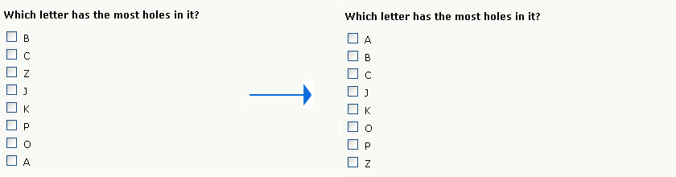

	*Figure 9.1* Non-alphabetized to alphabetized questions

.. note::

	When a survey is live, and has already received numerous responses, but you realize there is a choice missing, ie., "District of Columbia", do not add the choice in its appropriate spot. Instead, enable the option, "Alphabetize". The respondent will see the "District of Columbia" in its appropriate slot, without causing any harm to your sensitive, and needed data.

Side-By-Side
^^^^^^^^^^^^

Side-by-side allows you to place 2 questions beside each other in separate columns. Only 2 questions can be added side-by-side, even if the survey width was altered through CSS to be 100%.

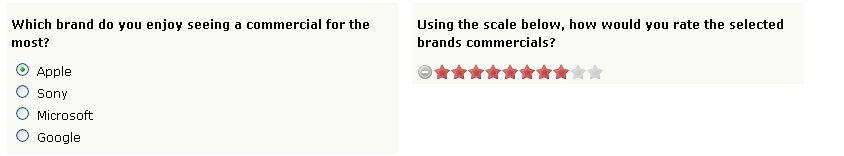

	*Figure 9.1* Example of side-by-side

.. tip::
	
	A common use of using "Side-by-Side" is to ask the respondent their level of satisifaction to a specific brand or product.

Append to Previous
^^^^^^^^^^^^^^^^^^

The song *"One is The Loneliest Number"* by **Three Dog Night** is no longer relevant with the Append to Previous option. In some cases, you would like to ask a respondent a sub-question that relates to the previous question. But, you would like to use a separate question type. Append to Previous allows for you to fulfill those desires, and still maintain a cognitive styling pattern across your survey, by making it look as though 3 questions are really 1.

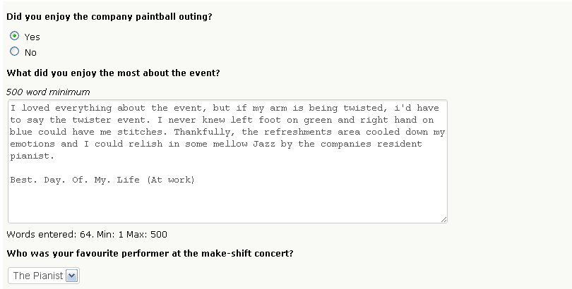

	*Figure 9.1* Example of 3 questions being appended to previous

.. tip::

	You can chain together a series of questions to make them look like one. Simply select "Append to Previous" for all the questions that you'd like to stick to its predecessor.

Width
^^^^^

There are 2 areas where the width plays a role in determining the overall aesthetic of a question.

.. figure:: ../../resources/editor/column_width.png
	:align: center
	:scale: 70%
	:alt: Column and width for Text Response
	:class: screenshot

	*Figure 9.1* Width and Column width options for a Text Response

.. list-table:: 
	:widths: 30 70
	:header-rows: 1

	* - Option
	  - Description
	* - 1. Column Width
	  - You can control the amount of space reserve for the text area (column). The size is determined by the "Columns" number within the Editor for a question. The default value is 20 columns
	* - 2. Width
	  - If you want to cover less or more space on the webpage, then edit the Percent width. This will either spread or condense the space it covers. Width percentage of the survey width that this	  question will take up. If you've ever wanted to cover less, or more space on your survey, then editing the Percent width of a question will either spread, or condense the space it covers. 
	    The default value is 100%

**Column Width**

.. figure:: ../../resources/editor/column_normal_vs_width.png
	:align: center
	:scale: 70%
	:alt: Column width
	:class: screenshot

	*Figure 9.1* Text area with 75 column width, and one with the default column size of 20.

**Question Width**

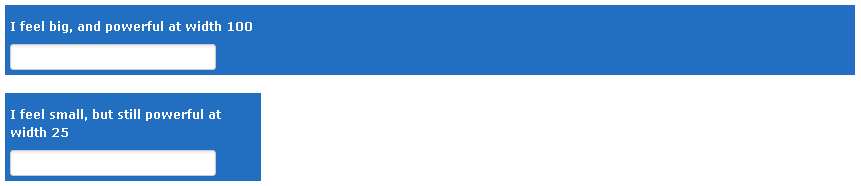

	*Figure 9.1* Example of a question without width, and one 80% (survey size) with.

.. note ::

	The background colour was changed for both question types to accurately represent the question width being altered within a default template.

.. warning::

	The width value for both a question, and the column will not be accurately reflected in the editor.

Choices/Variables
^^^^^^^^^^^^^^^^^

Choices and Variables are the answers themselves to close and open-ended question. 

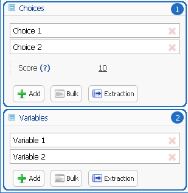

	*Figure 9.1* Choices and Variables for a Mulitple Choice Grid

.. list-table:: 
	:widths: 20 80
	:header-rows: 1

	* - Option
	  - Description
	* - 1. Choices
	  - Adding additional choices will increase the X-axis. Choice 1 and Choice 2, shown here, will appear on the X-axis (along the top of the question). Choices are commonly used as a means of better determining a respondents affinity toward a product, ie., "Like", "Hate", "N/A", etc.
	* - 2. Variables
	  - Adding additional variables will increase the X-axis. Varaible 1 and Variable 2, shown here, will appear on the Y-axis (along the side of hte question). Variables are commonly used as a means conveying a certain product, ie., Apple, McDonalds, Telus, etc.

Certain question types have specific options within the choices/variables that allow for a deeper integration of your desired goal and effect.

**Checkbox Question Type Choices**

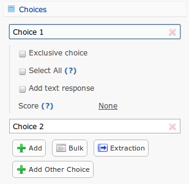

	*Figure 9.1* Choices for a Checkbox

.. list-table:: 
	:widths: 30 70
	:header-rows: 1

	* - Option
	  - Description
	* - 1. Exclusive Choice
	  - Enabling this option will force the choice to become the only selected option. When the respondent selects the choice, any previously selected choices will be automatically deselected in favour of this choice. By default, this option is disabled.
	* - 2. Select All
	  - Enabling this option will automatically select all choices in the question. By default, this option is disabled.
	* - 3. Add Text Response
	  - Enabling this option will put a text response beside the choice. The text response can have Validation applied. However, the width cannot be adjusted.
	* - 4. Score
	  - A score is what determines the weight for a Choice/Variable that can later be used during the Analytics phase. By default, this value is the value of the choices position, eg., Choice 1 is in the first slot, therefore the Score will be "1". To learn more about "Scores", refer to the "Scores" section of the manual.
	* - 5. Add Other Choice
	  - Clicking this button will create a choice that is, "Other, please specify" (which can be customized) along with a text response box. This is comparable to adding a text response to a choice.

**Multiple Choice Question Type Choices**

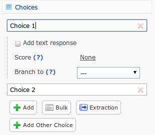

	*Figure 9.1* Choices for a Mulitple Choice 

.. list-table:: 
	:widths: 30 70
	:header-rows: 1

	* - Option
	  - Description
	* - 1. Add Text Response
	  - Enabling this option will put a text response beside the choice. The text response can have Validation applied. However, the width cannot be adjusted.
	* - 2. Score
	  - A score is what determines the weight for a Choice/Variable that can later be used during the Analytics phase. By default, this value is the value of the choices position, eg., Choice 1 is in the first slot, therefore the Score will be "1". To learn more about "Scores", refer to the "Scores" section of the manual.
	* - 3. Branch To
	  - If the user selects the Choice, then you can notify the software to branch the respondent down a different path. By default, all choices will lead to the next page.
	* - 4. Add Other Choice
	  - Clicking this button will create a choice that is, "Other, please specify" (which can be customized) along with a text response box. This is comparable to adding a text response to a choice.

**Dropdown Question Type Choices**

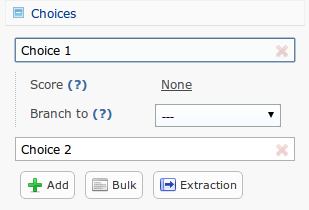

	*Figure 9.1* Choices for a Dropdown

.. list-table:: 
	:widths: 30 70
	:header-rows: 1

	* - Option
	  - Description
	* - 1. Score
	  - A score is what determines the weight for a Choice/Variable that can later be used during the Analytics phase. By default, this value is the value of the choices position, eg., Choice 1 is in the first slot, therefore the Score will be "1". To learn more about "Scores", refer to the "Scores" section of the manual.
	* - 2. Branch to
	  - If the user selects the Choice, then you can notify the software to branch the respondent down a different path. By default, all choices will lead to the next page.

**Text Response Grid Question Type Choices**

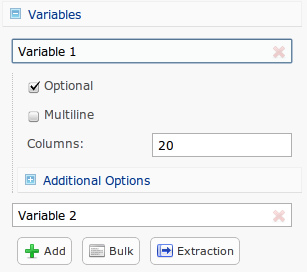

	*Figure 9.1* Variables for a Text Response Grid

.. list-table:: 
	:widths: 30 70
	:header-rows: 1

	* - Option
	  - Description
	* - 1. Optional
	  - Detemrins whether the question is required in order to proceed through the survey, or not. By default, this option is enabled.
	* - 2. Multiline
	  - Commonly referred to as the "width" of a text area. If a large amount of text is required, then altering this value may be adventageous.. By default, the value is set to 20 columns.
	* - 3. Validation
	  - Determins the type of text that can be entered, eg., Currency will only allow "$19.99". To learn more about "Validation", refer to the "Validation" section of the manual.
	* - 4. Initial Value
	  - By default, the initial value is blank.

**Dropdown Grid Question Type Choices and Variables**

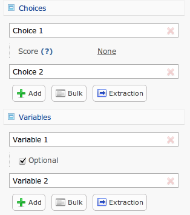

	*Figure 9.1* Choices and Variables for a Dropdown Grid

.. list-table:: 
	:widths: 20 80
	:header-rows: 1

	* - Option
	  - Description
	* - 1. Score
	  - A score is what determines the weight for a Choice/Variable that can later be used during the Analytics phase. By default, this value is the value of the choices position, eg., Choice 1 is in the first slot, therefore the Score will be "1". To learn more about "Scores", refer to the "Scores" section of the manual.
	* - 2. Optional
	  - Detemrins whether the question is required in order to proceed through the survey, or not. By default, this option is enabled.

**Checkbox Grid Question Type Choices and Variables**

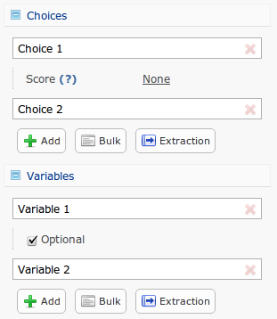

	*Figure 9.1* Choices and Variables for a Checkbox Grid

.. list-table:: 
	:widths: 20 80
	:header-rows: 1

	* - Option
	  - Description
	* - 1. Score
	  - A score is what determines the weight for a Choice/Variable that can later be used during the Analytics phase. By default, this value is the value of the choices position, eg., Choice 1 is in the first slot, therefore the Score will be "1". To learn more about "Scores", refer to the "Scores" section of the manual.
	* - 2. Optional
	  - Detemrins whether the question is required in order to proceed through the survey, or not. By default, this option is enabled.

**N-atrix Question Type Variables**

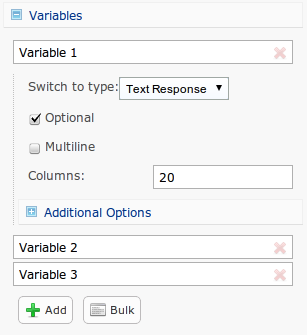

	*Figure 9.1* Choices and Variables for a N-atrix

.. list-table:: 
	:widths: 20 80
	:header-rows: 1

	* - Option
	  - Description
	* - Switch to type
	  - Since a N-atrix question type allows for it to contain more than 1 question type, you can alter which question type is available as a Variable. Available question types are
		    1. Dropdown
		    2. Text Response
		    3. Checkbox
		    4. Radio Buttons

**3D Matrix Question Type Choices**

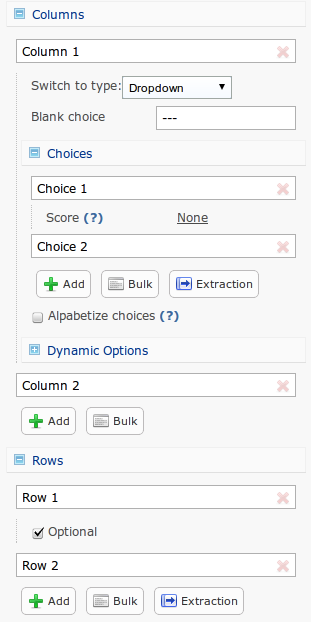

	*Figure 9.1* Choices and Variables for a 3D Matrix

.. list-table:: 
	:widths: 20 80
	:header-rows: 1

	* - Option
	  - Description
	* - Switch to type
	  - Since a N-atrix question type allows for it to contain more than 1 question type, you can alter which question type is available as a Variable. Available question types are
		    1. Dropdown
		    2. Text Response
		    3. Checkbox
		    4. Radio Buttons
	* - Dynamic Options
	  - When these are enabled for a specific choice, if the respondent clicks it, then the row can be disabled. By default, these choices are disabled.
	* - Optional
	  - Detemrins whether the question is required in order to proceed through the survey, or not. By default, this option is enabled.

**Drilldown Grid Question Type Choices**

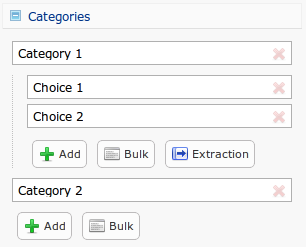

	*Figure 9.1* Choices and Variables for a Drilldown Grid

.. list-table:: 
	:widths: 20 80
	:header-rows: 1

	* - Option
	  - Description
	* - Score
	  - A score is what determines the weight for a Choice/Variable that can later be used during the Analytics phase. By default, this value is the value of the choices position, eg., Choice 1 is in the first slot, therefore the Score will be "1". To learn more about "Scores", refer to the "Scores" section of the manual.
	* - Branch to
	  - If the user selects the Choice, then you can notify the software to branch the respondent down a different path. By default, all choices will lead to the next page.

**Semantic Differential Question Type Choices and Variables**

.. figure:: ../../resources/editor/cv_semantic.png
	:align: center
	:scale: 70%
	:alt: Chocies and Variables
	:class: screenshot

	*Figure 9.1* Choices and Variables for a Semantic

.. list-table:: 
	:widths: 20 80
	:header-rows: 1

	* - Option
	  - Description
	* - Optional
	  - Detemrins whether the question is required in order to proceed through the survey, or not. By default, this option is enabled.

.. warning::

	Removing a Choice/Variable on a Live survey WILL delete the information associated with that option. Do not delete any information on a Live survey without first consulting with on one of our experienced Technical Support Representatives. 

Add Other Choice
^^^^^^^^^^^^^^^^

Clicking this button will create a choice that is, "Other, please specify" (which can be customized) along with a text response box. This is comparable to adding a text response to a choice. Add Other Choice is only available to certain question types, such as:

	1. Checkbox
	2. Multiple Choice 

Scores
^^^^^^

Simple Branching
^^^^^^^^^^^^^^^^

Question Title
^^^^^^^^^^^^^^

Question Description
^^^^^^^^^^^^^^^^^^^^

Appearance
^^^^^^^^^^

Columns
^^^^^^^

Optional
^^^^^^^^

Add Other Choice
^^^^^^^^^^^^^^^^

Validation
^^^^^^^^^^

Identifiers
^^^^^^^^^^^

Force Unique
^^^^^^^^^^^^

Background Color
^^^^^^^^^^^^^^^^

Borders
^^^^^^^

1st Column Size
^^^^^^^^^^^^^^^

1st Column Static
^^^^^^^^^^^^^^^^^

Initial Value
^^^^^^^^^^^^^

Multiline
^^^^^^^^^

Sum
^^^
	
