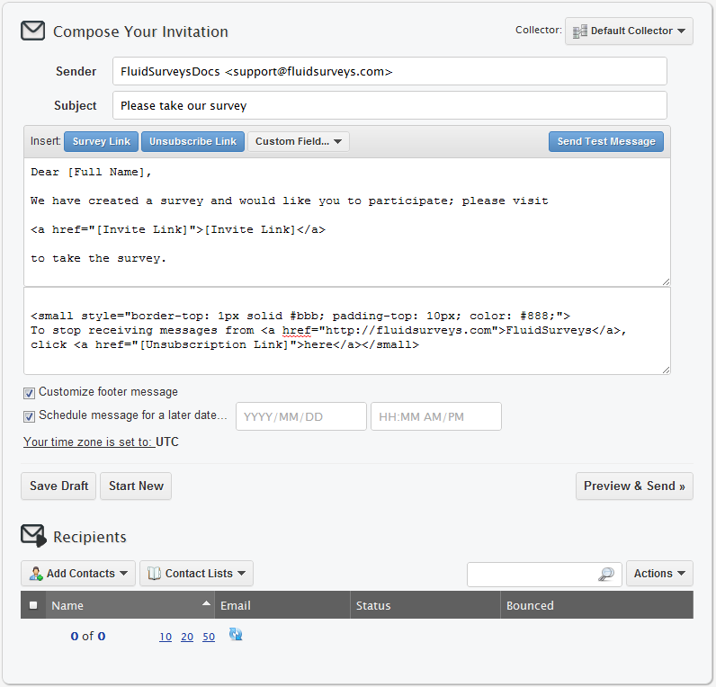
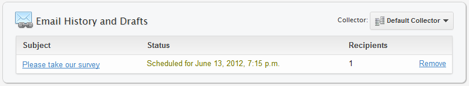
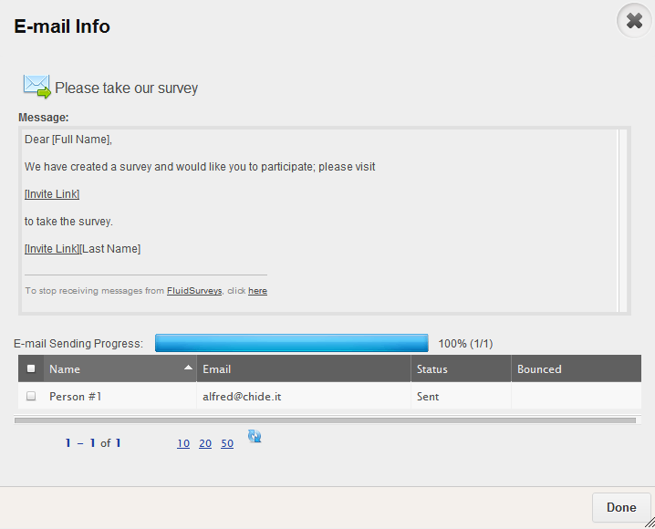
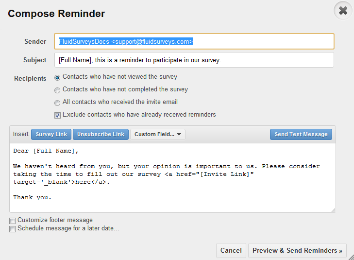
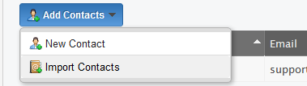
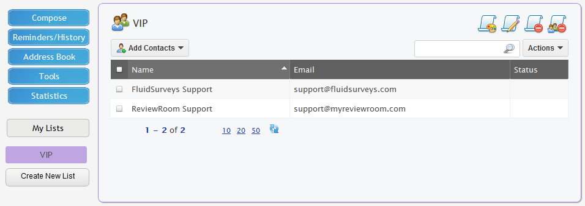
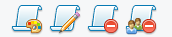

Invites
=======

FluidSurveys’ comes equipped with an invitation module through which survey links can be sent to potential respondents via email. Contacts can be added manually (one by one or in bulk) or imported directly from a third party address book. After the invitations are sent, the survey creator can keep track of who has received, viewed or completed the survey.

Survey invitations sent with the invitation module contain a customized message and a unique survey link through which the recipient can access the survey. The link includes a unique code that can identify the respondent and can be used by the respondent to re-gain entry and edit the survey, even after it has been submitted.

.. note::

	All emails are sent "on behalf of invites@fluidsurveys.com".

.. warning::
	
	An email will be delayed by 2 minutes from its initial "Send" time. If you send an email at 1:20 PM, the message will not leave the mail server until 1:22 PM. 

Compose
-------

Composing a message is essentially the same "Compose" screen you would see when dealing with any mail client, ie., Microsoft Outlook, Mozilla Thunderbird, Apple Mail, etc. It contains the same basic utensils, such as Sender (From Field), Subject, Save Draft, as seen below. 

	*Figure 9.1* Compose a Message in Invites

.. list-table:: 
	:widths: 30 70
	:header-rows: 1

	* - Section
	  - Description
	* - Sender
	  - Otherwise known as the "From" field. The email on the account, under "Settings" > "Email Address" is what's used. Changing the Email Address on the account, will alter the "Sender" field to represent the new address. The "Sender" standard is, "Name <email@address.com>"
	* - Subject
	  - When the email is sent, the string of text seen here is what the recipient will see in their inbox. The default subject is, "Please take our survey"
	* - Survey Link
	  - An invite **must** contain a Survey Link, [Invite Link], which contains the URL to your survey
	* - Unsubsubscribe Link
	  - A survey **must** contain an Unsubscribe Link, [Unsubscribe Link]. In order to remain compliant with the CAN-SPAM Act, Section V, *"Tell recipients how to opt out of receiving future email from you"*. This allows for the recipent to unsubscribe, and cease receiving survey invites from the individual.
	* - Custom Field
	  - If your Address Book, and subsequently your survey, contains Custom Invite Variables, you can include the column here. Inserting a Custom Field is very common when blast emailing a large group of people, and including the password to the survey, or their unique employee ID, etc. The format for inserting a Custom Field (if it exists) is [Custom:Custom Field]
	* - Send Test Message
	  - It is possible to send a test message before sending an email to the intended audience. The test message will go to the email address on the account, and will contain the exact look-and-feel that the recipients will see.
	* - Message Container
	  - Otherwise known as the body of the message, which contains the email contents
	* - Customize Footer
	  - The bottom section of an e-mail message that contains information that does not change from one e-mail marketing campaign to another. The footer will appear at the bottom of the email, in a smaller text, as well as hold the [Unsubscribe Link]
	* - Schedule Email
	  - When "Preview & Send" is clicked, the message will be sent to its recipients after a 2 minute delay. However, it is possible to send an email for a later time. Additionally, the "Schedule Email" option will contain your current timezone. If the timezone is incorrect, the zone can be adjusted by going to "Settings" > "Timezone" 
	* - Save Draft
	  - Allows for the email to be operated on at a later date. Save Draft will save everything, including any added recipients.
	* - Start New
	  - A new window will appear prompting you if you are sure you would like to start anew. Clicking "Yes" to "You will lose any un-saved changes to your current e-mail" will clear everything, ie., Body, Sender, Subject, Recipients, etc.
	* - Preview & Send
	  - When ready to send an email, clicking this button will allow for you to "Preview" its contents before clicking "Send".
	* - Add Contacts
	  - Add a new contact, import contacts, or use those already residing with the "Address Book"
	* - Contact Lists
	  - Add a new, or old list to the email
	* - Search
	  - If a large amount of recipients was added, and it was found out later that one was added in error, it is possible to use the "Search" feature to find said individual, and remove them from the intended audience
	* - Actions
	  - Using the current "Recipients" List, it is possible to "Export Selected Contacts" (For external use), or "Delete selected contacts" (People added in error)

.. tip::

	Like any powerful mail client, the ability to include HTML within the message body of the email is possible. There have been cases of individuals sending complicated <table> </table> emails using the Invite Tool.

The email will appear as follows in an recipients Inbox.

.. figure:: ../../resources/invites/invites_inbox_message.png
	:scale: 70%
	:align: center
	:class: screenshot
	:alt: Message in inbox (GMail)

	*Figure 9.1* Message in inbox (GMail)

.. note::

	All emails sent using the Invite Tool will contain an Invite Code, eg., ?code=T5o1R. This is by default, and an action that cannot be stopped. It allows for 100% accurate stat tracking of 1 respondent to another.

Reminders/History
-----------------

All emails, regardless of size, will be contained within the "Reminders/History" section, which holds all emails sent in the past or to be sent in the future. When an email is sent, it is scheduled to be sent within 2 minutes. Additionally, multiple Reminders can be sent for a survey

	*Figure 9.1* Scheduled Invite Email to 1 Recipient(s)

When the email is sent after 2 minutes, both screens will shift to represent a successfully sent email. 

.. figure:: ../../resources/invites/scheduled_invite_sent.png
	:scale: 70%
	:align: center
	:class: screenshot
	:alt: Sent Email

	*Figure 9.1* Sent Email after 2 minutes

Clicking on the subject of your email, will present a new popup titled, "E-mail Info" that shows the status of the email. 

	*Figure 9.1* Sent Email window

.. list-table:: 
	:widths: 30 70
	:header-rows: 1

	* - Section
	  - Description
	* - E-mail Sending Progress
	  - If the e-mail is scheduled to be sent at a later date, ie., in 2 minutes (Default behavior) or at a much later date (defined by "Schedule Email") the progress bar will remain at 0/n (where n is total recipients) or 0%. However, when the e-mail is sent, this value will shift to show 100% sent, and n of n emails sent. This bar is in real-time. The "E-mail Info" window can be opened, and the progress bar will progress from 0% to 100%, allowing for the Administrator to factually see if the emails are leaving the mail servers
	* - Status
	  - There are 4 possible Status' that can appear
		    1. **Sent**: The invite was sent, and the recipient has not clicked on the link yet
		    2. **Viewed**: The invite was sent, and the recipient opened the survey, but did nothing to it, and closed the browser
		    3. **Completed**: The invite was sent, and the recipient completed the survey
		    4. **Incomplete**: If your survey contains more than 1 page, and the recipient completed the first page, but left shortly thereafter, their status will be marked as "Incomplete"
	* - Bounced
	  - If the email came back with a Mail Code of 550, ie., Bounced, a flag of "Yes" will appear that either means, the email is inactive, or not accepting emails

Additionally, It can often be useful to send out reminders after your survey invitations have been sent. Perhaps individuals may have forgotten about the first email, or it got lost in an overcrowded inbox, etc. Reminders can give potential respondents the little nudge they need to provide you with some valuable feedback.

The process of sending reminders using FluidSurveys is fast and simple. First, from the left hand side toolbar, select the “Reminders/History” button. On this screen, you’ll see a history of all of the survey invitations and reminders that you've sent out.

Clicking "Send Reminder" will reveal a slightly different "Compose" screen. From here, you are able to enter your reminder message and specify to who the reminder should be sent.

	*Figure 9.1* Compose Reminder

.. list-table:: 
	:widths: 30 70
	:header-rows: 1

	* - Section
	  - Description
	* - Recipients
	  - This section allows for the target recipient list to be altered to represent those that either
			1. Have not viewed the survey
			2. Have not completed the survey
			3. All contacts, regardless of current state

Address Book
------------

An Address Book needs no immediate introduction, as the name speaks for itself at large volumes, or in the case of Figure #, a list containing a saddened state of friendships, only 1 contact. Over time, the list will grow to contain all contacts. 

.. figure:: ../../resources/invites/address_book.png
	:scale: 70%
	:align: center
	:class: screenshot
	:alt: Compose Reminder

	*Figure 9.1* Address Book. Looks like Old Mother's Cupboard -- Bare.

.. note::
	
	Despite invites being unique to each survey, the Address Book is global across the entirety of the account, and thus any email addresses added for 1 survey, will remain static on the account until "Deleted"

A new contact can be added via the "Add Contacts" button within the Address Book. To start the process of uploading contacts from a .CSV or .XLS file, clicking "Import Contacts" will present the necessary window to begin the movement

.. figure:: ../../resources/invites/import_contacts_from_csv.png
	:scale: 70%
	:align: center
	:class: screenshot
	:alt: Import contacts from CSV

	*Figure 9.1* Import contacts from CSV

If you have a large collection of contacts that you’d like to invite to take your survey, it might not be feasible to add them individually. In this case, you could bulk import contacts from an .XLS or .CSV file. Address book programs (Outlook, Gmail, Lotus, etc) typically allow you to export contact lists directly into .CSV or .XLS, so you can either use these programs or create your own file.

.. figure:: ../../resources/invites/how_should_csv_look_like.png
	:scale: 70%
	:align: center
	:class: screenshot
	:alt: How Should The Import CSV Look Like?

	*Figure 9.1* Import contacts must adhere to this format

.. image:: ../../resources/invites/plaxo.png
	:scale: 70%
	:align: right
	:class: screenshot
	:alt: Plaxo Import Screen

Once you’ve created your .CSV or .XLS file, select the “Import Contacts” button under the “Individuals to Invite” label. A pop-up will appear prompting you to select your file from your computer and upload it to FluidSurveys.com.

If obtaining a .CSV or .XLS file is not possible, then importing contacts through Plaxo is a possibility. This provides an ease of convenience when dealing with an online mail client (Yahoo, Gmail, Hotmail) or Microsoft Outlook.

Once you’ve uploaded your contacts, they’ll appear in the summary box. If the contact already exists in your Address Book, you will receive a message stating that the address already exists, and therefore has not been added.

.. note::

	A e-mail will not import twice, ie., if the contact has the exact same name, eg., Jason Bourne <jason@cia.gc> then it will not import, despite being part of the import list. Conversely, if either the name or email address is slightly different, eg., Jason Bourne Cell <jason@cia.gc> then it will import as a new contact. 

Additionally, a contact column when imported can contain a custom variable, eg., "Department" which allows for additional information to be uploaded with contacts, and these can then be viewed alongside their responses.

A survey can appear to be custom created for an individual using {{ invite.<custom_column> }} eg., {{ invite.Department }} will show "Retired" for Jason Bourne, but "Expired" for Kenneth Kitsum, assuming the column for both Jason and Kenneth were "Retired" and "Expired" respectively.

.. note:: 

	In order for your contacts to upload properly with custom fields, the file has to contain the two columns: “Name” and “Email”, in addition to the Custom Fields, which do not need to follow any specific order. During the initial upload, ensure that the checkboxes for your custom fields have been checked off.
	
	.. image:: ../../resources/invites/custom_fields_checked.png
		:scale: 70%
		:align: center
		:class: screenshot
		:alt: Custom Fields Checked

Tools
-----

Every email sent using the Invite Tool, has an Invite Code appended, which allows for a deep tracking system. However, there are times when using the Invite Tool is not possible, but the need to track responses is still a priority. Within "Tools", there is a "Generate Invite Codes" section, that allows for you to generate n number of invite codes, and export the list which will adhere to the same style as using the Invite Tool, ie., <url>/?code=<invite_code>

.. figure:: ../../resources/invites/invite_tools.png
	:scale: 70%
	:align: center
	:class: screenshot
	:alt: 20 Generated Invite Codes

	*Figure 9.1* Invite Tools with 20 Generated Invite Codes

Export to CSV allows to copy-and-paste each URL into an email. 

.. figure:: ../../resources/invites/codes_exported.png
	:scale: 70%
	:align: center
	:class: screenshot
	:alt: Codes Exported

	*Figure 9.1* Exported Codes

Furthermore, it is sometimes appropriate to restrict access to your survey so only select individuals have access to it. A perfect way to do this is with invite codes.

Invite codes can be distributed in two ways. If the FluidSurveys’ invitation module is used, the invite code will automatically be appended to the invite link in the email and no work on the part of the respondent is required. If the invitation module is not used, the survey creator can manually generate the invite codes for their survey (as many as necessary). They would then have to provide a unique code for each potential respondent as access to the survey would not be granted without a code.

Statistics
----------

Statistics allow for the questions, "How many email users did I send this survey to?", "how many people that I invited, completed the survey?", "how many e-mails do I have left this month?" to be answered with gusto and an earnest conviction. When invites are sent, the Statistics table will update itself with need-to-know information.

.. figure:: ../../resources/invites/invite_statistics.png
	:scale: 70%
	:align: center
	:class: screenshot
	:alt: Invite Statistics

	*Figure 9.1* Statistics for an email invite sent

.. list-table:: 
	:widths: 30 70
	:header-rows: 1

	* - Section
	  - Description
	* - Overall Completion Rate
	  - How many respondents completed your survey, including both invites sent, as well as those that may have received the survey through other means, eg., word of mouth, social networking mediums, etc.
	* - Invite Completion Rate
	  - The amount of respondents that completed the survey who were invited via the Invite Tool
	* - E-mails Remaining*
	  - The amount of e-mails available. Every plan has a different amount of emails available to be sent, ie., Pro 1000, Ultra 5000, Enterprise 50000. The figure above represents 4215 emails are remaining on a limit of 5000 per month. This value is reset on the payment date.
	* - E-mails Sent*
	  - Represents the total amount of e-mail sent. This value is specific to the entirety of the account. The figure above represents 785 e-mails sent in total.
	* - Invitations Sent
	  - Indicative of the amount of invitees sent for this specific survey
	* - Reminders Sent
	  - The amount of reminders sent for this survey
	* - Responses Through Invitations
	  - Any response that has ""Incompleted", ie., the individual never completed the survey, will be counted here.
	* - Completions Through Invitations
	  - Any response that has "Complete" flag will be counted here, ie., they fully completed the survey

.. note::

	The above image represents an above average response rate through the Invite Tool for respondents completing a survey

Lists
-----

Lists, while separate from the Address Book, allow for an easier means of sending emails. Lists contain only individuals you wish to send to, as opposed to including the entirety of the address book. 

Clicking "Create New List" on the left-hand side allows for . On the left-hand side is the usual functionality found within the Invite section, 

	*Figure 9.1* Create New List and Current List

.. list-table:: 
	:widths: 30 70
	:header-rows: 1

	* - Section
	  - Description
	* - Add Contacts
	  - Add new contacts manually, import contacts from Microsoft Excel, or add contacts from the Address Book. Any new addresses added via manual, or imported data entry, will be reflected in the Address Book. Therefore, there will be no need for multiple uploads of the same contacts. 
	* - Four List Options
	  - 

.. list-table:: 
	:widths: 30 70
	:header-rows: 0

	* -
	  -
		1. **[Change Color]** of the currently selected list. By default, a random color is selected when creating a list.
		2. **[Rename]** a list from its original name. Altering a list name will not affect any emails sent.
		3. **[Delete List]** that is currently active. This will not remove any contacts or affect any emails sent.
		4. **[Delete List & Contacts]** that is currently active. This **will** remove contacts, but will not affect any emails sent. 
	* - Status
	  - If a list was used to send invites, the status of each individual will be reflected here, ie., Sent, Viewed, Completed, Incompleted. The default status is Blank

.. note::

	Adding contacts either by manual input, or importing from Excel, will add all email addresses to the Address Book.