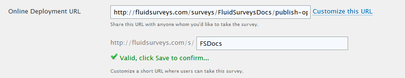
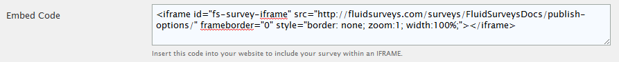
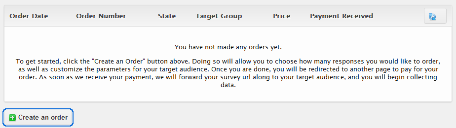
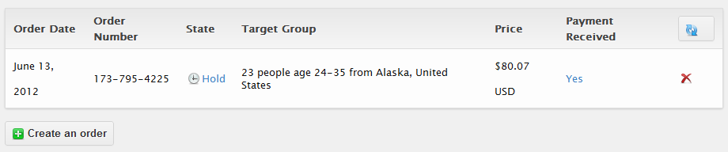
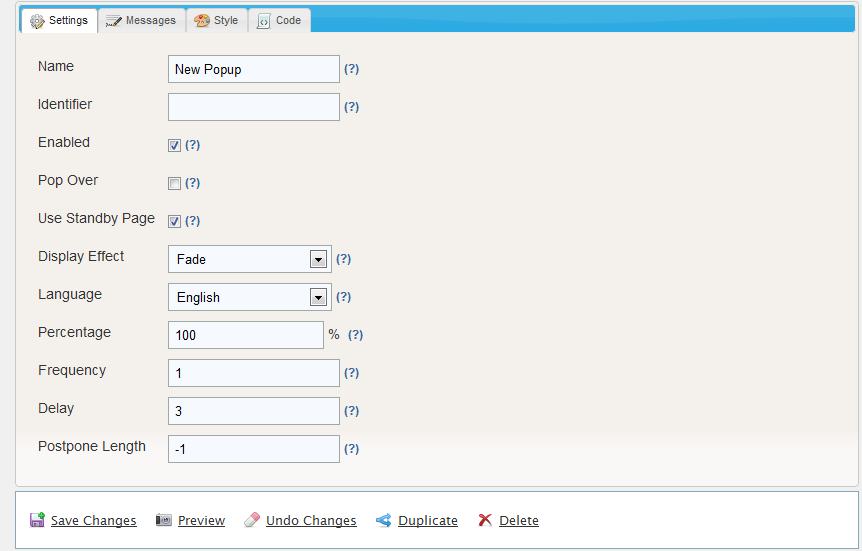
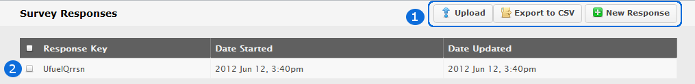
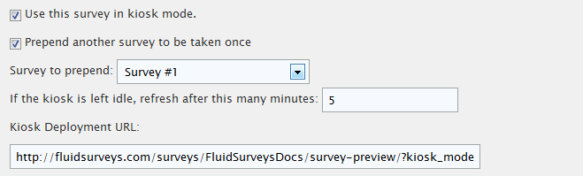

Deployment
----------

Deployment Status
^^^^^^^^^^^^^^^^^

In order to make survey either accessible, or inaccessible to the public, it must be set to Live or Closed respectively. But, any survey created, by default will have its status set to "Live". "Closed" allows the survey creator to build and test their questionnaire in a private environment. Since all surveys are "Live" by default, the surveys existence will be unknown to anyone, as the Administrator is in control of informing the rest of the world about its being.

.. tip::

	You can also alter the deployment status on your survey by clicking "Live" or "Closed" on your survey in the Survey Dashboard

	.. image:: ../../resources/publish/deployment_status_indicator.png
		:scale: 70%
		:align: center
		:class: screenshot
		:alt: Section Heading

A Closed survey will present the following error message to anybody who tries to load the survey.

.. figure:: ../../resources/publish/closed_survey_message.png
	:scale: 70%
	:align: center
	:class: screenshot
	:alt: Closed Survey Error Message

	*Figure 9.1* Closed Survey Error

When a survey is Live, it is a generally advised against changing anything. However, if a addition or subtraction must be made, please refer to the list below to see if your aim is Acceptable, or an Unacceptable Change

**Acceptable Changes:** These modifications can be made while responses are being, or have been, collected and will not affect the integrity of the data.

* Changing the order of questions (Moving questions around on the page, or between pages)
* Changing the wording of questions
* Add new questions

**Unacceptable Changes**: These modifications cannot be made while responses are being, or have been, collected as they will affect the integrity of the data.

* Deleting questions: Once you delete a question, all of the responses that have been collected for that question will be cleared from the results with no possibility of recovery
* Re-arranging choices in a question: If you change the order of choices in a question, the responses will no longer correctly match up, resulting in data integrity issues. Responses are stored based on the location of the choice, not the name of the choice

Online Deployment URL
^^^^^^^^^^^^^^^^^^^^^

Every survey created within an account is defined by its parts; Username and the name of the survey. The Online Deployment URL is what links the world up with your specific survey.

As a result, a URL will always take the username and the name of the survey into consideration when defining itself. In some cases, this can cause a large link that may look off-setting to some potential respondents. It is possible to shorten the URL to a smaller and more manageable size.  

Click "Customize this URL" beside the Online Deployment URL, enter a desired name, and either "Valid, click Save to confirm..." will appear, or "Already taken, choose another..." if the URL has already been claimed.

	*Figure 9.1* Customized URL

Additionally, a feature of FluidSurveys is the ability to present a survey in a number of languages (72 to be exact!) which allows for a survey to be deployed in those languages. If, for instance, your survey has English, French and Spanish as the survey languages, then you can send respondents either an English, French, Spanish Link, or the default Online Deployment URL that will use the default survey language. If your survey does not have multiple languages, then the language dropdown will not be visible.

.. figure:: ../../resources/publish/multiple_language_dropdown.png
	:scale: 70%
	:align: center
	:class: screenshot
	:alt: Multiple Language Dropdown

	*Figure 9.1* French Online Deployment URL

As you'll notice, French has been selected, and the "Online Deployment URL" immediately switches to langfra (Indicating French)

Embed Code
^^^^^^^^^^

An alternative way to expanding your surveys horizons via the usual routine, eg., e-mails, QR codes, Social Networking, it is possible to embed the survey directly into your web site, so anyone who visits the site will be able to take the survey via an IFRAME.

	*Figure 9.1* Embed Code

You can manually add extra HTML code (to change the height and width, for example) directly into the code. When editing your web site to include your survey, you can refresh your website at any time to preview the changes in your survey. 

The survey will take on the default style that we provide and the themer will allow you to dynamically modify what your survey looks like.

If you have `WordPress`_, you can take the provided code and copy and paste it into a “Post” or “Page”.

.. _WordPress: http://www.wordpress.com

Email Invitations
^^^^^^^^^^^^^^^^^

FluidSurveys’ comes equipped with an invitation module through which survey links can be sent to potential respondents via email. To learn more about Email Invitations, refer to the "Invites" section of the manual.

Custom Survey Panel
^^^^^^^^^^^^^^^^^^^

In the past, when you wanted to collect responses from a target audience, eg., Females ages 24-34 who live in Alaska, United States), you'd have to create your own survey in FluidSurveys, and then work with an external panel management company, or list provider to start collecting responses. But, collecting responses from your target audience is possible within the Custom Survey Panel via CINT.

Custom Survey Panel is available on all plans, including Free, and the cost associated with each "Completed" response is based on the type of respondent segment that you are going after (Some segments will be more expensive than other segments -- this is mainly determined by supply/demand in the response marketplace)

	*Figure 9.1* Create a CINT order

**Step 1: Basics**

The new dialog that appears after "Create an order" was clicked is Step 1 of 3. Basics is where you begin outlining your high-level target audience, ie., Country, Region, the number of questions you will be asking, along with the age group. Using the aforementioned example, Females ages 24-34, who live in Alaska, United Stated, an order would look as follows.

.. figure:: ../../resources/publish/cint_step1_basics.png
	:scale: 70%
	:align: center
	:class: screenshot
	:alt: Step 1 Basics

	*Figure 9.1* Basic Target Demographic

.. list-table:: 
	:widths: 30 70
	:header-rows: 1

	* - Section
	  - Description
	* - 1. Country
	  - Choose where you wish to run your survey. If you would like to conduct your survey in more than one region, we suggest you create a different target group for each selection. The cost of running two separate selections is the same as running one larger selection
	* - 2. Region
	  - Select the region of your target group. If you would like to conduct your survey in more than one region, we suggest you create a different target group for each selection. The cost of running two separate selections is the same as running one larger selection
	* - 3. Gender
	  - Select the gender of your target group. If you would like to specify the exact distribution between genders, we suggest you create a different target group for each selection. For example, if you wish to get 200 answers from females and 300 answers from males, place two orders with 200 females and 300 males respectively. The cost of running two separate selections is the same as running one larger selection
	* - 4. Age Range
	  - Choose the age range for the target group. If you would like to specify the exact distribution between age groups, create a different target group for each selection. For example, if you wish to get 200 answers from people in age range 18-22 and 300 answers from people in the age range 23-27, place two orders with 200 and 300 answers respectively. The cost of running two separate selections is the same as running one larger selection
	* - 5. Completed Surveys Needed
	  - The amount of completed surveys required before a successful amount of data has been received
	* - 6. Price
	  - The price is instantly and automatically calculated when you define your target group. Since the process is automated from start-to-finish there are no project costs, set-up costs, minimum or hidden fees. More respondents, longer surveys and narrower target group yields a higher pricer. Why is that? Cint pays incentives to panelists and panel owners when participating in your survey. We pay more for a larger group, for a longer survey and for people harder to find.
	* - 7. Delivery Time
	  - Delivery time is calculated based upon your search criteria and our current available respondents
	* - 8. Available Respondents
	  - This is the current number of available **respondents completing your survey (completes)** for your selected target group within the delivery time shown above. To clarify, if you order 500 completed surveys, Cint will continue to send respondents to your survey until 500 respondents have fully completed your survey.

.. warning::

	If your target audience is unavailable, a warning will appear at the bottom stating the base minimum available for your desired group.

	.. image:: ../../resources/publish/cint_basics_error.png
		:scale: 70%
		:align: center
		:class: screenshot
		:alt: Step 1 Basics

Once the Basics have been outlined, clicking [Continue] will allow for a deeper customization of finding that desired target group. 

** Step 2: Profiling**

.. figure:: ../../resources/publish/cint_step2_profiling.png
	:scale: 70%
	:align: center
	:class: screenshot
	:alt: Step 2 Profiling

	*Figure 9.1* Profiling Target Audience

.. list-table:: 
	:widths: 30 70
	:header-rows: 1

	* - Section
	  - Description
	* - 1. Standard Demographics and Occupation Status
	  - Education level or 
	* - 2. Household
	  - Martial Status, Houshold size, Number of children, Ages of children, Personal income, Household income.
	* - 3. Profession
	  - Company size, Field of expertise, Professional position in company
	* - 4. Transportation
	  - Car access, Access to motorcycle, Purpose of travelling by plane
	* - 5. Other
	  - Glasses/Contact lenses, Smoking habits, Use of mobile phone features

**Overview**

Once your target demographic has been fully finalized, clicking [Continue] brings you to the Overview screen which allows for you to double-check that your survey is indeed tailored for the desired target group.

.. figure:: ../../resources/publish/cint_step3_overview.png
	:scale: 70%
	:align: center
	:class: screenshot
	:alt: Step 3 Overview

	*Figure 9.1* Overview before purchasing

**Buy**

The last step is providing payment options. Available payment plans are:

	* Master card
	* Visa
	* PayPal

Clicking [Process my order] will return you to the first screen, only this time you will see your order. Depending on the defined time, ie., 8 days, you will start to see responses trickle into your survey. 

	*Figure 9.1* Overview of purchased order

Website Popups
^^^^^^^^^^^^^^

Popups can be the fastest, and easiest and most effective way for site visitors to come back. Track visitor opinions, gauge trend popularity, and find out what your web site visitors are thinking with a FluidSurveys survey and a Popup. One way to distribute a survey is via a pop-up window on your website. A common use of popups is to ask the user why they are viewing a certain item in the "Store" page, or what the visitor would like to see on your web site to guarantee that they will/would return.

.. figure:: ../../resources/publish/pop_up.png
	:scale: 70%
	:align: center
	:class: screenshot
	:alt: Popup example

	*Figure 9.1* How a popup looks like

Click "Add new popup" to get started. A new screen will slowly fade into view, which contains all necessary control options as defined below.

**Settings**

	*Figure 9.1* Available settings for a popup

.. list-table:: 
	:widths: 30 70
	:header-rows: 1

	* - Section
	  - Description
	* - 1. Name
	  - The name is simply a label for identification purposes when viewing your list of popups. The user who views the popup will not see this label.
	* - 2. Identifier
	  - This value will be used to set the cookie preventing the popup from being shown twice. You may leave this blank to use a unique identifier, or set it to a custom value. If you use a custom value, all popups sharing this value will check for this value before being displayed. This allows you to have multiple popups on multiple pages but only present the user with one.
	* - 3. Enabled
	  - Allows you to quickly enable or disable this popup. This way you can leave the code for the popup on your website, but if you disable the popup here, it will not appear to any visitors.
	* - 4. Pop Over
	  - Force this popup to stay in the foreground. By default (disabled) the script will attempt to put the displayed survey in the background if the browser allows it. Checking this will attempt to show the window the survey appears in above the current window
	* - 5. Use Standby Page
	  - If this option is enabled, when the user accepts the survey offer, the window popping up in the background will show the standby page first. The standby page will display the message set on the messages tab and contain a link to the survey, but encourages the user to finish browsing. When the user leaves the domain, the standby page automatically redirects to the survey. 
	* - 6. Display Effect
	  - Select an effect to use when displaying t he popup.
	* - 7. Language
	  - Determines which language the survey will be displayed in if your survey uses multiple languages. Since we are unable to detect which language your user would prefer, you will need to create multiple popups, or duplicate an existing one and place the code for the correct language on the corresponding page of your site. The user may still change the survey language once they visit the survey, regardless of which language it was started in.
	* - 8. Percentage
	  - Percentage value between 0 and 100%. Your popups will only be shown to this percentage of people. If you set this value to 10%, abolut 1 in 10 people will see your popups. You may use floating point values such as 0.5% for 1 in 200. For frequency, every X visitor will be shown your popup, while with percentage, each visitor has an X% chance of being shown your popup.
	* - 9. Frequency
	  - Display your popup to every x vistior. If this value is set to 5, every 5th visitor will see your popup. 5, 10, 20, etc. This is checked before the percentage value, so if you have frequency set to 5, and percentage set to 25%, every 5th visitor has a 25% chance of seeing your popup. For percentage, every visitor has X% chance of being shown your popup, where with frequency every X visitor is guaranteed to see the popup.
	* - 10. Delay
	  - Delay (in seconds) before the popup will appear to a visitor on your page
	* - 11. Postpone Length
	  - The length of time (in hours) before a user will be eligible to see the popup again after they were not shown it based on either frequency or percentage limitations. Set this to -1 and the user will not see the popup a second time, unless they clear htier cookies.

**Messages**

Once the functionality, settings, and your desired outcome has been tailored and tweaked, the message can be modified by clicking on the Messages tab at the top. Messages allows for the overall message to be tweaked, which allows for the target audience to instnatly become connected with wording provided on the initial popup. 

.. figure:: ../../resources/publish/popup_messages.png
	:scale: 70%
	:align: center
	:class: screenshot
	:alt: Messages popup

	*Figure 9.1* Available message settings for a popup

.. list-table:: 
	:widths: 30 70
	:header-rows: 1

	* - Section
	  - Description
	* - 1. Header
	  - The text in the header of the popup, usually one line which will draw the user's attention and cause them to read the rest of htem message below
	* - 2. Message
	  - THe text in the main content of the popup. This is the greeting you will give your user and ask them to take their survey, possibly providing some information about the survey, and why it is being taken.
	* - 3. Yes Button
	  - The text displayed on the button that the user will click to take the survey
	* - 4. No Button
	  - The text displayed on the button that the user will click to opt out of taking the survey
	* - 5. Standby Mesage
	  - This text will be displayed in the window that sits in the background while the user finishes browsing the site. It should contain a word or phrase surrounded by [[ ]]. This text will be linked to the survey URL, allowing the user to being the survey immediately instead of waiting until they leave the site. **Example:** "Click [[ here ]] to begin your survey"

**Style**

Styling your popup can ensure that the maximum amount of visitors take your survey. While the width and height can be altered on the "Settings" tab, the ability to affect the Overall colour, height, border is possible. 

**Code**

The final step before publishing your popup survey on your web site, is to link your web site up, with your popup, using the provided "Code"

.. figure:: ../../resources/publish/popup_code.png
	:scale: 70%
	:align: center
	:class: screenshot
	:alt: Popup code

	*Figure 9.1* Popup Code

.. list-table:: 
	:widths: 30 70
	:header-rows: 1

	* - Section
	  - Description
	* - 1. HTML Code
	  - This is the code you will need to paste in your website to trigger the popup
	* - 2. Prevent Popup Code
	  - Place this code at the top of a page which you would like to disable the popup for that user. For example, if you have a user who lands on your pricing page, and you do not want this person to see the popup now, put this code on your pricing page.

At any point during the process of creating, adjusting and tweaking your popup, it is always encouraged to save any work completed thus far. At the bottom of the "New Popup" screen, is a "Options" dial, that contains *Save Changes*, *Preview*, *Undo Changes*, *Duplicate*, *Delete*

.. figure:: ../../resources/publish/popup_save.png
	:scale: 70%
	:align: center
	:class: screenshot
	:alt: Save your popup settings

	*Figure 9.1* Save your popup

Create a 2D Bar Code
^^^^^^^^^^^^^^^^^^^^

Smart phones are becoming more and more common, and a popular way of getting a survey onto a phone is via QR Codes. Like a barcode, the QR code contains all necessary information for your survey to be loaded when scanned via the phones barcode reader. The phone can scan the QR code and be instantly transported to your survey. Each and every survey you create will produce an entirely unique QR code. 

You can include this image on your website or on printed material to enable mobile device users to quickly and easily access your survey. To download a QR code for a survey, right click the image and click 'Save Image As', or click the 'Save Image' button at the bottom of this dialog. 

.. figure:: ../../resources/publish/qr_code.png
	:scale: 70%
	:align: center
	:class: screenshot
	:alt: QR Code

	*Figure 9.1* Sample QR Code. Try it out.

Offline Mode
^^^^^^^^^^^^

No matter where we go, it seems as if we can always access the Internet, be it on our laptops, phones or tablets. Whether we’re in a coffee shop or on a bus, our favourite websites are just a click away.

It’s something thats often taken for granted. There are numerous situations, after all, in which obtaining Internet access isn't so easy. Perhaps we’re working in the field in a remote area, or we’re at a trade show where the connection is unreliable. Collecting data in such situations is often necessary, but difficult.

Through the use of Offline Mode, it is easy and economical to gather survey response data offline on any PC or tablet, and have it uploaded to a centralized database (FluidSurveys.com) once a connection has been re-established.

	*Figure 9.1* Offline survey

.. list-table:: 
	:widths: 30 70
	:header-rows: 1

	* - Section
	  - Description
	* - 1. Options
	  - When an Internet connection is established on a devise, **[Upload]** will upload all your responses to its online counter-part. Conversely, if an Internet connection can never be instituted, then **[Export to CSV]** will export all current response data to a Microsoft Excel (.csv) wherein the "Import Responses" can be used. When a new response is to be entered, when **[New Response]** is clicked, a respondent will go through the survey, while remaining Offline
	* - 2. Response Row(s)
	  - A row constains 1 response.

Designed to run in locations where offline data collection is required (limited or no internet access), FluidSurveys’ Mobile Surveys offer a much more convenient and powerful method than traditional pen & paper.

Sales personnel can now gather feedback as they meet with new clients, researchers can collect data in the field where wireless connections are unavailable, and organizations can set up survey stations at trade shows, kiosks, malls, etc without relying on an internet connection.

.. note::

	When a survey is in Kiosk Mode on a tablet, there is no "Shift" key to exit the fullscreen mode. Therefore, the following code will need to be entered anywhere on the survey, which will force the survey out of Kiosk Mode. 

	HTML Code: <a rel="nofollow" href="#" onclick="application.surveyView.unlock()">EXIT KIOSK MODE</a>

Share With Networks
^^^^^^^^^^^^^^^^^^^

Any survey you create can keep itself close to the pulse of Internet society with the click of a button. You can easily deploy your survey directly on any of your social networks:

.. figure:: ../../resources/publish/share_with_networks.png
	:scale: 70%
	:align: center
	:class: screenshot
	:alt: Share with Networks

	**Left to right:** `Twitter`_, `Facebook`_, `Digg`_, `Reddit`_, `Delicious`_

.. _Twitter: http://www.twitter.com
.. _Facebook: http://www.facebook.com
.. _Digg: http://www.digg.com
.. _Reddit: http://www.reddit.com
.. _Delicious: http://www.delicious.com

To perform a social network release, click on “Publish” and then select which web site you wish to post on. A popup window will appear asking for your login credentials, and once the information has been entered, you’re done. It’s as easy as 1 – 2 – 3

Kiosk Mode
^^^^^^^^^^

Deploying your survey in kiosk mode allows you to assign a short survey as an "entrance" survey. The entrance survey runs only "one time" when you first run your survey and then the torch is passed to your main survey. Your main survey will then run in a loop. The responses to the entrance survey will be pre-pended to all responses gathered in that session. 

	*Figure 9.1* Kiosk Mode with "Survey #1" perpended

The path a respondent will take is that "Survey #1" will be taken once, while the actual survey will constantly loop with a 5 minute timeout timer attached. The first survey is generally a "Location Survey", ie., "Where is this Kiosk located?". Therefore, all responses will have the location perpended. Kiosk mode is perfect for running your survey at a central terminal/computer, whether it’s at a trade show, conference, store, etc.

When kiosk mode is enabled, your survey runs in a loop. Every time a survey response is completed, it automatically refreshes so the next respondent can begin. This allows multiple people to take the survey from one location with ease!

