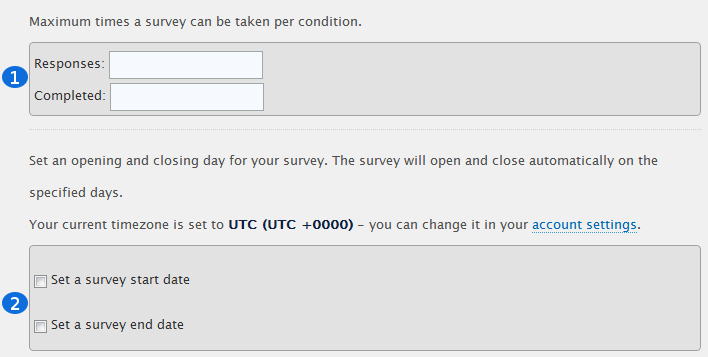
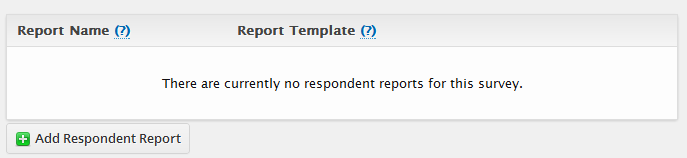
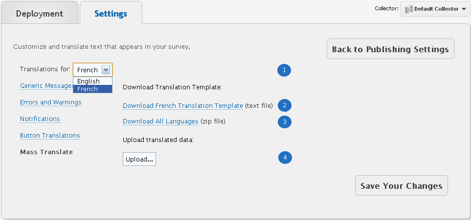

Settings
--------

Essentially, the look-and-feel, or for the car buffs out there, fine-tuning a '71 Oldsmobile Cutlass Convertible into a mean-lean driving machine. After the building blocks have been laid in place, personalizing everything from restriction options, redirections upon completion, to quotas are what Settings allowed to be fine tuned. 

Accessing Settings is possible by clicking "Settings" when in the [Publish] page.

Display Options
^^^^^^^^^^^^^^^

Display options are everything that is front-facing, ie., what affects a respondent the most, such as "Removing the Back button from the survey" all the way to "Skip validation after errors"

.. figure:: ../../resources/publish/display_options_page.png
	:scale: 70%
	:align: center
	:class: screenshot
	:alt: Display Options Page

	*Figure 9.1* Available Display Options 

.. list-table:: 
	:widths: 30 70
	:header-rows: 1

	* - Section
	  - Description
	* - 1. Remove the back button from the survey
	  - Prevent respondents from going backwards and editing their rersponses. As soon as the respondent presses “Next”, the responses they've submitted are saved and can not be altered
	* - 2. Remove the progress bar from the survey
	  - The progress bar appears, by default, at the top of every survey page. It lets the respondent know how much of the survey they’ve completed and how much they have left. Enabling this will disable the progress bar
	* - 3. Allow user to save their survey and continue it at a later time
	  - Surveys can often be very long and detailed and therefore it’s not always feasible for respondents to complete them in one sitting. A nifty feature allows respondents to save their progress and come back to it at a later date.
	* - 4. Show "Clear Page" button at the bottom of survey pages.
	  - The clear page button allows a respondent to delete all of the answers from the page, regardless of the question type
	* - 5. Show "Save Page" button at the bottom of survey pages.
	  - Saves all of the answers on the page. This is not the same as, "Save and Continue Later", the user must remain on the page.
	* - 6. Show "Exit Survey" button at the bottom of survey pages.
	  - Add an 'Exit Survey' button to the bottom of your survey that will allow a respondant to exit the survey, deleting any responses they have provided.
	* - 7. Allow users to download/print responses upon completion of the survey.
	  - Allows respondents to download a hardcopy of their responses.
	* - 8. Display a button that will allow users to download a PDF to review their responses before completing the survey.
	  - Allow respondents to review and print their responses before clicking submit
	* - 9. Allow user to edit their responses after completing the survey
	  - Allows users to regain entry to their survey using the original invite link. However, they would be taken to the beginning of the questionnaire, not to the exact spot where they left off.
	* - 10. Auto-select Checkboxes
	  - Determine whether or not checkbox type questions' choices should be automatically selected when typing in a text-response enabled choice.
	* - 11. Use Fieldset and Legend elements in the HTML Markup for the survey.
	  - Wrap every question in a separate HTML fieldset element. Each question title will be placed in an legend tag. This may be useful for improving screen-reader accessibility, but may alter the visual display of the survey in some browsers.
	* - 12. Skip validation after errors
	  - When enabled, errors are ignored on the second time [Next] is clicked. For instance, if a user enters 3 words on a minimum 500 word validation text response question type, this option will be ignored on the second time the respondent clicks [Next]

Privacy and Security
^^^^^^^^^^^^^^^^^^^^

Not necessarily restrict access to the survey, but disabling specific options, such as the tracking of user privacy information, and enable the same style of security found on an online banking web site

.. figure:: ../../resources/publish/privacy_and_security_page.png
	:scale: 70%
	:align: center
	:class: screenshot
	:alt: Privacy and Security Page

	*Figure 9.1* Available Privacy & Security Options

.. list-table:: 
	:widths: 30 70
	:header-rows: 1

	* - Section
	  - Description
	* - 1. Prevent this survey from being indexed by search engines.
	  - Add a META tag to the top of your survey instructing search engines (e.g. Google, Bing, etc) to ignore your survey.
	* - 2. Enable SSL (Secure Socket Layer) Connections
	  - Enable SSL on this survey (users will be redirected to a secure address to take the survey).
	* - 3. Capture IP Address
	  - Save the IP address of the users responding to the survey. This option is forced on (greyed-out) when the 'only once per IP address' option is checked (see above).
	* - 4. Track Respondent Location
	  - Tracks the originating country of your respondents.
	* - 5. Make this survey anonymous (Selects all below)
	  - Fully disable all tracking for the following options
		  	* Hide any invite codes that were used
		  	* Hide the email address of the respondent
		  	* Hide the custom invite variables
		  	* Hide referring URL
		  	* Hide the get parameters
		  	* Hide the IP address of the respondent
		  	* Hide the username if the user is logged in
	* - 6. Use external authentication
	  - As opposed to using our own SSL Certificate, your own can be provided. When enabled, the OAuth Endpoint URI, and Client Secret are required

.. warning::

	Once a survey has been set as Anonymous, even if a single option was enabled, the setting cannot be undone

Quotas and Deadlines
^^^^^^^^^^^^^^^^^^^^

Quotas allows for the number of respones to be tracked that match a specific numerical value. When the limit is met, eg., 100 Completed Responses, the survey can be automatically closed. Deadlines on the other hand, allows for the survey to be closed (or opened) on a specific date, regardless of the number of garnered responses.

	*Figure 9.1* Available Quotas and Deadlines Options

.. list-table:: 
	:widths: 30 70
	:header-rows: 1

	* - Section
	  - Description
	* - 1. Maximum times a survey can be taken per condition.
	  - *Responses* are the total number of responses received, including Incomplete, whereas *Completed* are the total number of completes received
	* - 2. Set an opening and closing day for your survey.
	  - Set a start and end date for your survey. Ensure the correct Timezone has been selected in order for t he "Survey Start Date" and "Survey End Date" to adhere according to your area.

Access Restrictions
^^^^^^^^^^^^^^^^^^^

Specificy the amount of times a user can complete a survey, or the access alloted to a user, such as entering a password before viewing even a single question, or completing a Turning Test after the survey has been completed to ensure that valid data was provided by a Human

.. figure:: ../../resources/publish/access_restrictions_page.png
	:scale: 70%
	:align: center
	:class: screenshot
	:alt: Access Restrictions Options

	*Figure 9.1* Access Restrictions Options

.. list-table:: 
	:widths: 30 70
	:header-rows: 1

	* - Section
	  - Description
	* - 1. Password Protect this survey
	  - Provide a password, which is not restricted to any format. All characters are allowed. Additionally, as opposed to using a text password, the ability to enable CAPTCHA whcih is a Completed Automated Public Turning test that allows for the software to tell Computers and Humans apart. This will require respondents to transcribe two random words. This will nto show for logged in users, and thus will not be visible by pressing the preview button above. You must log out to view this feature in action.
	* - 2. Many times per computer (no restrictions)
	  - Allows individuals to respond to the survey as many times as they’d like, from any computer. There would be no restrictions placed on respondents, and every response 	  would be recorded as a new entry in analytics. This is the default survey mode.
	* - 3. Once per computer (uses cookies/sessions to identify users)
	  - Once an individual completes the survey, a cookie is created and no one using that same computer would be able to access the survey again. Note, Internet browsers allow for the deletion of internet cookies, and if an individual does this, they would be able to re-take the survey (or another user would be able to take the survey) from the same computer.
	* - 4. Once per location (once per IP Address - not recommended for surveys to be completed by more than one individual per organization. In most organizations everyone shares one IP Address)
	  - The most restrictive option, this setting limits survey responses to one per IP address. Typically, users in a household or organization all have the same IP address. Therefore, if you’d like one response per household, this would be a good feature to use, however, if you’re surveying many people in one organization, it would not be the best choice
	* - 5. Embedded survey (only enabled on one page surveys)
	  - If you have a one page survey, you can embed it into a 3rd party website, and all of the results will be recorded to fluidsurveys.com. Selecting this option will provide you with the HTML code required to embed the questionnaire.
	* - 6. Invite only (only allow users with a valid unused invite to take the survey)
	  - This setting prevents anyone without a valid invite code from accessing the survey. Invite codes are randomly generated 5 character codes (composed of letters and numbers). They act as a password; however, each user has to have a unique code. No two invite codes can be the same. They can be generated and distributed manually, or via the invite tool.

Redirection
^^^^^^^^^^^

Allows for a serious survey to transform into a survey equipped with piping to enable a specific flow. Redirection allows for an element to be added at the end of the survey that would allow for all respondents to see an entirely different page once [Submit] has been clicked, or their survey responses have bene deemed Terminated, ie., not needed. 

.. note:: 

	Redirect to a custom webpage on different conditions. Don't forget to add http:// to the front.

.. figure:: ../../resources/publish/redirection_page.png
	:scale: 70%
	:align: center
	:class: screenshot
	:alt: Redirection Page

	*Figure 9.1* Redirection Options

.. list-table:: 
	:widths: 30 70
	:header-rows: 1

	* - Section
	  - Description
	* - 1. Pass through GET variables received from the survey entrance page
	  - Panels are 3 rd party companies that allow for surveyors to pass through response data for a respondent, and have the company provide the results in a different manner. Response data for a respondent are passed from FluidSurveys to a 3rd party panel company by taking advantage of GET Variables. 
	* - 2. Survey Complete Redirect
	  - Once a respondent completes and submits a survey, you can specify a URL to which they would be redirected, bypassing the “Thank You” page
	* - 3. Survey Terminated Redirect
	  - A terminated survey occurs when a respondent is ejected from the survey before reaching the end due to one of their responses. A rejected repsonse is specified for a question, based on the Branching Condition within the survey. 
	* - 4. Quota Filled Redirect 
	  - When the quota has been filled, eg., 100 Completed responses, it is possible to redirect the respondent to an entirely different web site, separate to FluidSurveys, apart from the default (customizable) Quota Filled message
	* - 5. Confirm before leaving the survey through external links on the page
	  - If this is enabled, the respondent will need to verify that they do in fact wish to leave the survey in favour of an external web site.

.. tip::

	Redirection can be unique to a language. English can redirect to the English portal, while French can redirect to the French portal. Thus, allowing for a continued stream of fluidity

Respondent Reports
^^^^^^^^^^^^^^^^^^

Respondent Reports allow the user to download a summary of their response, using a pre-built report template. You can build these report templates in the Reports section under the 'Analyze' tab. These reports will be available for download from the Survey Complete page.

	*Figure 9.1* Respondent Reports

Clicking [Add Respondent Report] allows for a Report to be tied into a survey

.. figure:: ../../resources/publish/options_responent_reports.png
	:scale: 70%
	:align: center
	:class: screenshot
	:alt: Respondent Reports Options

	*Figure 9.1* Respondent Reports Options

.. list-table:: 
	:widths: 30 70
	:header-rows: 1

	* - Section
	  - Description
	* - 1. Report Name 
	  - This will be the name of the report that respondents see when they have completed the survey. Note, these names cannot be translated
	* - 2. Report Template
	  - This is the template from which the respondent report will be generated. You can use any regular report for this purpose. These reports will then be automatically filtered to only use answers from the respondent

Once the options have been saved, whenever the respondent completes their survey, they are presented with the option to download an individualized report

.. figure:: ../../resources/publish/response_table_in_survey.png
	:scale: 70%
	:align: center
	:class: screenshot
	:alt: Respondent Reports At End Of Survey

	*Figure 9.1* Respondent Reports at the end of a survey

Other Options
^^^^^^^^^^^^^

Other options are mainly options that do not strictly belong in a category on their own since they relate to the storing of responses, providing metatags for survey customization, or receive responses via email

.. figure:: ../../resources/publish/other_options_page.png
	:scale: 70%
	:align: center
	:class: screenshot
	:alt: Other Options Options

	*Figure 9.1* Other Options... Options

.. list-table:: 
	:widths: 30 70
	:header-rows: 1

	* - Section
	  - Description
	* - 1. Keep users' responses even if they are invalidated by the respondent navigating down a different branching tree
	  - If a respondent selects a series of responses only to realize that they are incorrect, if they go back and take an alternate route, their old responses will be saved.
	* - 2. Enable Olark real-time chat plugin
	  - Enabling this option will allow you to engage in real-time chat with your respondents through your Olark account.
	* - 3. Receive notifications
	  - Receive a daily email notification to your registered email when your survey has received responses.
	* - 4. Save Responses to Dropbox
	  - Enabling this option will cause a PDF version of each completed response to be saved your Dropbox account.
	* - 5. Metatag Name
	  - A Metatag is a data (information) about data. When customizing for a tablet, it is required that the viewport is added as a metatag, in order for a specific CSS rule to be fired when a tablet with a small screen triggers it. 

Changes Pages/Messages
^^^^^^^^^^^^^^^^^^^^^^

Any error message, page, or message that appears in your survey is customizable and translatable.

**Generic Messages Page**

The basic pages found at the end of a survey

.. list-table:: 
	:widths: 30 70
	:header-rows: 1

	* - Section
	  - Description
	* - 1. Thank You Page
	  - This is displayed upon successful completion of a survey.
	* - 2. Survey Closed Page
	  - This is displayed when a survey is not live or has been closed.
	* - 3. Save & Continue Page
	  - This text is displayed when a respondant has saved their survey for continuation later.

**Error & Warnings Page**

Error page warnings that appear on only key pages, such as when providing an email address to enter the survey

.. list-table:: 
	:widths: 30 70
	:header-rows: 1

	* - Section
	  - Description
	* - 1. Page Contains Error
	  - Displayed at the top of a page which contains validation errors.
	* - 2. Question Required
	  - Displayed above a required question when a user does not supply an answer.
	* - 3. Email Already In Use
	  - Displayed when the same email is used twice for an invite only survey.
	* - 4. Termination Page
	  - This is displayed when a survey is terminated.

**Notifications Page**

Notifications pertain to errors that occur on a survey, such as invalid data input, text validation, or incorrect selection

.. list-table:: 
	:widths: 30 70
	:header-rows: 1

	* - Section
	  - Description
	* - 1. Quota Reached 
	  - This is displayed when a surveys quota has been reached and a new survey taker attempts to access the survey.
	* - 2. Restriction Notification
	  - This is displayed when a user is attempting to gain access to a restricted survey.
	* - 3. Password prompt
	  - Text to go along with the box for users to enter their password if required
	* - 4. Respondent-report prompt
	  - Text to show before listing respondent-reports (if there are any)
	* - 5. CAPTCHA Prompt
	  - Text that prompts the users to fill out the reCAPTCHA form
	* - 6. CAPTCHA Error
	  - Error message that shows when the respondent filled out the incorrect text for the CAPTCHA validation 
	* - 7. Unsubscription Page
	  - Modify what the users will see when they reach the unsubscription page.
	* - 8. Invite Only Header
	  - Header shown on the invite only page
	* - 9. Invite Only Page
	  - Modify what the users will see when they are asked to provide an invite code, when the survey is set to invite only.
	* - 10. Invite Only Prompt
	  - Text to go with the box asking for the user's invite code
	* - 11. Invitation Over Used Page
	  - Modify what the users will see when they try to use an invitation code multiple times.
	* - 12. Require Email Message
	  - Instead of using an invite code, prompt the user for their email to generate one.
	* - 13. Email Confirmation Message
	  - If allowing the user to generate their own invite, send an email to confirm the address
	* - 14. Email Prompt
	  - Label for the email entry box
	* - 15. Already Completed Header 
	  - Header shown on the page displayed when a user tries to take a survey twice.
	* - 16. Already Completed with Edit
	  - Message shown when user visits a survey a second time, and is allowed to edit responses.
	* - 17. Already Completed without Edit
	  - Message shown when user visits a survey a second time, and is not allowed to edit responses.

**Button Translations**

Every button found on a survey is translatable, from the "Back" button all the way to, "Download Responses"

**Mass Translations**

Being able to deliver online surveys around the world can bring a host of new challenges. One of these challenges is language barriers – someone who doesn't speak the survey language wouldn't be able to respond. FluidSurveys already allows for the translation of all aspects of your survey – the questions, buttons, errors and warnings. However, you have to translate your questions in the editor, and the buttons on the settings page, and you have to switch between languages each time you need to translate something. We’ve devised a solution to this slow workflow: Mass Survey Translation.

Mass Translations can be found under [Publish]. 

	*Figure 9.1* Mass Translate French for a survey

.. list-table:: 
	:widths: 35 65
	:header-rows: 1

	* - Option
	  - Description
	* - 1. Translate For
	  - Select from the dropdown the language you'd like to translate
	* - 2. Download French Template
	  - If the French language was selected from the dropdown, then the French language template is available for download. Whichever language was selected, that will become the deciding factor for this section
	* - 3. Download All Languages
	  - If there are multiple languages within a survey, it may be more advantageous to download all languages in bulk, as opposed to translating each separately, ie., all languages will download into a .zip file
	* - 4. Upload Data
	  - Once the translations have been completed, re-upload the templates so they can be reflected online

.. figure:: ../../resources/editor/mass_translation_infile.png
	:align: center
	:scale: 70%
	:alt: Mass Translation French File in Editor
	:class: screenshot

	*Figure 9.1* Mass Translation French file in Editor

.. list-table::
	:widths: 35 65
	:header-rows: 1

	* - Option
	  - Description
	* - 1. Survey Language
	  - Each language will have a specific code that allows for you to quickly identifiy which file you are presently translating. Example of such languages
		    * fr = French
		    * en = English
		    * de = German
		    * es = Spanish
		    * ar = Arabic
	* - 2. Question Titles/Variables
	  - A row represents a chunk of your question. The first 2 rows, "msgid" and "msgstr", which both contain "Question 1", are the question titles.

.. warning::

	It is not advised to change the first row, "msgid" within the translation file. The "msgid" row refers to the default language text. If the default survey language is English, yet you are altering the French language file, then "Question 1" is what ties any changes made back to the:

		1. That question, ie., Question 1
		2. The foundation language text

	If the first row is changed, then you will receive a new translation file the next time you download the text file, or the [Upload] process may not work. Therefore, changing the first instance of "msgid" is advised against.