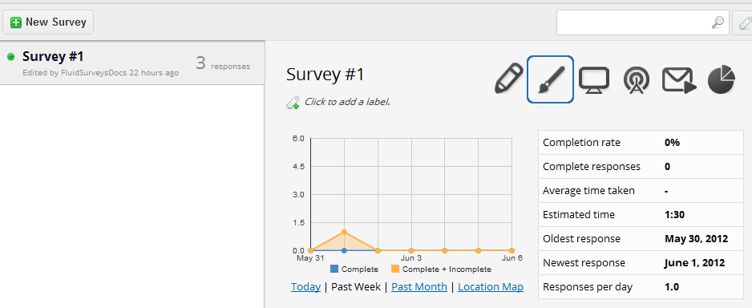
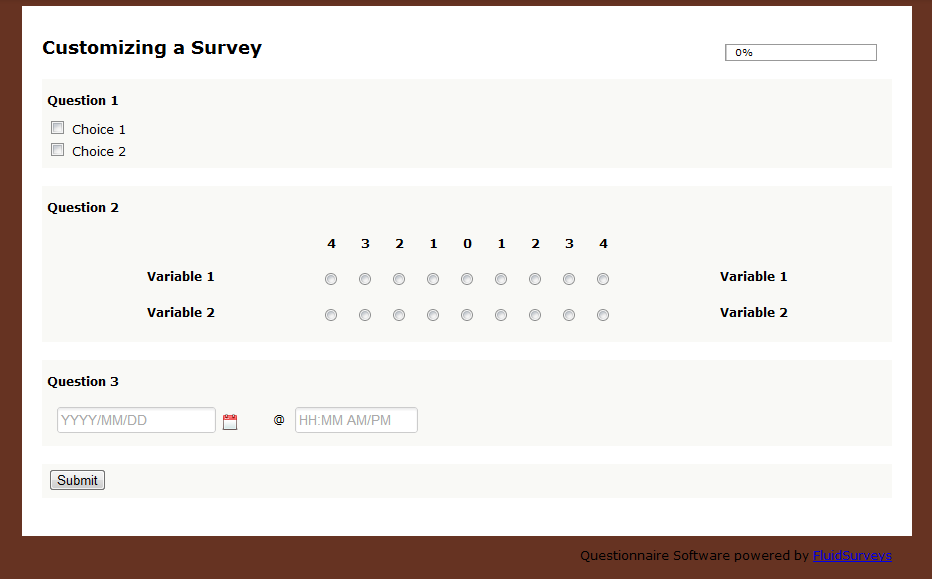
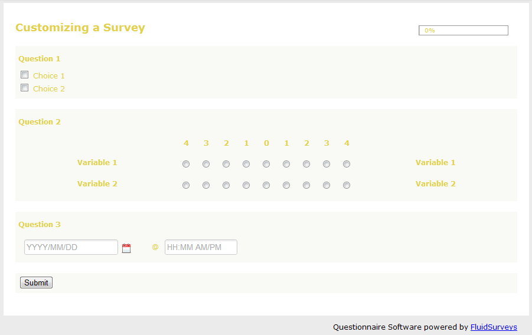
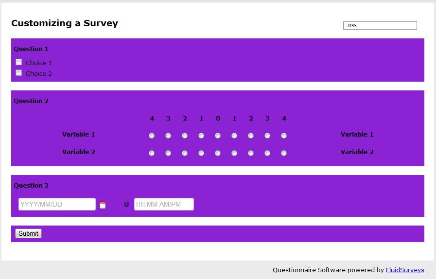
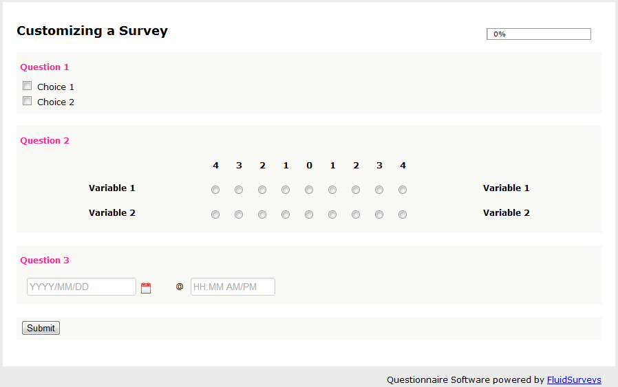
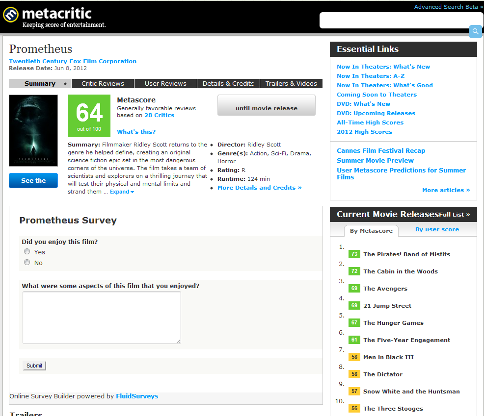

.. _Themer:

Style
=====

If the Editor is the meat and potatoes, then the Themer is the desert capable of delievering a polished product. By default, every new survey adheres to a basic template, which holds the signature colours of FluidSurveys (Grey, Light Grey, Black, Blue). This style may not fit the needs of every individual, and therefore we provided the option to fully allow for everything to be changed.

In this chapter, you will be introduced to the ability of changing not only basic elements, but complex aspects of your survey. Regardless of your CSS prowess, you can add your companies logo, alter the survey background colour, question fonts, all the way to how buttons look-and-feel. However, when venturing into the CSS Editor, it would not hurt to brush up on some basic CSS knowledge, or use it as a database of knowledge, then `w3schools`_ is the perfect starting point.

.. _w3schools: http://www.w3schools.com/

To get started, the Themer can be found through either the "Style" button within the Editor

.. figure:: ../../resources/style/quick_links_style.png
	:align: center
	:scale: 70%
	:alt: Quick Link Style
	:class: screenshot

	*Figure 9.1* Quick Link Style button found in the Editor

Or the paint brush on the Survey Dashboard.

	*Figure 9.1* Quick Link Style button in the Survey Dashboard

When the Themer is loaded up for the first time, the first page will be on display, with an Administrator Toolbar sticking at the top of the page with all styling options available. The Administrator bar will hold all changes available to an Administrator and the survey. 

.. figure:: ../../resources/style/themer_admin_bar.png
	:align: center
	:scale: 70%
	:alt: Themer Admin Bar
	:class: screenshot

	*Figure 9.1* Administrator Themeing Toolbar

.. list-table:: 
	:widths: 30 70
	:header-rows: 1

	* - Section
	  - Description
	* - 1. Theme
	  - Apply a pre-built theme to your survey
	* - 2. Customize 
	  - Alter Colours, Elements, or a specific Question without knowing any CSS
	* - 3. Advanced
	  - Customize CSS or grab a template from an already built web site. 
	* - 4. Pages
	  - If your survey consists of multiple pages, directly jump from page to page. Based on the complexity of a theme, it might be advantageous to ensure that all pages, and question types adhere to any CSS styling.

Theme
-----

The Theme is the first option available on the Toolbar. Essentially, the Theme allows for a survey to adhere to an already pre-styled colouring, outline and CSS format. To apply a Theme, click on [Theme], select the desired theme (see Live examples below) and then [Save Changes]. 

.. figure:: ../../resources/style/theme_stylings.png
	:align: center
	:scale: 70%
	:alt: Themes
	:class: screenshot

	*Figure 9.1* Available Themes

.. list-table:: 
	:widths: 30 70
	:header-rows: 1

	* - Section
	  - URL
	* - 1. Basic
	  - `Basic Theme Example`_ 
	* - 2. Chirp 
	  - `Chirp Theme Example`_ 
	* - 3. Green Tartan
	  - `Green Tartan Theme Example`_
	* - 4. Blue Tartan
	  - `Blue Tartan Theme Example`_
	* - 5. Green Wallpaper
	  - `Green Theme Example`_
	* - 6. Console
	  - `Console Theme Example`_
	* - 7. Matrices
	  - `Matrices Theme Example`_
	* - 8. Pretty
	  - `Pretty Theme Example`_
	* - 9. Sunburst
	  - `Sunburst Theme Example`_
	* - 10. Aztec
	  - `Aztec Theme Example`_
	* - 11. Classic Blue
	  - `Classic Blue Theme Example`_
	* - 12. Social
	  - `Social Theme Example`_
	* - 13. Mobile 
	  - `Mobile Theme Example`_

.. _Basic Theme Example: http://fluidsurveys.com/surveys/FluidSurveysDocs/basic-theme-example
.. _Chirp Theme Example: http://fluidsurveys.com/surveys/FluidSurveysDocs/chirp-theme-example
.. _Green Tartan Theme Example: http://fluidsurveys.com/surveys/FluidSurveysDocs/green-tartan-theme-example/
.. _Blue Tartan Theme Example: http://fluidsurveys.com/surveys/FluidSurveysDocs/blue-tartan-theme-example
.. _Green Theme Example: http://fluidsurveys.com/surveys/FluidSurveysDocs/green-theme-example
.. _Console Theme Example: http://fluidsurveys.com/surveys/FluidSurveysDocs/console-theme-example
.. _Matrices Theme Example: http://fluidsurveys.com/surveys/FluidSurveysDocs/matrices-theme-example/
.. _Pretty Theme Example: http://fluidsurveys.com/surveys/FluidSurveysDocs/pretty-theme-example
.. _Sunburst Theme Example: http://fluidsurveys.com/surveys/FluidSurveysDocs/sunburst-theme-example
.. _Aztec Theme Example: http://fluidsurveys.com/surveys/FluidSurveysDocs/aztec-theme-example/
.. _Classic Blue Theme Example: http://fluidsurveys.com/surveys/FluidSurveysDocs/classic-blue-theme-example
.. _Social Theme Example: http://fluidsurveys.com/surveys/FluidSurveysDocs/social-theme-example
.. _Mobile Theme Example: http://fluidsurveys.com/surveys/FluidSurveysDocs/mobile-theme-example/

.. note::

	A Theme is not 'stuck' to a survey. You can alter anything at anytime, even go so far as to remove all styling formats on a survey at any time.

Customize
---------

Customize is the start of recasting your survey to fit the needs and styles of what you desire. Within the Customize option, you can alter the:

* Color
* Elements
* Questions

Altering each option within Color can either slightly or drastically change the outlook of your survey. Refer to the bolded points below to see a brief example of what each Color option will modifyBody

Color
^^^^^

**Background Color**

	*Figure 9.1* Body Background Color (#663322)

**Header text color**

.. figure:: ../../resources/style/header_text_color.png
	:align: center
	:scale: 70%
	:alt: Modified Header Text color
	:class: screenshot

	*Figure 9.1* Header text color (#9881ff)

**Survey background color**

.. figure:: ../../resources/style/survey_background_color.png
	:align: center
	:scale: 70%
	:alt: Modified Survey Background Color
	:class: screenshot

	*Figure 9.1* Altered Survey Background Color (#ea64c0)

**Survey text color**

	*Figure 9.1* Altered Survey Text Color (#e1d14e)

**Question Background color**

	*Figure 9.1* Altered Question Background Color (#8b22d4)

**Question title color**

	*Figure 9.1* Altered Question Title Color (#fd2d98)

Elements
^^^^^^^^

Advanced
--------

Custom CSS
----------

If none of the available Colors, Survey Elements, or Question styles push for a deeper experience 

.. figure:: ../../resources/style/custom_css.png
	:align: center
	:scale: 70%
	:alt: Custom CSS Editor
	:class: screenshot

	*Figure 9.1* Custom CSS Editor

Template Grabber
----------------

Grabbing a template from a pre-existing web site requires a little bit of digging, but it will allow for you to take everything, ie., colours, format, outline, pictures, css files, etc. and allow for them to reside within your survey. In order to successfully execute a Template Grab, you will need the following information seen below.

.. figure:: ../../resources/style/grab_template.png
	:align: center
	:scale: 70%
	:alt: Grab Template
	:class: screenshot

	*Figure 9.1* Grab Template Window

.. list-table:: 
	:widths: 30 70
	:header-rows: 1

	* - Section
	  - Description
	* - 1. Page URL {{ name }}
	  - The link to the web site that you'd like to grab from
	* - 2. Target id
	  - This is where the survey will go in the grabbed theme. Using the example below, Metacritic.com has a section of its web site that has an id, "critic_user_reviews_wrap". The survey will go where the summary of a critics review goes.
	* - 3. Language link id
	  - If the survey you are grabbing from has a multi-language front facing section of their web site, then the URL can be entered here. This only applies when you have a survey with multiple languages, ie., French, 

.. warning::

	If the wrong Target id was provided, then your survey may simply flash once, and retain its old base template. If this happens, then return back to the web site in question, and ensure that the appropriate id was copied.

To learn more on how to successfully grab a template from any web site, refer to the, "Grab a Template" found under the Tutorial section of this manual.

The end result, after finding the correct div id (critic_user_reviews_wrap) on Metacritic (http://www.metacritic.com/movie/prometheus) yields the following result. Notice anything familiar under the films description?

	*Figure 9.1* Template Grabbed from Prometheus Review on Metacritic

.. note::

	You can reset your theme at any time by clicking "Reset" under the "Template Grabber"

Pages
-----

