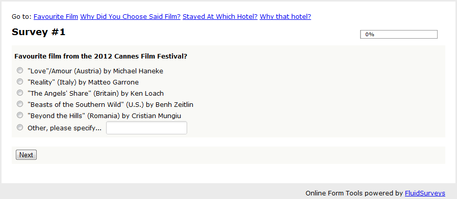
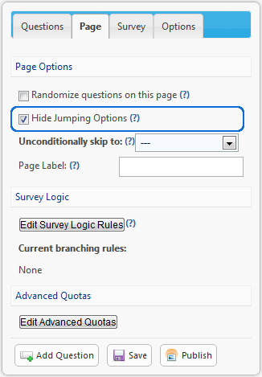
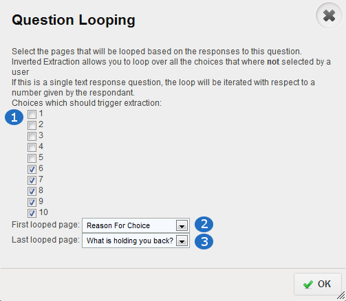
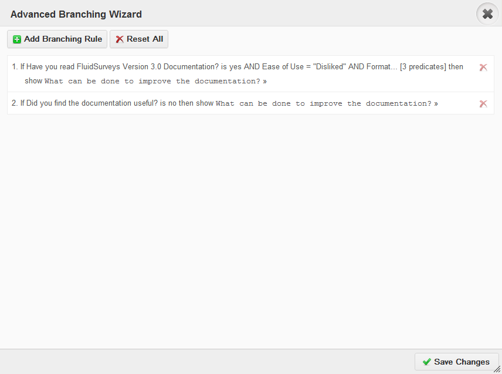
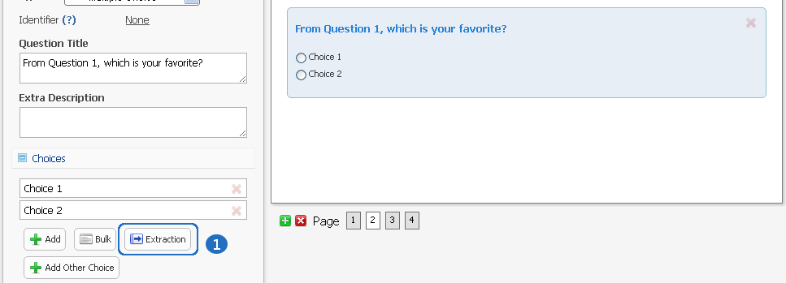
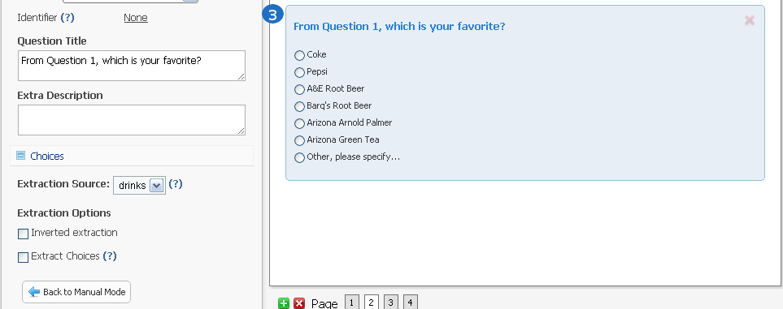
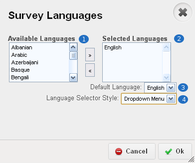
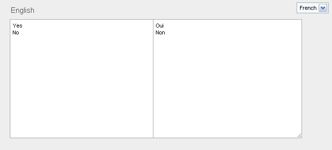

.. _Advanced Features:

Advanced Survey Features
------------------------

This chapter will teach you how to:

* Randomize questions on a page
* How to randomize questions
* Advanced Expression Piping
* Advanced Branching
* Looping
* Fully complete your knowledge banks of FluidSurveys Editor features

Jumping
^^^^^^^

Jumping allows you to create named points in your survey in which the respondent can easily navigate to.

.. figure:: ../../resources/editor/enable_jumping.png
	:align: center
	:scale: 70%
	:alt: Enable Jumping
	:class: screenshot

	*Figure 9.1* Enable Jumping

.. note::

	Jumping will only become available when the page labels have been altered to anything other than 1, 2, 3, etc. By default, this option is disabled

	*Figure 9.1* Breadcrumb on survey

When a respondent takes your survey, as opposed to unknowingly progressing through the pages of your survey, they will be able to see each-and-every upcoming page. Enabling this option allows for the respondent to jump between pages. This option is perfect for when FluidSurveys is being used for something other than a survey, ie., account information, gathering financial information, etc. By default, the option for jumping is disabled. 

However, you can hide which pages you do not want to appear in the jumping menu. 

	*Figure 9.1* Disable Jumping between pages

Looping
^^^^^^^

Looping allows for the ability to create a block of questions that contain questions about the quality of previously asked questions, ie., why the selected hotel was chosen over the others. Looping will save time, as it replaces the necessity to create 1 block for each potential question, by adhering to a loop that appears to be dynamically created specifically for each and every respondent.

Looping is available through the Right-Click menu

.. image:: ../../resources/editor/looping_right_click.png
	:align: center
	:scale: 70%
	:alt: Looping through Right-Click
	:class: screenshot

Once "Looping" has been selected, a new window will reveal itself, presenting you with the option of selecting which pages you'd like to loop. Conversely, you can select which page will be the last within the looping cycle.

	*Figure 9.1* Pop-up window for Looping

.. list-table:: 
	:widths: 25 75
	:header-rows: 1

	* - Option
	  - Description
	* - 1. Choice
	  - Only the following choices, 6, 7, 8, 9, 10, will set off the Looping condition. When either value is chosen for any of the # choices, it will loop once for each choice that hit the required condition.
	* - 2. First Page
	  - Looping will begin on "Reason For Choice" page, ie., Page 2
	* - 3. Last Page
	  - Looping will end on "What is holding you back?", ie., Page 3

.. note::

	The Looping Pop-up window will present slightly different options depending on the question type that is being used as the looping pivot point. The figure above uses a Dropdown Grid as the test 

Looping is only available to the following question types:

	* Text Response
	* Checkbox
	* Text Response Grid
	* Multiple Choice Grid
	* Checkbox Grid
	* Semantic Differential

.. tip::

	When Piping is used, Looping is put into overdrive. Each and every page can contain previously inputted responses by the respondent, which gives off the illusion of a survey created uniquely for an individual. Refer to Piping in the manual to learn more.

Quotas
^^^^^^

Dynamic quotas allow for the surveyor to limit the amount of responses for a given question. If the response limit is reached for a particular question, then the survey can be exited, terminated or finished, the question can be hidden, or no action can be carried out. 

The Advanced Quota window is available under [Page] > [Edit Advanced Quotas] within the Editor

.. figure:: ../../resources/editor/advanced_quotas_logic.png
	:align: center
	:scale: 70%
	:alt: Advanced Logic
	:class: screenshot

	*Figure 9.1* Only 50 responses for "Amour"/"Reality" AND those that stayed at "Hotel Nelligan" allowed

.. list-table:: 
	:widths: 25 75
	:header-rows: 1

	* - Option
	  - Description
	* - 1. Response Total
	  - The value entered will determine that amount of desired responses for a block of logic. In the example above, only 50 complete responses for the logic (seen in #2) is allowed. By default, this number is 10. 
	* - 2. Logic Rule
	  - The deciding factor when determining the end point of the respondents journey. In the example above, if 50 respondents completed the survey with the response of "Amour" AND stayed at the Hotel Nelligan, then the 51st respondent will be redirected to the "Quota Filled" screen.
	* - 3. Survey Path
	  - Depending on what you determine in the "then" clause, the respondent will the defined path. In this case, the user will be brought to the "Quota filled" page at the end of the survey. The available branching paths are:
			* Exit the survey with a quota filled message
			* Finish the survey
			* Terminate the survey
			* Hide a question
	* - 4. Add Quota
	  - Add a new quota rule, with its own survey path, logic rule, and response total.
	* - 5. Command
	  - Save or Cancel any changes made

Additionally, a survey itself can have a quota, that when reached, eg., 100 completed responses, will automatically close the survey. The survey quota is found under [Publish] > [Settings]

.. figure:: ../../resources/editor/settings_survey_quotas.png
	:align: center
	:scale: 70%
	:alt: Survey Quota
	:class: screenshot

	*Figure 9.1* Final quota on a survey, where # equals the total amount desired

Piping
^^^^^^

Piping is defined as taking the respondent’s answer to a previous question and inserting it (a.k.a piping it) into a later question. This sort of behavior will help keep your respondent more engaged and will make them feel as if the survey is customized to their particular situation. Piping is definitely recommended for anyone who’d like to increase their avg. survey completion rate.

The Piping Wizard, found by right-clicking on a question and selecting "Piping Wizard" from the right-click menu, will present a new pop-up

.. figure:: ../../resources/editor/piping_wizard_popup_drag.png
	:align: center
	:scale: 70%
	:alt: Piping Wizard popup
	:class: screenshot

	*Figure 9.1* Piping Wizard popup

Dragging over {{ film }} (a question identifier on Page 1) into the Question Title for the Text Response on Page 2 will pipe in what the respondent selected on Page 1. In this example, the respondent selected, "Love/Amour", which appears into the title on the following page.

.. note::

	Only questions with an identifier will appear in the piping wizard. To learn more about Identifiers, please refer to the section in the manual.

.. figure:: ../../resources/editor/result_of_piping.png
	:align: center
	:scale: 70%
	:alt: Result of Piping
	:class: screenshot

	*Figure 9.1* Piping from 1 question to another

.. tip::

	One of the unsung hero features is that you can pipe in custom fields that you have already uploaded into your address book. Let’s say that you have uploaded the contact info for 100 people into your address book and that one of these fields is “City”. You could then pipe this value into a question like: “How long have you lived in {{ invite.city }}. The correct value would then be inserted for each contact who responds. We won't go into too much detail about this here, but you can check the Email section of the manual, which talks about Custom Variables, to learn more.

Advanced Expression Piping
^^^^^^^^^^^^^^^^^^^^^^^^^^

While piping provides the ability to take answers from one question in your survey, and use them with questions either on a later page (or on the same page), Advanced Expression Piping (AEP) allows for you to take that same basic principle, but power it with the same style of functionality that Microsoft Excel offers. But, before jumping into AEP, refer to the `"Piping"`_ section in the Documentation to learn the basic principles.

.. _"Piping": http://docs.fluidsurveys.com/chapters/Editor/advancedfeatures.html#piping

In essence, AEP allows for the use of code to perform simple (or complex) math operations in your survey, wherein you can then display the output to the respondent and record it in your response data. Furthermore, AEP can reduce the use/need for Custom JavaScript in your survey when desiring simple mathematical operations, such as addition, subtraction, or even when only wishing to display certain elements of a word, such as "Fluid" from "FluidSurveys". With AEP, you can perform math calculations and operations in real-time while the respondent is taking the survey, which can assist in calculating the cost, total, max, min, etc.

AEP works on a very basic principle::

	expression = identifier 

.. warning::

	An identifier must start with a letter and can only contain either letters, digits, underscore, eg., ``anIdentifier_``

An equation must start with {{ contain the function, or identifier, and end with }}. 

**Possible Constants**

Within Advanced Expression Piping, your expressions can only consist of either an 1) string, 2) float, 3) integer, 4) list. Expressions are short for identifiers. Therefore, your identifiers must adhere to the aforementioned standard, wherein the values contained in the identifiers can only be:

.. list-table:: 
	:widths: 35 70
	:header-rows: 1

	* - Constant
	  - Description
	* - string
	  - An expression that start and end with single quotes. Examples: 'abcd', '123'
	* - float
	  - An expression that consist of decimal numbers, eg., 3.0, 10.33, 99.5
	* - integer
	  - An expression that consist of whole numbers, eg., 0 100 2013
	* - list
	  - An expression that starts and ends with square bracket. eg., [1,2,3], ['a', 'b', 'c']

**Possible Attributes**

Attributes are used as simple anchors that return specific information about a certain expression, eg., q1, or about a invite email, eg., user.email. As a result, attributes are used for .score, .label.

.. tip::

	The identifier.attribute is perfect for building your own quizzes, where you can add up section totals as opposed to only getting the entire surveys score back via the Scoring Question Type. For instance, Section 1, {{ q1.score + q2.score }}, Section 2 {{ q3.score + q4.score }} allow to create section based quizzes.

.. list-table:: 
	:widths: 35 65
	:header-rows: 1

	* - Attribute
	  - Description
	* - identifier.attribute
	  - Return the score of a question, or all the values entered in a question, or the exact survey URL + its GET Variables or Invite Codes. eg (respective order)., q1.score, q1.label, collector.url. Other possible attributes are user.email, invite.first_name
	* - index.identifier
	  - Return only specific index values, eg., q1[0].label returns everything entered for Row 1, and q2[2].score returns only the score for choice 2
	* - array.identifier
	  - Return for only a range of values, eg., q1[0:2].label returns everything for rows and columns 1 and 2, while q2[:1].score will return only column 1 scores

.. note::

	Here is a sample survey to give hands-on practice with Array AEP: http://fluidsurveys.com/s/attribute-aep/

**Possible Arrays**

Arrays allow for you to create a series of 'arrays' that contain certain words, as opposed to the entirety of the word. For instance, you can create an array for "FluidSurveys", and manipulate it to return only certain letters.

.. tip::

	If you wish to calculate the row, or column of a question, then arrays make the most sense when your survey contains a 3D Matrix Question Type. This will allow for you to calculate only 1 (or mulitple) row, or 1 (or mulitple) column without having to resort to Custom JavaScript Development

.. list-table:: 
	:widths: 35 65
	:header-rows: 1

	* - Array
	  - Description
	* - identifier[expression:expression]
	  - Create an array based on 2 expressions, eg.,: q1[0:2] will produce "slot 1, slot 2". **Note** if your question contains 3 rows, and you wish to calculate all values provided by the respondent, then put 0:3
	* - identifier[expression:]
	  - Will only take the values from the rows in a question, eg., q1[3:] will return values for 3 rows. **Note**: Only works in 3D Matrix Question
	* - identifier[:expression] 
	  - Will only take the values from the columns in a question, eg., q1[:2] will return values for 2 columns. **Note**: Only works in 3D Matrix Question
	* - identifier[:] 
	  - Returns **all** numbers in your question, eg., q1[:], returns, "1, 2, 3, 4"

.. note::

	Here is a sample survey to give hands-on practice with Array AEP: http://fluidsurveys.com/s/arrays-aep/

Arrays can be used when dealing with Functions (seen below), in that you can have {{ SUM(q1[0:2]) }} and it will calculate all values for 2 rows.

**Possible Index**

Once your array is understood, and you wish to go inside the array itself, you can provide an index, where you can return only certain letters. For instance, if you only care to return the letter at index 0 (First letter) in the "FluidSurveys", it would return the "F"

.. list-table:: 
	:widths: 35 65
	:header-rows: 1

	* - Index
	  - Description
	* - identifier[expression]
	  - Return only 1 Examples: q1[0]
	* - array[expression] 
	  - Examples: q1[1:][0]
	* - identifier.integer  
	  - Examples: q1.0

.. note::

	Here is a sample survey to give hands-on practice with Array AEP: http://fluidsurveys.com/s/index-aep/

**Possible Expressions:**

Expressions allow for basic math operations, such as addition, subtraction to be performed on variables, thus providing the same level of interaction as you would receive in Microsoft Excel when manipulating cells.

.. list-table:: 
	:widths: 35 65
	:header-rows: 1

	* - Expression
	  - Description
	* - expression1 + expression2
	  - Will perform addition on 2 identifiers, eg., 1 + 1 is 2
	* - expression1 - expression2
	  - Will perform subtraction on 2 identifiers, eg., 1 - 1 is 0
	* - expression1 * expression2
	  - Will perform multiplication on 2 identifiers, eg., 1 * 1 is 1
	* - expression1 / expression2
	  - Will perform division on 2 identifiers, eg., 1 / 1 is 1
	* - not expression
	  - Compares 2 expressions to ensure that they are equal, or not, eg., not (1 = 1) is true
	* - expression1 and expression2
	  - Will append expression2 to the overall value, where expression1 is a math operation, eg., 1 + 2 = 2 + 1 and 2 > 1 is true
	* - expression1 or expression2
	  - Will append subtraction on 2 identifiers, where expression1 is a math operation, eg., 1 + 2 = 2 + 1 or 2 > 1 is true
	* - expression1 = expression2
	  - Will append 1 expression, eg., 1 + 1, with another expression eg., 2 + 2 to allow for deeper mathematical operations. For instance, 2 = 1 + 1 is true because 1 + 1 = 2
	* - expression1 > expression2
	  - Will return if expression1 is greater than expression2, eg., 1 > 1 produces **false**
	* - expression1 < expression2
	  - Will return if expression1 is less than expression2, eg., 1 < 2 produces **true**
	* - expression1 >= expression2 
	  - Will return if expression1 is less than expression2, eg., 1 >= 1 produces **true**
	* - expression1 <= expression2 
	  - Will return if expression1 is less than expression2, eg., 1 <= 2 produces **true**
	* - expression1 != expression2
	  - Compares 2 expressions to ensure that they are equal, or not, eg., 1 != 1 is **false**, whereas 1 != 2 is **true**

.. warning::

	The and, or, not expressions can only be used to compare mulitple variables together, eg., {{ q1.0 + q1.1 = q1.2 + q1.3 and q1.4 > q1.5 }} will compare the following math operation, (1 + 2 = 2 + 1 and if 4 > 5). Since the first to operations (1 + 2 = 2 + 1) both return 3 = 3, the flag will remain "false" as long as 4 > 5, which is false. Therefore, the operation will return false.

.. note::

	Here is a sample survey to give hands-on practice with Expression AEP: http://fluidsurveys.com/s/expressions-aep/

**Possible Functions:**

Functions provide the same level of interaction per variable, eg., {{ q1.0 }} as you would receive in Microsoft Excel when interacting with multiple cells. 

.. list-table:: 
	:widths: 25 65
	:header-rows: 1

	* - Function
	  - Description
	* - SUM(expression,...)
	  - In a list of 3 numbers, eg., "1, 2, 3", it will return the sum of all parameters: **6**
	* - MAX(expression,...) 
	  - In a list of 3 numbers, eg., "4, 5, 6", it will return the maximum over all parameters: **6**
	* - MIN(expression,...) 
	  - In a list of 3 numbers, eg., "7, 8, 9", it will return the minimum over all parameters: **7**
	* - AVG(expression,...)  
	  - In a list of 3 numbers, eg., "10, 11, 12", it will return the average over all parameters: **11**
	* - CONCAT(expression,...) 
	  - Will return the joined string over all params, eg., "a b" yields **ab**
	* - COALESCE(expression,...)  
	  - In a list of 3 items, eg., "1, , 3", it will return the first non-empty parameter in all parameters: **1**
	* - INT(expression)  
	  - In a list of 3 decimal values eg., "1.1, 2.2, 3.3", it will transform the parameter into an integer (whole number): **7**
	* - STR(expression)
	  - Transforms the parameter into a string, eg., 1 becomes "1"
	* - REAL(expression)
	  - Transforms the parameter into a real number, eg., 7 becomes 7.0
	* - SUBSTR(expression,expression[,expression])z
	  - Returns the substring of the first parameter starting from the second parameter (and ending at the third parameter if it exists). 
	* - INDEXOF(expression,expression)  
	  - Returns the index of the second parameter in the first parameter. *Only for string parameters*
	* - CONTAINS(expression,expression) **[Coming Soon]**
	  - In a list of 2 strings, eg., "FluidSurveys, "Fluid", it will check if the first parameter includes the second parameter: **False**
	* - CONTAINSONEOF(expression,expression) **[Coming Soon]**
	  - In a list of 2 strings, eg., "FluidSurveys, "Fluid", it will check if the first parameter includes one of the second parameter: **True**
	* - INTERSECT(expression,expression) **[Coming Soon]**  
	  - In a list of 6 numbers, eg., "1, 2, 3" and "2, 3, 4", it will return the intersection of the two parameters: **2, 3**
	* - ISNULL(expression) **[Coming Soon]**
	  - Checks if the parameter is empty or not, eg., if q1 = no response, then it will return **True**
	* - LENGTH(expression) **[Coming Soon]**
	  - In a list of 1 string, eg., "FluidSurveys", it will return the length or size of the parameter: **12**

.. warning::

	There cannot be a space between expressions and commas, eg., {{ SUM(q1,q2) }} **Note**: the lack of space between expressions within the parenthesis

.. note::

	Here is a sample survey to give hands-on practice with Function AEP: http://fluidsurveys.com/s/function-aep/

From here, it is possible to combine Functions, Expressions, with Index, Attributes all using Constants. Therefore, you can provide complex arithemtic in real-time to your client, wherein you can produce a truly unique survey, as well as strongly building a deeper back-end data catalog.

Stay tuned for future updates to Advanced Expression Piping such as:

	* Assignment, eg., varaible = {{ q1.0 + q1.1 }} 
	* IF/THEN expression piping
	* Filters based on Advanced Expression Piping
	* ... and much much more

Branching
^^^^^^^^^

Branching is similar to simple skipping in that it allows you to send respondents to different sections of your survey based on their responses. There are however, several differences. With advanced branching, you can skip based on multiple conditions (multiple questions), as well as based on questions on previous pages. You can also implement dynamic on-page skipping (hide, show, disable questions), and trigger a variety of actions (email messages, terminate the survey, etc). Plus, you can implement branching on additional question types, such as text response fields, grid questions and checkbox (multi-answer) questions. All in all, advanced branching can do everything that simple skipping can + more.

.. figure:: ../../resources/editor/survey_logic_wizard.png
	:align: center
	:scale: 70%
	:alt: Survey Logic Wizard start
	:class: screenshot

	*Figure 9.1* The first window seen when "Advanced Logic" is clicked

.. list-table:: 
	:widths: 30 70
	:header-rows: 1

	* - Option
	  - Description
	* - 1. Add Branching Rules
	  - Click "Add Branching Rule" to add a rule. Please note that in order to associate branching with a question in your survey, the question must first have a question identifier. To learn how to add an identifier, refer to the Identifier section in the manual.

Every branching logic condition has a quality that will execute when a block has been satisfied. There are 11 choices available to help better farther assist you in customizing your survey to your specific needs.

.. figure:: ../../resources/editor/choices_logic.png
	:align: center
	:scale: 70%
	:alt: Available Choices
	:class: screenshot

	*Figure 9.1* Available Logic Branches

.. list-table:: 
	:widths: 40 60
	:header-rows: 1

	* - Option
	  - Description
	* - 1. Skip to page
	  - Jump to a specific page. You cannot select a previous page
	* - 2. Complete the survey
	  - Jump to the "Thank you" page. This will mark any response as "Complete". This branching logic is perfect.
	* - 3. Terminate the survey
	  - Jump to the end. This will mark any response as "Incomplete". This branching logic is perfect when you want to keep track of a demographic you may not specifically be tailoring to, ie., a survey only for females, those that watch more than 10 movies a year, etc.
	* - 4. Skip to a random page
	  - Randomly jump to a random page. You cannot select a previous page.
	* - 5. Hide a question
	  - Based on a response, hide a question from the respondents view outright 
	* - 6. Show a question
	  - Based on a response, show a question to the respondents view
	* - 7.  Disable a question
	  - Disabling a question will make it so that its choices and variables cannot be selected, ie., grayed out
	* - 8. Send an email
	  - Email an individual(s) with the satisfied branching logic with a customizable Subject, Message, and adjustable Advanced Options
	* - 9. Redirect to a URL
	  - Redirect the respondent to a web site.
	* - 10. Mark the response as completed
	  -  Responses are either Incomplete, or Complete. Based on a condition, some Administrators would want a survey to be marked "Complete" right away based on a response, as opposed to waiting until the [Submit] button is clicked at the end of the survey.
	* - 11. Randomly traverse a page range
	  - Jump between specified pages, ie., 4, 10, 11

.. warning::

	Randomly traverse specified range has the ability to branch backwards into a survey, but the issue of an infinite recursive looping issue has the possibility of arising. For instance, based on a response, you could go back to Page 2, but if the respondent follows the same path and choices to have the logic loop them back to Page 2, the respondent may grow frustrated, leave your survey, and mark their response group as "Incomplete". It is advised against branching back into a survey.

Branching Logic can include more than 1 condition. It is best to look at logic as a series of logical statements. While it may be confusing to understanding at first glance, breaking down the conditions is as simple as deciding, "if the user selects A&E Root Beer, and if the user selects Barq's Root Beer, then I do not want them to answer the rest of the survey. I want them to leave". A block contains 1 logic condition, as seen in Figure 9.1

.. figure:: ../../resources/editor/survey_logic_conditions.png
	:align: center
	:scale: 70%
	:alt: Survey Logic Wizard start
	:class: screenshot

	*Figure 9.1* Logic applied to a page in a survey

.. list-table::
	:widths: 30 70
	:header-rows: 1

	* - Option
	  - Description
	* - 1. Condition 1
	  - Branching Conditions can be broken down into a basic sentence structure that adheres to, "If Have you read FluidSurveys Version 3.0 Documentation is Yes, AND Ease of Use AND Format are both exactly Disliked".
	* - 2. Add Rule
	  - Click "Add Rule" to add a branching condition. Please note that in order to associate branching with a question in your survey, the question must first have a question identifier. To learn how to add an identifier, refer to the Identifier section in the manual
	* - 3. Rule Actions
	  - Every condition has a rule. Therefore, based on the above Condition, the individual will see the "What can be done to improve the document?" question
	* - 4. Control
	  - Save Rule, or Cancel, or the added advanced branching logic

Clicking "Save Rule" will return you to the main branching logic screen, wherein additional rules can be added. 

	*Figure 9.1* Main screen with logic

Clicking the "X" (Top-right) or pressing [Esc] on the keyboard, will present an error dialog that will inform you to Save any unsaved changes. Always be saving!

.. warning::

	It’s not recommended to use advanced branching and simple skipping together. If one is used, the other shouldn't. Using both could lead to clashing conditions and unexpected results.

Extraction
^^^^^^^^^^

Data extraction is the act or process of retrieving data out of a previous data source for further data processing (in the case with surveys, part of another question). Essentially, data extraction allows the selected choices from one question to appear in a following question. 

Extraction, like all Advanced Logic within FluidSurveys, requires multiple pages. When extracting choices selected by a respondent, they must reside on a page before the fact.

.. note::

	By default, "Extraction" is disabled

	*Figure 9.1* Randomize choices on the page

.. figure:: ../../resources/editor/select_variable.png
	:align: center
	:scale: 70%
	:alt: Randomize questions on the page
	:class: screenshot

	*Figure 9.1* Randomize choices on the page

	*Figure 9.1* Randomize choices on the page

.. list-table:: 
	:widths: 30 70
	:header-rows: 1

	* - Option
	  - Description
	* - 1. Extraction
	  - Clicking Extraction will lead to the next section that allows for you to choose which question you'd like to extract from
	* - 2. Variable
	  - Select the question with the correct variable name. 
		**Note** You must give the question you're extracting from a variable name
	* -  3. Extracted Choices
	  - Notice how the choices are now all the choices from the previous question. Do not be alarmed by this. Only the choices that the user selects will be shown here. Additionally, you can alter the Extraction choices to only pull [Inverted Choices], ie, choices other than what they chose, and [Extract Choices], ie., extract only the choices instead of the variables

.. warning::

	You can [Extract From] 

		* Checkbox
		* Multiple Choice Grid
		* Text response grid
		* Dropdown Matrix

	and you can [Extract To] any question except a 3D Matrix

Languages/Translations
^^^^^^^^^^^^^^^^^^^^^^

Languages and Translations are a powerful way to reach a wide target audience by allowing for the surveyor to select from 70+ languages to reside in a single survey. 

.. figure:: ../../resources/editor/language_bar.png
	:align: center
	:scale: 70%
	:alt: Language top bar
	:class: screenshot

	*Figure 9.1* Language option in the Editor

The respondent will then be able to choose the language they would like to take the survey in, by selecting it from a dropdown language bar in the upper right-hand corner of the survey. Regardless of the language selected by the respondent, the data will be overlayed into the one single survey.

When the language button has been selected, a new window will appear that allows for the desired languages to be selected. To add a language, simply move it from the "Available Languages" side to the "Selected Languages" side by using the appropriate arrows, ie., right to add, left to remove.

	*Figure 9.1* Available Survey Languages

.. list-table:: 
	:widths: 30 70
	:header-rows: 1

	* - Option
	  - Description
	* - 1. Available Languages
	  - Selected the language you wish to have in your survey. There are 70+ languages available to chose from.
	* - 2. Selected Languages
	  - All languages presently in your survey. There is no limit to the amount of languages you can have on a survey.
	* - 3. Default Language
	  - Select the default language. By default, English is the base language
	* - 4. Style
	  - Change the style between Radio Buttons, or a Dropdown menu. By default, the language selector is a dropdown menu.

Multiple languages on a survey will become prevalent when using the [Bulk] feature. In order to a smooth transition between multiple languages, it is advised to be aware of those

	*Figure 9.1* Bulk Window when dealing with multiple languages

.. warning::

	Only specific sections will be translated, such as [Back], [Next], [Submit], and the "Yes/No" question type. The entirety of the question title/description, its variables and choices will need to be translated by the survey creator. If the scope and size of a survey reaches 50+ questions, spread across 20+ pages, it may be advantageous to use "Mass Translations" to quickly, and efficiently translate the entirety of the content. To learn more, refer to the "Mass Translations" section of the manual

