.. _Question Options:

Question Options
----------------

This chapter will teach you how to:

* Randomize questions on a page
* Set the border of a question
* Change the default Scores for Choices and Variables
* Enable text Validation input
* Learn the specifics of the Editors question types options

Randomize
^^^^^^^^^

By default, questions on a survey page are held in the same place on each and every page load. However, there is an option that can do the opposite. You can randomize the questions on a survey page so that every respondent sees them in a different, and random, order. 

.. figure:: ../../resources/editor/randomize_choices.png
	:align: center
	:scale: 70%
	:alt: Randomize questions on the page
	:class: screenshot

	*Figure 9.1* Randomize choices on the page

.. note::

	By default, "Randomize questions on this page" is disabled

.. list-table:: 
	:widths: 30 70
	:header-rows: 1

	* - Option
	  - Description
	* - 1. Randomize questions
	  - Check this option if you would like the questions on this page to be shown in a random order every time this survey is taken.

Coincidentally enough, loading the survey for the first time presented the questions in their appropriate outline.

.. figure:: ../../resources/editor/pre_random.png
	:align: center
	:scale: 70%
	:alt: Before randomizing questions on the page
	:class: screenshot

	*Figure 9.1* Questions not yet randomized

However, after loading the survey a second time, the questions "What are your favorite styles of Jazz? (select all that apply)" and "Who's your favorite Jazz artist?" are flipped

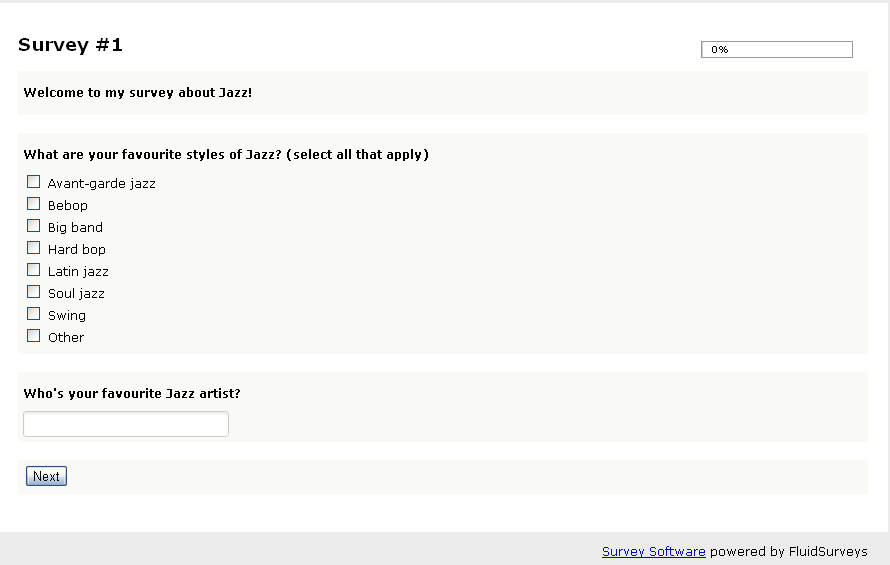

	*Figure 9.1* Questions randomized on the page

.. note::

	The Section Header will never randomize as it allows for an Administrator to outline specific containers on the page

Alphabetize
^^^^^^^^^^^

By default, choices/variables appear in the order they were entered. Therefore, if B is put before A, the system will not auto-correct it. "Alphabetize" will automagically sort the choices/variables for you, without losing your data.

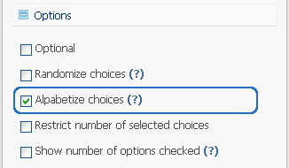

	*Figure 9.1* Alphabetize option in the Editor for a Text Response 

.. note::

	By default, "Alphabetize" is disabled

**Alphabetize is available to the following question types:**

	1. Checkbox
	2. Multiple Choice
	3. Dropdown 
	4. Text Response Grid
	5. Multiple Choice Grid
	6. Dropdown Grid
	7. Checkbox Grid
	8. Dropdown within a N-atrix
	9. Radio Buttons within a N-atrix
	10. Dropdown within a 3D Matrix
	11. Radio Buttons within a 3D Matrix
	12. Semantic Differential

The option is available under "Options" found in the floating editor box on the left-hand side.

.. figure:: ../../resources/editor/notalpha_toalpha.png
	:align: center
	:scale: 70%
	:alt: Not-Alphabetized to Alphabetized
	:class: screenshot

	*Figure 9.1* Non-alphabetized to alphabetized questions

.. note::

	When a survey is live, and has already received numerous responses, but you realize there is a choice missing, ie., "District of Columbia", do not add the choice in its appropriate spot. Instead, enable the option, "Alphabetize". The respondent will see the "District of Columbia" in its appropriate slot, without causing any harm to your sensitive, and needed data.

Side-By-Side
^^^^^^^^^^^^

Side-by-side allows you to place 2 questions beside each other in separate columns. Only 2 questions can be added side-by-side, even if the survey width was altered through CSS to be 100%. There can instances when the display side-by-side will not work, such as the case when the question being condensed has a fixed width, eg., 70, which would break the outline

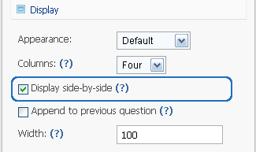

	*Figure 9.1* Side-by-side option in the Editor

.. note::

	By default, "Display side-by-side" is disabled

.. figure:: ../../resources/editor/side_by_side.png
	:align: center
	:scale: 70%
	:alt: Not-Alphabetized to Alphabetized
	:class: screenshot

	*Figure 9.1* Example of side-by-side

.. tip::
	
	A common use of using "Side-by-Side" is to ask the respondent their level of satisfaction to a specific brand or product.

Append to Previous
^^^^^^^^^^^^^^^^^^

The song *"One is The Loneliest Number"* by **Three Dog Night** is no longer relevant with the Append to Previous option. In some cases, you would like to ask a respondent a sub-question that relates to the previous question. But, you would like to use a separate question type. Append to Previous allows for you to fulfill those desires, and still maintain a cognitive styling pattern across your survey, by making it look as though 3 questions are really 1.

When the option, "Append to Previous" has been selected, the question will 

.. figure:: ../../resources/editor/text_response_append_to_previous.png
	:align: center
	:scale: 70%
	:alt: Append to Previous for Text Response
	:class: screenshot

	*Figure 9.1* Example of 3 questions being appended to previous

.. note::

	By default, "Append to Previous" is disabled

.. figure:: ../../resources/editor/append_to_previous.png
	:align: center
	:scale: 70%
	:alt: Append to Previous
	:class: screenshot

	*Figure 9.1* Example of 3 questions being appended to previous

.. tip::

	You can chain together a series of questions to make them look like one. Simply select "Append to Previous" for all the questions that you'd like to stick to its predecessor.

Width
^^^^^

There are 2 areas where the width plays a role in determining the overall aesthetic of a question.

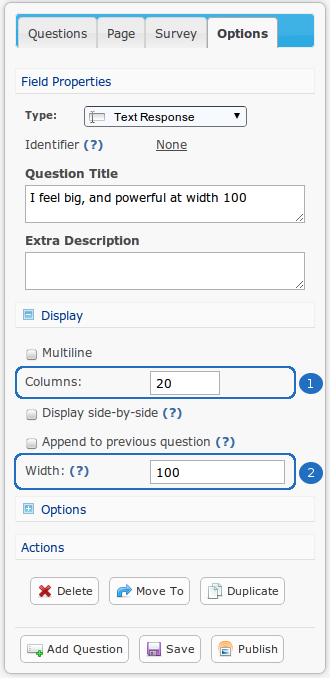

	*Figure 9.1* Width and Column width options for a Text Response

.. list-table:: 
	:widths: 30 70
	:header-rows: 1

	* - Option
	  - Description
	* - 1. Column Width
	  - You can control the amount of space reserve for the text area (column). The size is determined by the "Columns" number within the Editor for a question. The default value is 20 columns
	* - 2. Width
	  - If you want to cover less or more space on the web page, then edit the Percent width. This will either spread or condense the space it covers. Width percentage of the survey width that this	  question will take up. If you've ever wanted to cover less, or more space on your survey, then editing the Percent width of a question will either spread, or condense the space it covers. 
	    The default value is 100%

**Column Width**

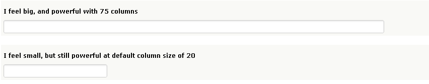

	*Figure 9.1* Text area with 75 column width, and one with the default column size of 20.

**Question Width**

.. figure:: ../../resources/editor/question_normal_vs_width.png
	:align: center
	:scale: 70%
	:alt: Question width
	:class: screenshot

	*Figure 9.1* Example of a question without width, and one 80% (survey size) with.

.. note ::

	The background colour was changed for both question types to accurately represent the question width being altered within a default template.

.. warning::

	The width value for both a question, and the column will not be accurately reflected in the editor.

Choices/Variables
^^^^^^^^^^^^^^^^^

Choices and Variables are the answers themselves to close and open-ended question. 

.. figure:: ../../resources/editor/choices_and_variables.png
	:align: center
	:scale: 70%
	:alt: Choices and Variables
	:class: screenshot

	*Figure 9.1* Choices and Variables for a Mulitple Choice Grid

.. list-table:: 
	:widths: 20 80
	:header-rows: 1

	* - Option
	  - Description
	* - 1. Choices
	  - Adding additional choices will increase the X-axis. Choice 1 and Choice 2, shown here, will appear on the X-axis (along the top of the question). Choices are commonly used as a means of better determining a respondents affinity toward a product, ie., "Like", "Hate", "N/A", etc.
	* - 2. Variables
	  - Adding additional variables will increase the X-axis. Variable 1 and Variable 2, shown here, will appear on the Y-axis (along the side of the question). Variables are commonly used as a means conveying a certain product, ie., Apple, McDonalds, Telus, etc.

Certain question types have specific options within the choices/variables that allow for a deeper integration of your desired goal and effect.

**Checkbox Question Type Choices**

.. figure:: ../../resources/editor/cv_checkbox.png
	:align: center
	:scale: 70%
	:alt: Chocies for a Checkbox
	:class: screenshot

	*Figure 9.1* Choices for a Checkbox

.. list-table:: 
	:widths: 30 70
	:header-rows: 1

	* - Option
	  - Description
	* - 1. Exclusive Choice
	  - Enabling this option will force the choice to become the only selected option. When the respondent selects the choice, any previously selected choices will be automatically deselected in favour of this choice. By default, this option is disabled.
	* - 2. Select All
	  - Enabling this option will automatically select all choices in the question. By default, this option is disabled.
	* - 3. Add Text Response
	  - Enabling this option will put a text response beside the choice. The text response can have Validation applied. However, the width cannot be adjusted.
	* - 4. Score
	  - A score is what determines the weight for a Choice/Variable that can later be used during the Analytics phase. By default, this value is the value of the choices position, eg., Choice 1 is in the first slot, therefore the Score will be "1". To learn more about "Scores", refer to the "Scores" section of the manual.
	* - 5. Add Other Choice
	  - Clicking this button will create a choice that is, "Other, please specify" (which can be customized) along with a text response box. This is comparable to adding a text response to a choice.

**Multiple Choice Question Type Choices**

.. figure:: ../../resources/editor/cv_multiplechoice.png
	:align: center
	:scale: 70%
	:alt: Choices for Multiple Choice
	:class: screenshot

	*Figure 9.1* Choices for a Mulitple Choice 

.. list-table:: 
	:widths: 30 70
	:header-rows: 1

	* - Option
	  - Description
	* - 1. Add Text Response
	  - Enabling this option will put a text response beside the choice. The text response can have Validation applied. However, the width cannot be adjusted.
	* - 2. Score
	  - A score is what determines the weight for a Choice/Variable that can later be used during the Analytics phase. By default, this value is the value of the choices position, eg., Choice 1 is in the first slot, therefore the Score will be "1". To learn more about "Scores", refer to the "Scores" section of the manual.
	* - 3. Branch To
	  - If the user selects the Choice, then you can notify the software to branch the respondent down a different path. By default, all choices will lead to the next page.
	* - 4. Add Other Choice
	  - Clicking this button will create a choice that is, "Other, please specify" (which can be customized) along with a text response box. This is comparable to adding a text response to a choice.

**Dropdown Question Type Choices**

.. figure:: ../../resources/editor/cv_dropdown.png
	:align: center
	:scale: 70%
	:alt: Choices for a Dropdown
	:class: screenshot

	*Figure 9.1* Choices for a Dropdown

.. list-table:: 
	:widths: 30 70
	:header-rows: 1

	* - Option
	  - Description
	* - 1. Score
	  - A score is what determines the weight for a Choice/Variable that can later be used during the Analytics phase. By default, this value is the value of the choices position, eg., Choice 1 is in the first slot, therefore the Score will be "1". To learn more about "Scores", refer to the "Scores" section of the manual.
	* - 2. Branch to
	  - If the user selects the Choice, then you can notify the software to branch the respondent down a different path. By default, all choices will lead to the next page.

**Text Response Grid Question Type Choices**

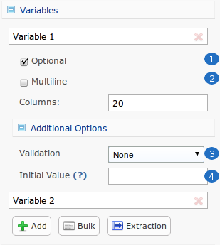

	*Figure 9.1* Variables for a Text Response Grid

.. list-table:: 
	:widths: 30 70
	:header-rows: 1

	* - Option
	  - Description
	* - 1. Optional
	  - Determines whether the question is required in order to proceed through the survey, or not. By default, this option is enabled.
	* - 2. Multiline
	  - Commonly referred to as the "width" of a text area. If a large amount of text is required, then altering this value may be advantageous.. By default, the value is set to 20 columns.
	* - 3. Validation
	  - Determins the type of text that can be entered, eg., Currency will only allow "$19.99". To learn more about "Validation", refer to the "Validation" section of the manual.
	* - 4. Initial Value
	  - By default, the initial value is blank.

**Dropdown Grid Question Type Choices and Variables**

.. figure:: ../../resources/editor/cv_dropdowngrid.png
	:align: center
	:scale: 70%
	:alt: Chocies and Variables
	:class: screenshot

	*Figure 9.1* Choices and Variables for a Dropdown Grid

.. list-table:: 
	:widths: 20 80
	:header-rows: 1

	* - Option
	  - Description
	* - 1. Score
	  - A score is what determines the weight for a Choice/Variable that can later be used during the Analytics phase. By default, this value is the value of the choices position, eg., Choice 1 is in the first slot, therefore the Score will be "1". To learn more about "Scores", refer to the "Scores" section of the manual.
	* - 2. Optional
	  - Determines whether the question is required in order to proceed through the survey, or not. By default, this option is enabled.

**Checkbox Grid Question Type Choices and Variables**

.. figure:: ../../resources/editor/cv_checkboxgrid.png
	:align: center
	:scale: 70%
	:alt: Choices and Variables
	:class: screenshot

	*Figure 9.1* Choices and Variables for a Checkbox Grid

.. list-table:: 
	:widths: 20 80
	:header-rows: 1

	* - Option
	  - Description
	* - 1. Score
	  - A score is what determines the weight for a Choice/Variable that can later be used during the Analytics phase. By default, this value is the value of the choices position, eg., Choice 1 is in the first slot, therefore the Score will be "1". To learn more about "Scores", refer to the "Scores" section of the manual.
	* - 2. Optional
	  - Detemrins whether the question is required in order to proceed through the survey, or not. By default, this option is enabled.

**N-atrix Question Type Variables**

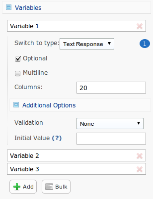

	*Figure 9.1* Choices and Variables for a N-atrix

.. list-table:: 
	:widths: 20 80
	:header-rows: 1

	* - Option
	  - Description
	* - Switch to type
	  - Since a N-atrix question type allows for it to contain more than 1 question type, you can alter which question type is available as a Variable. Available question types are
		    1. Dropdown
		    2. Text Response
		    3. Checkbox
		    4. Radio Buttons

**3D Matrix Question Type Choices**

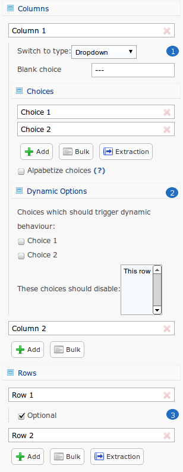

	*Figure 9.1* Choices and Variables for a 3D Matrix

.. list-table:: 
	:widths: 20 80
	:header-rows: 1

	* - Option
	  - Description
	* - Switch to type
	  - Since a N-atrix question type allows for it to contain more than 1 question type, you can alter which question type is available as a Variable. Available question types are
		    1. Dropdown
		    2. Text Response
		    3. Checkbox
		    4. Radio Buttons
	* - Dynamic Options
	  - When these are enabled for a specific choice, if the respondent clicks it, then the row can be disabled. By default, these choices are disabled.
	* - Optional
	  - Detemrins whether the question is required in order to proceed through the survey, or not. By default, this option is enabled.

**Drilldown Grid Question Type Choices**

.. figure:: ../../resources/editor/cv_drilldown.png
	:align: center
	:scale: 70%
	:alt: Choices and Variables
	:class: screenshot

	*Figure 9.1* Choices and Variables for a Drilldown Grid

.. list-table:: 
	:widths: 20 80
	:header-rows: 1

	* - Option
	  - Description
	* - Score
	  - A score is what determines the weight for a Choice/Variable that can later be used during the Analytics phase. By default, this value is the value of the choices position, eg., Choice 1 is in the first slot, therefore the Score will be "1". To learn more about "Scores", refer to the "Scores" section of the manual.
	* - Branch to
	  - If the user selects the Choice, then you can notify the software to branch the respondent down a different path. By default, all choices will lead to the next page.

**Semantic Differential Question Type Choices and Variables**

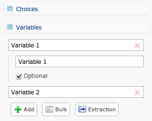

	*Figure 9.1* Choices and Variables for a Semantic

.. list-table:: 
	:widths: 20 80
	:header-rows: 1

	* - Option
	  - Description
	* - Optional
	  - Determines whether the question is required in order to proceed through the survey, or not. By default, this option is enabled.

.. warning::

	Removing a Choice/Variable on a Live survey WILL delete the information associated with that option. Do not delete any information on a Live survey without first consulting with on one of our experienced Technical Support Representatives. 

Add Other Choice
^^^^^^^^^^^^^^^^

Clicking this button will create a choice, "Other, please specify" (which can be customized) along with a text response box. This is comparable to adding a text response to a choice. 

.. figure:: ../../resources/editor/add_other_choice_before.png
	:align: center
	:scale: 70%
	:alt: Add Choice Before
	:class: screenshot

	*Figure 9.1* Before clicking [Add Other Choice]

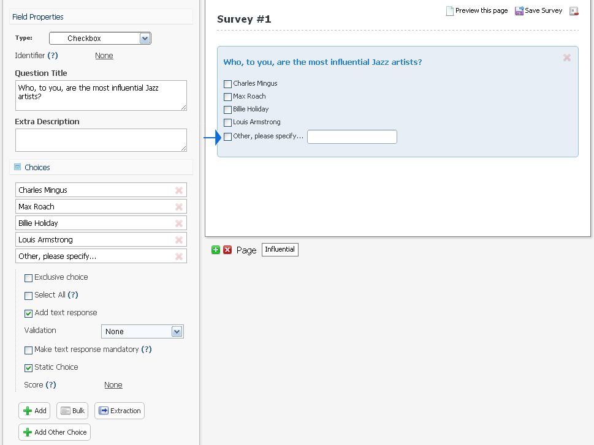

	*Figure 9.1* After clicking [Add Other Choice]

Other question types, such as multiple choice grids, N-atrix, 3D Matrix, etc don’t have the option of including an “Other, please specify” choice. However, it is still possible to include a text box asking for more information.

.. tip ::

	To give the illusion that a question has an "Other Choice", first create a question containing your variables and choices and add a text response, or text response grid, question directly beneath it.

	When you preview your survey, these would appear as two different questions. However, if you check off the “append to previous question” check box under display settings (for the text response question), they’ll be combined into one. Refer to the manuals section on "Append to Previous" to learn more about this nifty feature.

.. note::

	Add Other Choice is only available to certain question types, such as:

		1. Checkbox
		2. Multiple Choice

Scores
^^^^^^

If you are setting up your survey as a quiz, you can show the respondent their score either after each question in the survey or at the end of the survey (Figure 6-9). The respondent can also be shown whether or not they got the answer correct. When you download the data, additional columns are provided to show the Sum, Weighted Average, and the Weighted Standard Deviation scores for each respondent

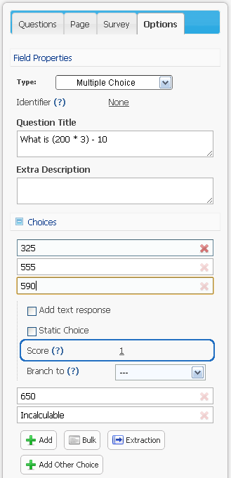

	*Figure 9.1* The correct answer has a numeric score of "1"

Adding score values to an individual choice or variable allows for them to be tallied up to give the respondent a numerical score. This feature can be used to make a survey into a quiz, and allow for you to promote complex logical functions. You can attach a numerical score to all closed question types, except for the "Yes/No" question type which by default is a static numerical score of either 1 (Yes) or 2 (No)

Choices and Variables that contain a custom "Score" are predominately used in a quiz build specifically within FluidSurveys. Doing so would allow for you to quickly adminster scored tests to respondents. Assign individual point values to different answer choices, and then display those very same scores back to the respondent while they are still in the process of taking the survey.

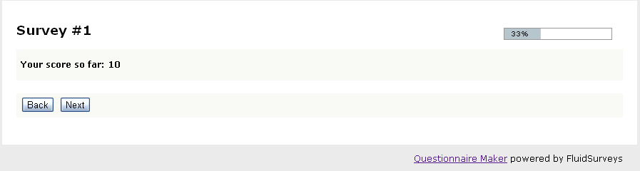

	*Figure 9.1* The [Current Score] question type with a respondent score of 10

.. note::

	By default, choices within a question will have scores assigned to them. The first choice in a question would have a score of 1, the second a score of 2, and so on. These scores are customizable, however. Additionally, while Scores will say "None" by default, the value does not represent a 0, but rather that a custom value has not been provided, and therefore it will adhere to the default order, eg., 1, 2, 3, 4, etc.

Simple Branching
^^^^^^^^^^^^^^^^

Simple branching directs respondents through different paths in a survey based on a previous responses to a question. In essence, skipping allows you to branch respondents from one page to another based on their answers to a single question. For example, if a respondent answered “Yes” to a question, they could be sent to Page 3, if they answered No, they could be skipped straight to Page 4. Basic skipping works based on the respondents answers to single-answer questions such as the dropdown, multiple-choice and yes/no question types. 

.. figure:: ../../resources/editor/branch_to.png
	:align: center
	:scale: 70%
	:alt: Branch to a page
	:class: screenshot

	*Figure 9.1* Branch to [Page 4]

.. tip::

	If you’ll be using advanced branching, you shouldn’t use simple skipping and vice-versa. While the two can be used together, generally speaking, they shouldn’t be because this could lead to clashing conditions that could produce unexpected results.

When the respondents selects, "Go to page 4 for the Princess to escape" as a choice, they will be transported to [Page 4]

.. warning::

	All branching logic happens when the respondent causes a page change, eg., click [Next], [Back], [Submit]

Advanced skipping allows you to branch a respondent from one page to another based on their answers to one, or multiple, questions. The questions that trigger the branching can be on one, or several, pages. For example, one branching condition could be created based on questions on Page 1, 4, and 5. Furthermore, you can use advanced skipping to branch based on most question types (including checkbox questions and grid-type questions).

.. note:: 

	Simple Branching is available to:

		1. Yes/No 
		2. Multiple Choice
		3. Dropdown
		4. Drill Down

To learn how to set up a page with simple branching, refer to the Tutorial section

Question Title
^^^^^^^^^^^^^^

The question title is the over-arching explanation of the question itself. It is what the respondent will see at the top of a question. 

.. figure:: ../../resources/editor/editor_question_title.png
	:align: center
	:scale: 70%
	:alt: Question Title in the Editor
	:class: screenshot

	*Figure 9.1* Question title in the Editor

The question title in the Editor is not a final depiction of how it will appear to the respondent. 

.. figure:: ../../resources/editor/survey_question_title.png
	:align: center
	:scale: 70%
	:alt: Question Title in the Survey
	:class: screenshot

	*Figure 9.1* The default look and feel of the question title in the Survey.

.. tip::

	While the question title by default is generic, you can customize it to include any number of HTML, CSS and even JavaScript functions to further expand those horizons of customization

Question Description	
^^^^^^^^^^^^^^^^^^^^

If you wish to provide more information about a specific section, then you can do so within the Extra Description text area.

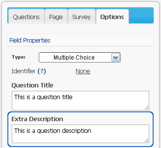

	*Figure 9.1* Question Description in the Editor

The question description in the Editor is not a final depiction of how it will appear to the respondent. 

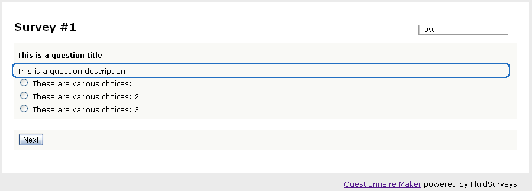

	*Figure 9.1* The default look and feel of the question description in the Survey.

.. tip::

	While the question description by default is generic, you can customize it to include any number of HTML, CSS and even JavaScript functions to further expand those horizons of customization

Appearance
^^^^^^^^^^

Certain question types allow for the choices/variables to be morphed and appear as though they are an entirely different question type. 

Altering the appearance can be achieved by clicking on the Multiple Choice question type, and selecting the desired layout under "Appearance" found beneath "Display"

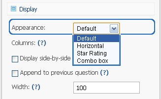

	*Figure 9.1* Available appearance choices

The available morph styles are

.. figure:: ../../resources/editor/default_appearance.png
	:align: center
	:scale: 70%
	:alt: Default Appearance
	:class: screenshot

	*Figure 9.1* Default Appearance of a Multiple Choice 

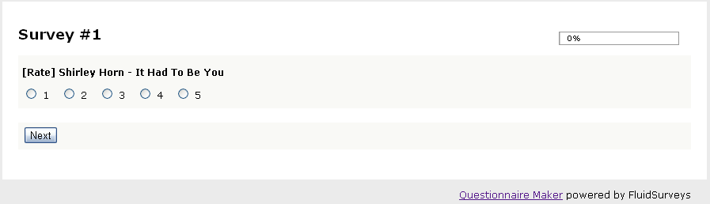

	*Figure 9.1* Horizontal Appearance of a Multiple Choice 

.. figure:: ../../resources/editor/star_rating.png
	:align: center
	:scale: 70%
	:alt: Question Description in the Survey
	:class: screenshot

	*Figure 9.1* Star Rating Appearance of a Multiple Choice 

.. figure:: ../../resources/editor/combo_box.png
	:align: center
	:scale: 70%
	:alt: Question Description in the Survey
	:class: screenshot

	*Figure 9.1* Combo Box Appearance of a Multiple Choice 

Question Types that blend other questions into themselves, ie., 3D Matrix, N-atrix, can also have their choices altered to match the aforementioned appearances.

Columns
^^^^^^^

Columns can refer to a lot of things within FluidSurveys, but generally it is ascribed to the amount of columns a text response area has. 

.. figure:: ../../resources/editor/columns_for_tr.png
	:align: center
	:scale: 70%
	:alt: Columns for Text Response Grid
	:class: screenshot

	*Figure 9.1* Columns for a Text Response Grid in the Editor

By default, a text area has 20 columns. The value can be altered at any time. Changing the column value will increase the text areas width. Whenever making alterations to the text area, even putting a value of 75 may bleed off the Editor page, always be saving and [Preview] the survey in order to assure a maximum success rate

However, columns can also be associated with the Choices of a Grid, eg., Multiple Choice Grid, Checkbox Grid, 3D Matrix question type. 

.. figure:: ../../resources/editor/columns_and_rows.png
	:align: center
	:scale: 70%
	:alt: Columns and Rows in a Survey
	:class: screenshot

	*Figure 9.1* Columns in a survey

Optional
^^^^^^^^

Unchecking this option forces the question to be answered when the user is filling out your survey. 

.. figure:: ../../resources/editor/optional_option.png
	:align: center
	:scale: 70%
	:alt: Optional Option in Editor
	:class: screenshot

	*Figure 9.1* Optional option for a Multiple Choice question

.. note::

	By default, Choices/Variables are "Optional" 

While you can force a question to be either optional or required under the "Options" menu of the Editor, there are a few question types where the entirety of the question may not be optional or required, but each individual choice is the deciding factor. The following question types require that you click on the Choices/Variables portion in order to alter it state

**Text Response Grid**
	
.. figure:: ../../resources/editor/tr_optional.png
	:align: center
	:scale: 70%
	:alt: Text Response Grid Optional
	:class: screenshot

	*Figure 9.1* Optional option for a Text Response Grid

**Multiple Choice Grid**

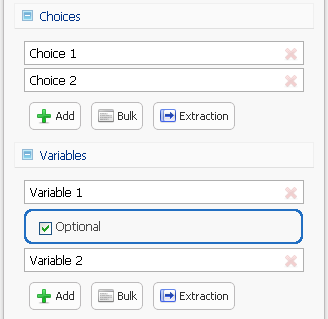

	*Figure 9.1* Optional option for a Multiple Choice Grid

**Dropdown Grid**

.. figure:: ../../resources/editor/ddg_optional.png
	:align: center
	:scale: 70%
	:alt: Dropdown Grid Optional
	:class: screenshot

	*Figure 9.1* Optional option for a Multiple Choice question

**Checkbox Grid**

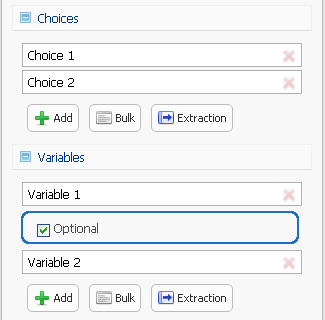

	*Figure 9.1* Optional option for a Multiple Choice question

**3D Matrix**

.. figure:: ../../resources/editor/3d_optional.png
	:align: center
	:scale: 70%
	:alt: Optional Option in Editor
	:class: screenshot

	*Figure 9.1* Optional option for a Multiple Choice question

**N-atrix** 

.. figure:: ../../resources/editor/n_optional.png
	:align: center
	:scale: 70%
	:alt: Optional Option in Editor
	:class: screenshot

	*Figure 9.1* Optional option for a Multiple Choice question

**Semantic Differential**

.. figure:: ../../resources/editor/sd_optional.png
	:align: center
	:scale: 70%
	:alt: Optional Option in Editor
	:class: screenshot

	*Figure 9.1* Optional option for a Multiple Choice question

Additionally, if you do not wish to deselect "Optional" for all choices and variables, you can select all questions you'd like to make "Optional" or "Required", right-click and select "Mark all as optional" or "Mark all as required"

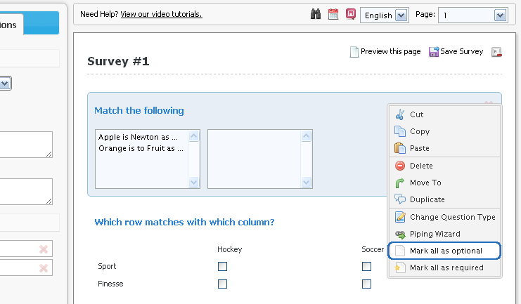

	*Figure 9.1* Optional option for a Multiple Choice question

.. note::

	Despite the menu stating, "Mark all as required or optional", if you have n choices selected (Where n = a positive number) then only those questions will receive the altered state

To learn more about the right-click menu, refer to the Right-click Menu section of the manual

Validation
^^^^^^^^^^

FluidSurveys allows validation to be added for text response questions. With validation, a response must adhere to the format specifications set up, otherwise it won’t be accepted.
Validation can be set up for phone numbers, emails, postal codes, integers, letters, etc.

.. figure:: ../../resources/editor/validation_options.png
	:align: center
	:scale: 70%
	:alt: Character Limit
	:class: screenshot

	*Figure 9.1* Character limit validation

.. note::

	By default, "Validation" is disabled

With validation, you can specify a character limit/range for the question. So, for example, you could require the response to have between 10 and 100 characters, or 5 to 25 integers, etc.
To do so, select validation for letters, integers, letters & numbers or all characters. You will then be able to enter a limit length.

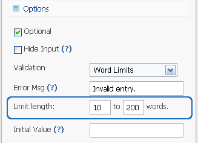

	*Figure 9.1* Character limit validation

When validation is set for integers (positive or negative), you can set up a range within which the value must reside. So, for example, if the limit value is set to between 5 and 9, a response of 3 would not be accepted while a response of 6 would be.

.. figure:: ../../resources/editor/limit_values_validation.png
	:align: center
	:scale: 70%
	:alt: Limit Values Validation
	:class: screenshot

	*Figure 9.1* Limit values validation

When a respondent attempts to enter an answer that does not adhere to the validation settings, they are shown a default message. It’s possible to change this message for each question, or text field. 

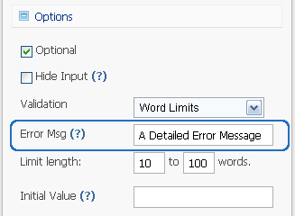

	*Figure 9.1* Error message when validation is not met

Depending on the error message entered, the user will see a message that alerts them about any malformed text input.

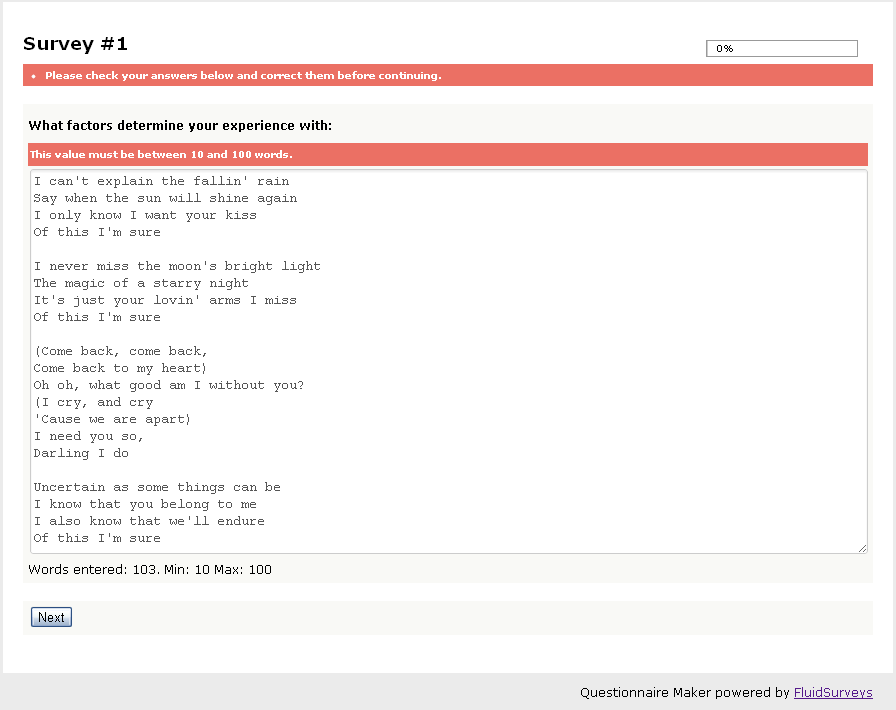

	*Figure 9.1* Error validation for a text response

Identifiers
^^^^^^^^^^^

Any time you want to do anything advanced with a question, make sure to give it an identifier. These identifiers are used to easily refer to them when programming advanced logic conditions. 

.. figure:: ../../resources/editor/identifier_option.png
	:align: center
	:scale: 70%
	:alt: Question Description in the Survey
	:class: screenshot

	*Figure 9.1* Force Unique Option for a Dropdown Grid question type in the Editor

.. note::

	By default, the Identifier is "None", ie., blank

When a question has been given an Identifier, it will appear in the Advanced Branching Logic window.

.. figure:: ../../resources/editor/advanced_branching_logic_identifiers.png
	:align: center
	:scale: 70%
	:alt: Question Description in the Survey
	:class: screenshot

	*Figure 9.1* Force Unique Option for a Dropdown Grid question type in the Editor

To learn more about Advanced Branching Logic, refer to the Branching Logic section of the manual.

.. tip::

	The identifiers are also used for the purpose of exporting your data into Excel/CSV and SPSS. It may be wise to use an Identifier, even if advancing branching logic is not going to be applied.

Force Unique
^^^^^^^^^^^^

When using a rating scale question type, enabling "Force Unique" requires that a choice in a column remain unique. No two options in a column can be identical. This is perfect when you want to receive a wider range of answers from a respondents.

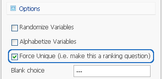

	*Figure 9.1* Force Unique Option for a Dropdown Grid question type in the Editor

.. note:: 

	By default, this option is disabled.

.. figure:: ../../resources/editor/force_unique_error.png
	:align: center
	:scale: 70%
	:alt: Force Unique Error Message
	:class: screenshot

	*Figure 9.1* If a row contains the same answer as previous column, then the respondent is presented with an error message

.. note::

	Force Unique is available for the following question types:

		* Dropdown Grid
		* Checkbox Grid
		* Multiple Choice Grid
		* Text Response Grid
		* Semantic Differential

	Any question that has the ability to be used as a rating scale will have the "Force Unique" option

Background Color
^^^^^^^^^^^^^^^^

If a close-ended question grows in size, then it may become cumbersome and confusing to some respondents when viewing multiple columns of information. Enabling [Alternate Background Color] option will paint each odd column a different color. 

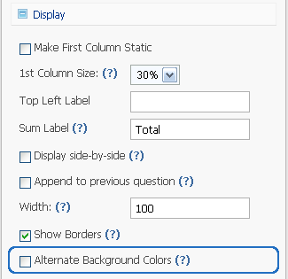

	*Figure 9.1* Alternate Background Color option for a 3D Matrix in the Editor

.. note:: 

	By default, this option is enabled. 

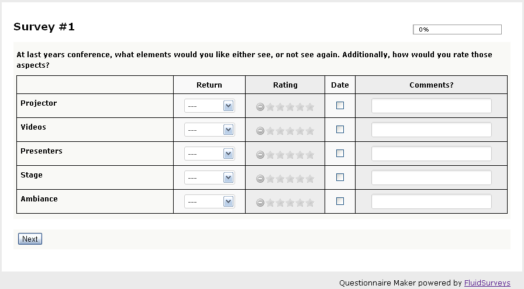

	*Figure 9.1* Combo Box Appearance of a Multiple Choice 

.. note::
	
	An alternating background color is only available to:
		
		* Multiple Choice Grid
		* Checkbox Grid
		* Semantic Differential

Borders
^^^^^^^

This option show borders separating the rows and columns of a question. It makes complex 3D Matrices much easier to understand.

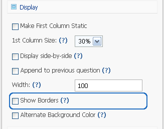

	*Figure 9.1* Show Borders option for a 3D Matrix in the Editor

.. note ::

	By default, this option is disabled. 

A 3D Matrix without a border will appear as

.. figure:: ../../resources/editor/no_borders_survey.png
	:align: center
	:scale: 70%
	:alt: Question Description in the Survey
	:class: screenshot

	*Figure 9.1* Show Borders for a 3D Matrix 

Whereas, if the option is enabled

.. figure:: ../../resources/editor/borders_survey.png
	:align: center
	:scale: 70%
	:alt: Question Description in the Survey
	:class: screenshot

	*Figure 9.1* Show Borders for a 3D Matrix 

.. note::

	Show Borders is only available on the 3D Matrix question type

1st Column Size
^^^^^^^^^^^^^^^

Allows you to change the size of the first column which contains the variable labels. Setting a higher percentage value will increase the size, while setting a lower percentage value will decrease the size.

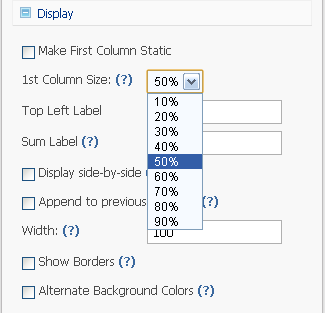

	*Figure 9.1* 1st Column Size Options for a 3D Matrix in the Editor

.. note::

	By default, this option is disabled. Altering the value will affect the 1st column size

.. figure:: ../../resources/editor/1st_column_size_survey.png
	:align: center
	:scale: 70%
	:alt: 1st Column Size in the survey
	:class: screenshot

	*Figure 9.1* 1st Column Size set to 50% in the survey

.. note::

	Setting the Column Size will not accurately reflect itself in the Editor. To see the best results, always save your survey and Preview it.

1st Column Static
^^^^^^^^^^^^^^^^^

When enabled, the first column containing the variable will not scroll; it will always be visible to respondents. This setting is useful if your question contains numerous columns and requires a scroll bar. 

.. figure:: ../../resources/editor/1st_column_static_option.png
	:align: center
	:scale: 70%
	:alt: Question Description in the Survey
	:class: screenshot

	*Figure 9.1* 1st Column Static for a 3D Matrix in the Editor
 
.. note::

	By default, this option is disabled. 

When enabled, the first column will always remain a constant. Notice the scrollbar on the bottom

.. figure:: ../../resources/editor/1st_column_static_survey.png
	:align: center
	:scale: 70%
	:alt: 1st Column Static Survey
	:class: screenshot

	*Figure 9.1* 1st Column Static on a 3D Matrix question.

Initial Value
^^^^^^^^^^^^^

Under validation, the option to pre-populate responses is available. Whatever is entered into the “Initial Value dropdown, it will be displayed to respondents when they view the survey. They will be able to change this response, or leave it in tact. 

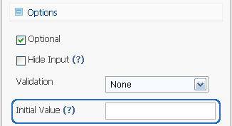

	*Figure 9.1* Initial Value option found under "Options" in the Editor

.. note::

	By default, the "Inital Value" is blank.

.. figure:: ../../resources/editor/initial_value_survey.png
	:align: center
	:scale: 70%
	:alt: Question Description in the Survey
	:class: screenshot

	*Figure 9.1* A Text Response question with an Initial Value of "Greatly"

.. warning::

	While an Initial Value is a perfect representation of how the respondent should answer the question, and while the question may be required, the "Initial Value" is seen as a response, and therefore that answer will reign supreme.

Multiline
^^^^^^^^^

Enabling this option allows for the text area to have multiple lines and columns. This option is perfect for when you require a large amount of text to be entered by the respondent.

.. figure:: ../../resources/editor/multiline_option.png
	:align: center
	:scale: 70%
	:alt: Initial Value 
	:class: screenshot

	*Figure 9.1* Multiline option found under "Options"

.. note::

	By default, "Multiline" is disabled.

.. figure:: ../../resources/editor/multiline_survey.png
	:align: center
	:scale: 70%
	:alt: Question Description in the Survey
	:class: screenshot

	*Figure 9.1* A Text Response question with 75 rows, and 100 columns.

.. warning::

	The survey width by default is 864px (Customizable through the :ref:`Themer`) and putting a number greater than 100 for "Columns" will cause the text box to bleed off the survey page. Always keep design decisions in mind when creating a survey

Sum
^^^

A constant sum question will require the answers given for a set of variables to add up to a specified value. For example, if you create a text response question with 5 variables, you can assure that the values entered for those 5 variables add up to 100. 

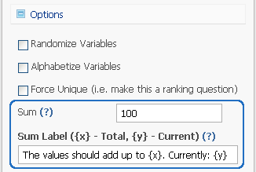

	*Figure 9.1* Setting the constant sum value to be 100

.. note::

	By default, the "Sum" is 0, ie., blank

This will ensure that the entered values add up to 100. To alter the value, click on "Options" in the left hand-side editor, and beside where it states, "Sum", enter the desired value. A respondent's answers for this question will now have to add up to the entered value. If the total is more or less, they’ll be presented with an error message.

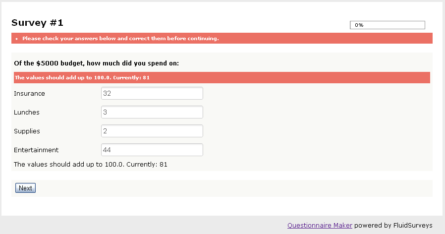

	*Figure 9.1* The error message the respondent sees for an invalid sum value
