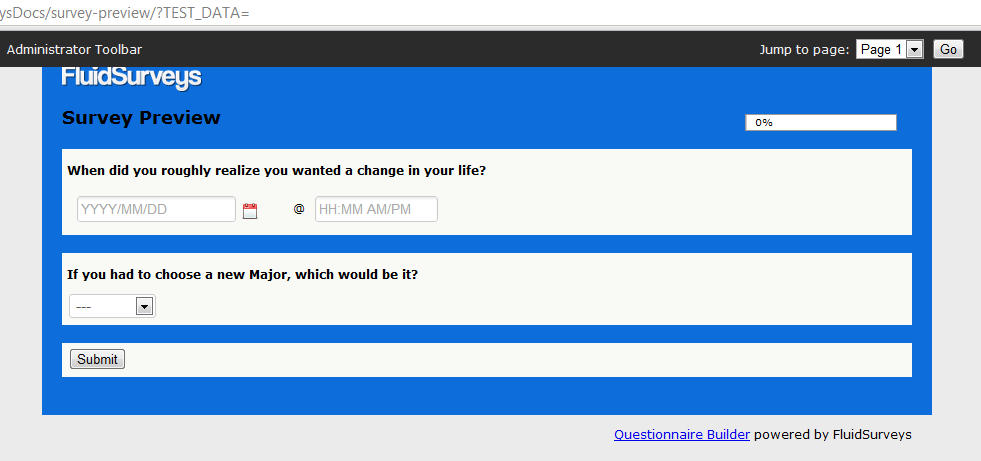
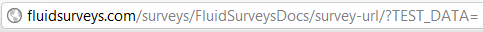

.. _Preview:

Preview
=======

Just like with every King, there is a powerful Queen behind him. Just like with every survey, there is a powerful Preview button available that allows for everything created thusfar, to be seen in its fully potential light. Clicking on the icon will open your survey in a new browser window for testing. The survey will appear identical to what a respondent will see, save the Administrator Toolbar.

	*Figure 9.1* Survey in Preview Mode

Previewing a survey allows for:

	1. Jumping between pages via The Administrator Toolbar
	2. Export currently selected responses to Adobe Reader (.PDF) or Microsoft Word (.DOC)
	3. Adhere to the same validation, and logic as a respondent would be subjected to

.. note::

	The administrator toolbar will only appear to you when you’re logged in, not to your respondents.

When previewing a page that has looping, or extraction based on a previous question, the question may appear blank or look odd due to not pulling the correct data. Therefore, in order to test Looping and Extraction, always refer to the initial pivot point.

Test Data
---------

As you go through the process of creating your survey, you're likely to test it out by either sending it around to colleagues or completing it yourself. Through this process, you'll accumulate data that you might not want included in the final results. 

Luckily, whenever the Preview button is pressed within the Editor, the /?TEST_DATA string is appended to the end of the link.

	*Figure 9.1* Test Data indicator in URL

This process alerts the survey software to attach the string (Test Data) to the response generated for that one single instance. You can then quickly identify and delete the responses that were submitted as tests, preventing them from skewing your end results.

If you were to visit your survey through the Publish link, or by removing the appended TEST_DATA string, then all data would be seen as “Complete”, rather than “Test”.

.. figure:: ../../resources/preview/test_data.png
	:align: center
	:scale: 70%
	:alt: Test Data in URL
	:class: screenshot

	*Figure 9.1* Test Data indicator in URL

This data is not final, however, and can still be removed, either individually or in bulk. To delete all of the responses, go to the “Response” page under “Analyze”, and select “Delete All Responses” from the “Actions…” dropdown. The software will then ask for you to enter a verification string, “I agree” before deleting all the information.

Locations
---------

Previewing the survey is possible through either clicking "Preview" on the Survey Dashboard page, or "Preview" within the Editor.